# Eval & Ops Playbook

A working guide to the evaluation and operations layer of SkinGraph: the three pieces that exist today, the six worth adding, and — for each — the general concept behind it, the different ways people build it, and how it lands in this repo.

It is written for someone who builds AI systems but is new to eval/ops. Each section starts with the idea in the abstract (what it is, how it is generally built, when you reach for it) and only then maps it onto SkinGraph's code, so the concepts transfer to any project, not just this one.

## Table of contents

- [Eval \& Ops Playbook](#eval--ops-playbook)
  - [Table of contents](#table-of-contents)
  - [0. The mental model](#0-the-mental-model)
    - [Why AI systems need a different kind of test](#why-ai-systems-need-a-different-kind-of-test)
    - [The vocabulary you need first](#the-vocabulary-you-need-first)
    - [The three axes you are always measuring](#the-three-axes-you-are-always-measuring)
    - [The eval flywheel](#the-eval-flywheel)
    - [Evaluation-Driven Development](#evaluation-driven-development)
    - [The map: where the nine components sit](#the-map-where-the-nine-components-sit)
  - [Part 1 — What you already have](#part-1--what-you-already-have)
    - [1. `evaluate.py` — reference-based accuracy + record/replay gate](#1-evaluatepy--reference-based-accuracy--recordreplay-gate)
      - [What it is, in general](#what-it-is-in-general)
      - [The ways people build reference-based evals](#the-ways-people-build-reference-based-evals)
      - [The record/replay technique](#the-recordreplay-technique)
      - [In SkinGraph](#in-skingraph)
    - [2. `vision_eval.py` — guardrail / classifier evaluation](#2-vision_evalpy--guardrail--classifier-evaluation)
      - [What it is, in general](#what-it-is-in-general-1)
      - [The ways people build guardrail evals](#the-ways-people-build-guardrail-evals)
      - [In SkinGraph](#in-skingraph-1)
    - [3. `metrics.py` — online operational observability](#3-metricspy--online-operational-observability)
      - [What it is, in general](#what-it-is-in-general-2)
      - [The ways people build it](#the-ways-people-build-it)
      - [In SkinGraph](#in-skingraph-2)
  - [Part 2 — What was added](#part-2--what-was-added)
    - [4. Latency \& cost benchmarking](#4-latency--cost-benchmarking)
      - [What it is, in general](#what-it-is-in-general-3)
      - [The ways people build it](#the-ways-people-build-it-1)
      - [In SkinGraph](#in-skingraph-3)
    - [5. Eval scorecard published from CI](#5-eval-scorecard-published-from-ci)
      - [What it is, in general](#what-it-is-in-general-4)
      - [The ways people build it](#the-ways-people-build-it-2)
      - [In SkinGraph](#in-skingraph-4)
    - [6. Eval-diff PR bot](#6-eval-diff-pr-bot)
      - [What it is, in general](#what-it-is-in-general-5)
      - [The ways people build it](#the-ways-people-build-it-3)
      - [In SkinGraph](#in-skingraph-5)
    - [7. Nightly live canary (drift detection)](#7-nightly-live-canary-drift-detection)
      - [What it is, in general](#what-it-is-in-general-6)
      - [The ways people build it](#the-ways-people-build-it-4)
      - [In SkinGraph](#in-skingraph-6)
    - [8. Coach faithfulness eval](#8-coach-faithfulness-eval)
      - [What it is, in general](#what-it-is-in-general-7)
      - [The ways people build it](#the-ways-people-build-it-5)
      - [In SkinGraph](#in-skingraph-7)
    - [9. Router threshold sweep (cost–accuracy Pareto)](#9-router-threshold-sweep-costaccuracy-pareto)
      - [What it is, in general](#what-it-is-in-general-8)
      - [The ways people build it](#the-ways-people-build-it-6)
      - [In SkinGraph](#in-skingraph-8)
  - [Part 3 — Sequencing and the one caveat](#part-3--sequencing-and-the-one-caveat)
  - [Glossary](#glossary)
  - [Sources](#sources)

## 0. The mental model

### Why AI systems need a different kind of test

A normal unit test asserts a boolean: `assert add(2, 2) == 4`. It works because the function is deterministic and has exactly one correct answer. A model-backed pipeline breaks all three assumptions at once:

- **Outputs are probabilistic.** The same image through the same prompt can yield slightly different text. There is no single string to assert against.
- **Inputs are unbounded.** You cannot enumerate every label photo a user might take. Coverage is a sample, never exhaustive.
- **"Correct" is a spectrum.** An extraction that gets 13 of 14 ingredients is not simply "wrong" — it is 93% right, and you need a number that says so.
- **The ground can move under you.** You depend on a provider's model (Gemini) that can change without notice, so a test that passed last month can fail today for reasons outside your repo.

An **eval** is the answer to all of this. It is a test whose assertion is a *metric* over a *dataset*, not a boolean over a single call. Instead of "is this exactly right," it asks "how right is this, across a representative set, compared to last time." Everything below is a variation on that theme.

### The vocabulary you need first

| Term | Plain meaning |
|------|---------------|
| **Golden set / ground truth** | A curated set of inputs with hand-verified correct answers. Your ruler. |
| **Offline eval** | Runs against a fixed dataset, usually in CI, before shipping. Answers "is the code good?" |
| **Online / operational metrics** | Measured on live production traffic. Answers "is the running system healthy?" |
| **Reference-based eval** | Compares output to a known correct answer (needs a golden set). |
| **Model-graded eval (LLM-as-judge)** | Uses another model to score output when there is no single right answer. |
| **Deterministic check** | A rule or exact/fuzzy match, no model involved. Cheap, reproducible, free. |
| **Gate** | An eval wired to block a merge or deploy when a metric falls below a floor. |
| **Track** | An eval whose result you record and trend, but do not block on. |
| **Regression** | A change that makes a previously-good metric worse. The main thing gates catch. |

The single most useful distinction is **gate vs. track**. You *gate* on things that are deterministic and safety-critical (a quality floor that must hold). You *track* things that are noisy or environment-dependent (latency, cost) because blocking a merge on a number that jitters would just produce flaky, ignored builds. A mature eval layer is deliberate about which metrics it gates and which it merely watches.

### The three axes you are always measuring

Every serious AI system is judged on three axes at once. Optimizing one usually costs you another, which is the whole reason this discipline exists.

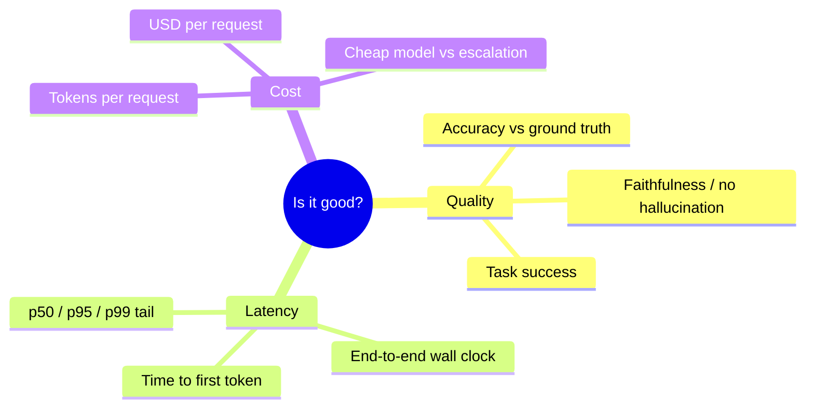

SkinGraph already touches all three: `evaluate.py` measures **quality**, `metrics.py` records **latency and cost** in production. The gaps this playbook fills are mostly about measuring latency and cost *deliberately and offline*, and about making quality **visible over time** rather than buried in a CI log.

### The eval flywheel

Evals are not a one-time setup. They form a loop: production surfaces failures, you capture and label them, they grow the golden set, the bigger set catches more regressions, and the gate protects the gains. Each turn of the wheel makes the ruler longer and the system safer.

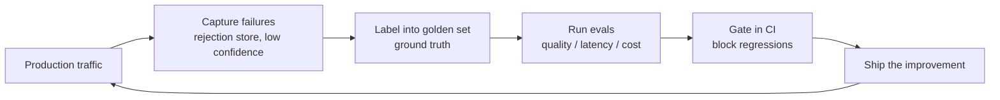

SkinGraph already has the capture stage wired: the opt-in rejection store (`src/rejection_store.py`, `REJECTION_STORE_ENABLED=1`) writes rejected frames to `data/rejections/`, which is the natural feed for the vision golden set. That is the flywheel's intake valve.

### Evaluation-Driven Development 

The "Ops/Eval route" you are aiming at comes from Chip Huyen's argument that for AI systems, evaluation is not a phase at the end — it is the thing that drives the whole lifecycle. You define what "good" means *first*, encode it as evals, and then let those evals guide model selection, design, and iteration. It is test-driven development with a metric where the assertion used to be.

Two of her points are worth internalizing because they shape the six additions below:

- **Automated evals do not replace looking at data.** Her line is that "staring at data for just 15 minutes usually gives me some insight that could save me hours of headaches." The best teams still have a human read 30–1,000 outputs regularly. Automation scales the boring checks; human judgment catches the things no metric was written for.
- **LLM-as-judge is useful but biased.** Judges are non-deterministic and show systematic biases (they prefer longer answers, favor the first option shown, and favor their own style). Use them, but validate them against human labels and prefer a deterministic check whenever the property can be checked deterministically. This is exactly why the coach faithfulness eval below starts deterministic.

### The map: where the nine components sit

Here is SkinGraph's pipeline with every eval component attached to the stage it watches. Solid boxes are the pipeline; the eval components are called out in the table beneath.

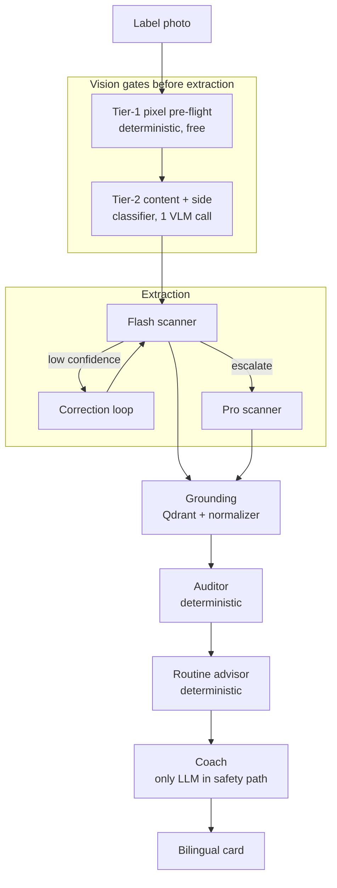

| # | Component | Watches which stage | Kind | Offline / Online | Gate or Track | Status |
|---|-----------|--------------------|------|------------------|---------------|--------|
| 1 | `evaluate.py` | Flash/Pro extraction | Reference-based accuracy + record/replay | Offline (CI) | **Gate** (F1 floor) | Built |
| 2 | `vision_eval.py` | Tier-1 & Tier-2 gates | Classifier / guardrail accuracy | Offline (+ live Tier-2) | Gate (optional) | Built |
| 3 | `metrics.py` | Whole live run | Operational observability | Online (prod) | Track | Built |
| 4 | Latency & cost bench | Flash vs Pro tiers | Performance benchmark | Offline (recorded) | Track | Built |
| 5 | Eval scorecard | `evaluate.py` output | Reporting / trend | Offline (CI) | Track | Built |
| 6 | Eval-diff PR bot | Prompt / cassette changes | Regression-in-review | Offline (PR) | Gate + Track | Built |
| 7 | Nightly canary | Live Gemini vs baseline | Drift detection | Online (scheduled) | Track / Alert | Built |
| 8 | Coach faithfulness | Coach card vs findings | Groundedness eval | Offline (+ judge) | **Gate** | Built |
| 9 | Router threshold sweep | Flash→Pro threshold | Cost–accuracy optimization | Offline (analysis) | Decide | Built |

## Part 1 — What you already have

### 1. `evaluate.py` — reference-based accuracy + record/replay gate

#### What it is, in general

This is the archetypal offline eval: a **reference-based accuracy** harness. You have a golden set (inputs with known-correct answers), you run the system, and you score output against truth with a metric. For anything that extracts or classifies, the metric is almost always some form of **precision / recall / F1**:

- **Precision** = of the things the model produced, what fraction were correct. Punishes hallucination (making things up).
- **Recall** = of the things that should have been found, what fraction were. Punishes omission (missing things).
- **F1** = the harmonic mean of the two, a single number that only stays high if *both* are high. It is the standard because it refuses to let a model game one at the expense of the other.

For a safety product, recall is the number that keeps you up at night: a missed allergen is a missed allergen. F1 is what you gate on so the model cannot cheat recall by dumping every ingredient it can imagine.

#### The ways people build reference-based evals

The interesting design choice is *how you decide two strings match*, and there is a spectrum from strict to lenient:

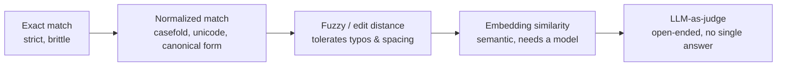

- **Exact match** is right for enums and structured fields (a boolean flag, a category). It is useless for free text because "Cetyl Alcohol" ≠ "cetyl alcohol " fails on a space.
- **Normalized then exact** folds away differences that do not matter (Unicode NFKC to unify full-width and half-width kana, lowercasing). Cheap and deterministic.
- **Fuzzy matching** (edit distance, token ratios via libraries like RapidFuzz) tolerates near-miss spellings with a tunable cutoff. This is the sweet spot for OCR-style extraction where the model gets the ingredient 95% right.
- **Embedding similarity** matches by meaning, not surface form. Powerful when phrasings vary wildly, but it needs an embedding model, so it is slower and less reproducible.
- **LLM-as-judge** is the tool of last resort, for genuinely open-ended output where no reference string exists (covered in component 8).

A second, load-bearing idea: **canonicalize before you compare.** If truth and prediction can each be written many ways, map both onto one canonical form first, or you will count correct answers as wrong. SkinGraph does this by resolving every ingredient to its English **INCI** name before scoring, which is also what makes the metric language-independent — a Korean or Japanese back label scores against the same ground truth.

Use cases for this whole family: entity/field extraction, classification, retrieval quality, translation, and code generation (where the "metric" is a unit-test pass rate).

#### The record/replay technique

A reference-based eval that calls a live model has two problems in CI: it costs money and it is non-deterministic (so it can fail for reasons unrelated to your change). **Record/replay** fixes both. You call the real model once, save the output to a file (a "cassette"), and on every subsequent run you replay the saved output through the real scoring path instead of calling the model.

There are two levels at which you can record:

- **HTTP-level** (VCR.py, `pytest-recording`): the library intercepts the raw HTTP request/response and stores it verbatim. Transparent, but brittle when the transport is gRPC or streaming or when the response is a structured-output object rather than plain text — and the cassette contains your auth headers, so you must redact secrets before committing.
- **Result-level**: you store the *parsed* output object, not the wire bytes. Less magic, but honest about what it actually regression-tests — everything *downstream* of the model call. This is the right choice when the transport is awkward.

The subtle danger with any recording is **staleness**: if you change the prompt but keep old cassettes, CI happily replays stale outputs and reports numbers that no longer describe your system. The fix is to hash the inputs that define the recording (the prompt, the model id) and refuse to replay when the hash no longer matches — forcing a re-record.

#### In SkinGraph

`eval/evaluate.py` is a clean, textbook implementation of all of the above:

- **Golden set**: 40+ real label photos in `data/golden_set/` (kept out of git — they are personal photos), 14 with per-product ground truth in `data/ground_truth.json` (brand, product, quasi-drug flag, full ingredient list with INCI translations).
- **Scoring**: each extracted ingredient is resolved to canonical English INCI (`canonical_inci`, using the VLM's own `name_standardized` then the normalizer ledger's exact tier), then fuzzy-matched (RapidFuzz `WRatio`, cutoff 85) as a set against truth to produce precision/recall/F1 plus the diagnostic `missed` and `hallucinated` lists. Text fields (brand/product) use a lower cutoff of 80 and match either side of a bilingual truth string like `Cetaphil / セタフィル`.
- **Result-level cassettes**: `eval/cassettes/<image-stem>.<model>.json` store the parsed `ProductExtraction` plus `image_sha256`, `model_id`, `prompt_sha256`, and `recorded_at`. The README is explicit about why result-level, not HTTP-level: "gRPC + structured output make transport-layer replay brittle."
- **Staleness guard**: on replay, `_load_cassette` recomputes `prompt_sha256` (hash of `SCANNER_SYSTEM_PROMPT`) and `model_id` and `sys.exit`s on any mismatch, so a prompt or model change cannot ship with stale eval numbers. Image hashes are checked too, when the images are present locally.
- **The CI gate**: `python -m eval.evaluate --replay --min-f1 0.90` runs fully offline (no API key, no images) and exits non-zero if aggregate F1 drops below the floor. This is the `eval-replay` job in `.github/workflows/ci.yml`.

The record and replay halves, and the offline/online split that makes the whole thing work:

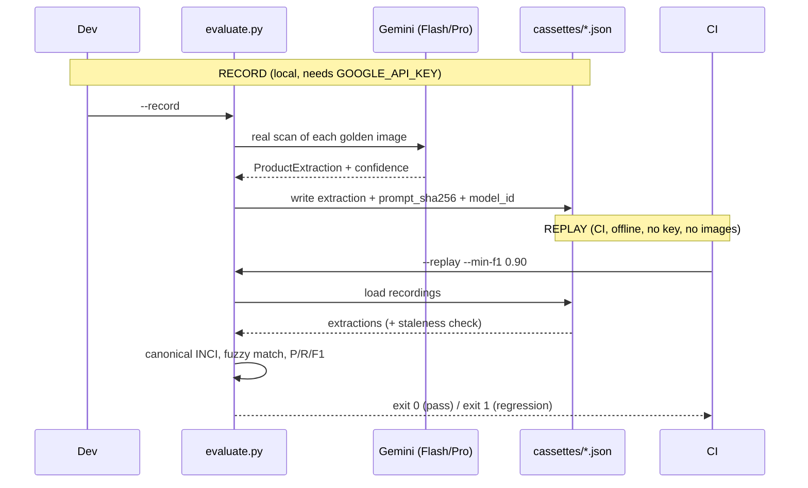

One honest limitation to carry forward: only extractions with `system_status == SUCCESS` are recorded, because several golden photos are of the product *front* and structurally yield zero ingredients — replaying those would gate on photo composition, not on code. That is correct, but it is why the replay gate currently covers a small handful of back-label photos, which the caveat in Part 3 addresses.

### 2. `vision_eval.py` — guardrail / classifier evaluation

#### What it is, in general

Not every part of an AI pipeline generates text. Some parts *decide*: is this input in-scope, is this content allowed, which route should this take. Those are **classifiers and guardrails**, and they need a different eval than a generator. You do not measure F1 against a reference answer string; you measure **classification accuracy and a confusion matrix** — for each true class, what did the system actually predict.

The confusion matrix matters more than the single accuracy number because **error direction is not symmetric**. For a safety gate that decides whether a frame is analyzable, letting a bad frame through (a *false accept*) is far worse than rejecting a good one (a *false reject*): a no-product frame that slips past the gate *forces* the downstream extractor to fabricate, because `brand` and `ingredients` are required fields. So you care specifically about the false-accept cell, and you may deliberately tune the gate to be conservative even at the cost of some false rejects.

#### The ways people build guardrail evals

- **Labeled set + accuracy + confusion matrix.** The baseline. Hand-label frames with their correct verdict, run the gate, tabulate correct vs. each type of error.
- **Threshold calibration.** Many gates reduce to "is this number above a cutoff." The right cutoff is not guessed, it is read off the data: plot the metric's distribution for each class and put the threshold in the gap between them. At larger scale this becomes an ROC or precision-recall curve; at small scale, eyeballing the separation beats overfitting an optimizer.
- **Deterministic vs. model-graded gates.** A gate can be pure pixel math (fast, free, reproducible) or a model call (flexible, catches semantic cases, costs money). Good systems layer a cheap deterministic gate in front of an expensive model gate so most junk is rejected for free.

Use cases: content moderation, out-of-distribution / out-of-scope detection, PII detection, spam filtering, image-quality gating, and routing classifiers — anything whose job is to make a categorical decision before the expensive work begins.

#### In SkinGraph

`eval/vision_eval.py` scores the two gates that run *before* extraction, exactly the defense-in-depth OOD gating in the project brief:

- **Tier 1** (`assess_image_quality`): deterministic pixel pre-flight, offline and free, returning one of `too_dark`, `too_bright`, `blank`, `blurry`, `unreadable`, or pass. `eval_tier1` reports accuracy plus a per-reason confusion `Counter`, printing a ❌ against any cell where expected ≠ got.
- **Tier 2** (`classify_side_node`): a content-and-side classifier folded into an existing VLM call (so it adds zero cost), scored only under `--live`. It reports `content_accuracy`, `side_accuracy`, and the confidence range.
- **Threshold calibration** (`--sweep`): prints the raw Tier-1 stat distributions (mean luminance, standard deviation, focus variance) per label so you pick `src/config.py` thresholds "in the gap between the None (pass) row and each reject row" — the data-driven-cutoff idea, done by hand because the set is small.
- **Gates**: `--min-tier1-acc` and `--min-content-acc` turn it into a CI-style gate.
- **Data source**: the manifest is `data/vision_eval_set.json` (images out of git), and the rejection store is the natural feed — the flywheel again.

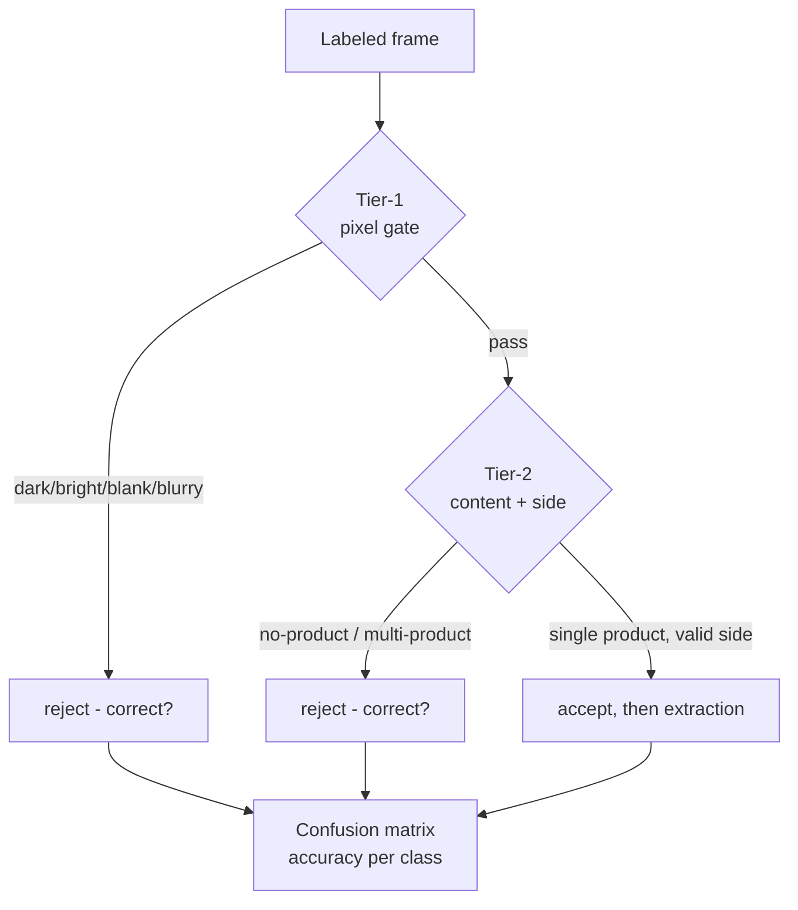

A confusion matrix reads like this (illustrative), where the off-diagonal cells are the errors you actually care about:

| expected ↓ / got → | pass | too_dark | blurry |
|---|---|---|---|
| **pass** | 8 ✅ | 0 | 1 ❌ (false reject) |
| **too_dark** | 0 | 5 ✅ | 0 |
| **blurry** | 2 ❌ (false accept — the dangerous cell) | 0 | 4 ✅ |

### 3. `metrics.py` — online operational observability

#### What it is, in general

Everything above is *offline* eval: quality measured on a fixed dataset before you ship. Once the system is live, you need the other half — **observability**: measuring the behavior of the running system on real traffic. This is the "Ops" in Ops/Eval, and it is a distinct discipline with its own canon.

The **three pillars of observability**:

- **Metrics** — cheap numeric aggregates over time (counts, durations, sums). "How many scans, how slow, how much did they cost." What `metrics.py` produces.
- **Traces** — the causal, per-request story: which nodes ran, in what order, how long each took. SkinGraph gets these from LangSmith.
- **Logs** — structured event records for forensic detail.

Two mnemonics tell you *which* metrics to emit:

- **RED** (for request-driven services): **R**ate, **E**rrors, **D**uration. How many requests, how many failed, how long they took.
- **USE** (for resources): **U**tilization, **S**aturation, **E**rrors.

The one non-obvious technical point: to get percentile latencies (p50/p95/p99), you emit a **histogram**, not an average. An average of 3 seconds can hide a p99 of 40 seconds, and the tail is what fills your support queue. A histogram buckets observations so a time-series database can compute any percentile after the fact.

The typical stack: your app exposes metrics on a `/metrics` endpoint, Prometheus scrapes it into a time-series database, Grafana draws dashboards, and Alertmanager pages you when a metric crosses a line.

#### The ways people build it

- **Metrics libraries**: `prometheus_client` (pull model — you expose `/metrics`, Prometheus scrapes) or OpenTelemetry / StatsD (push model). Counters only go up, gauges go up and down, histograms capture distributions.
- **Tracing**: OpenTelemetry as the vendor-neutral standard, or LLM-specific tools (LangSmith, Langfuse) that understand tokens, prompts, and nested chains out of the box.
- **The LLM-specific twist**: on top of rate/errors/duration you also track **tokens and cost per model**, because spend is a first-class operational concern the way it never was for a CRUD app. A silent spike in tokens-per-request is both a cost bug and an early drift signal.

#### In SkinGraph

`src/metrics.py` is a compact, correct Prometheus integration on the default registry, so everything shows up on the `/metrics` endpoint the `Instrumentator` in `src/api/main.py` already exposes, with zero extra wiring:

- `SCANS_TOTAL` — Counter of scans by `status` and `entrypoint` (the **Rate** and **Errors** of RED).
- `SCAN_NODE_DURATION` — Histogram of per-node wall-clock with buckets from 0.05s to 40s (the **Duration** of RED, as a percentile-capable histogram).
- `SCAN_ESCALATIONS` / `SCAN_CORRECTIONS` — Counters for the Flash→Pro escalations and correction-loop retries, i.e. the router's behavior in the wild.
- `SCAN_TOKENS` / `SCAN_COST` — Counters of tokens and estimated USD by model, fed by `ScanUsageCallback` (a `UsageMetadataCallbackHandler` subclass) attached to the graph run config, which LangChain propagates to every Gemini call so no node code changes. `estimate_cost_usd` prices tokens from `MODEL_PRICES_USD_PER_MTOK`.

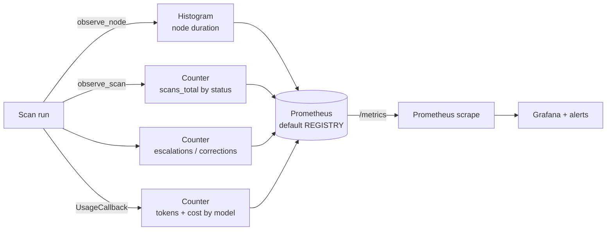

The thing to notice: `metrics.py` already measures latency and cost, but only *in production, in aggregate, invisibly*. It cannot answer "what is Flash's p95 on the golden set" before you ship, and its numbers live on a `/metrics` endpoint nobody looks at until something breaks. Components 4 and 5 close exactly those two gaps.

## Part 2 — What was added

The three components above cover quality (offline) and operations (online). The six below extend that spine along the two axes a recruiter probes for: measuring **latency and cost as deliberately as you measure accuracy**, and making all of it **visible, automated, and in the development loop**. All six are now implemented — each subsection closes with a **Shipped** pointer to the exact module and CI wiring, and everything runs offline in CI except the live drift canary.

### 4. Latency & cost benchmarking

#### What it is, in general

A benchmark measures how *fast* and how *expensive* the system is on a representative workload, reported as **distributions, not averages**. The standard LLM latency metrics, with their precise definitions:

| Metric | Definition |
|--------|-----------|
| **TTFT** (time to first token) | Time from sending the prompt to the first token back. Governs perceived responsiveness. |
| **E2E latency** | Full duration, prompt to complete response. `E2E = TTFT + generation time`. |
| **TPOT / ITL** (time per output token / inter-token latency) | Generation speed after the first token: `TPOT = (E2E − TTFT) / (output_tokens − 1)`. |
| **TPS** (tokens per second) | Throughput: `output_tokens / (t_last − t_first)`. |
| **RPS** (requests per second) | System capacity: completed requests / total seconds. |

And you report each at **percentiles**: p50 (the median, the experience half your users beat), p95 (the unlucky 5%, the usual SLA line), p99 (near worst case). Cost is reported the same way — USD per request and per thousand tokens — often weighted at p95 for cost-sensitive workloads.

#### The ways people build it

- **Load-testing harness** (Locust, k6, vegeta): fire many concurrent requests, measure throughput and tail latency under saturation. This is what you use to answer "how many users can I serve."
- **Golden-set replay-timed benchmark**: run a representative fixed set once, capture wall-clock and tokens per item, report the distribution. This is what you use to answer "how fast and costly is one scan, per model tier." It reuses the golden set you already have.
- **Client-side wall-clock vs. server metrics**: client-side includes network and queueing (what the user feels); server-side isolates compute (what you can optimize). Measure the one that matches the question.

The crucial design decision here is **track, do not gate**. Latency depends on the provider's load, the network, and the machine, so it is non-deterministic in a way accuracy (via replay) is not. Gating a merge on "p95 < 6s" would produce flaky red builds that teams learn to ignore. You *track* latency and cost as a recorded benchmark and trend, and at most gate on a large *relative* regression, never an absolute wall-clock in CI. Being explicit about that distinction — this is a benchmark, not a gate, and here is why — is itself a senior signal.

#### In SkinGraph

`evaluate.py --record` already makes the live calls; it just throws the timing away. The addition:

1. In `--record`, capture per-image wall-clock and the token counts already available from the usage callback, and write them into each cassette and the manifest alongside the extraction.
2. Add a `--bench` mode that aggregates those into p50/p95/p99 latency and mean/p95 USD-per-scan, **per model tier** (Flash vs. Pro), so you can state "Flash: p50 3.1s, p95 6.2s, $0.004/scan; Pro: p50 8.4s, p95 15s, $0.03/scan."
3. Report it, do not gate it — it is the offline benchmark counterpart to the production histogram in `metrics.py`, sharing the same cost function (`estimate_cost_usd`).

Illustrative output (real numbers land once `--bench` runs against the golden set):

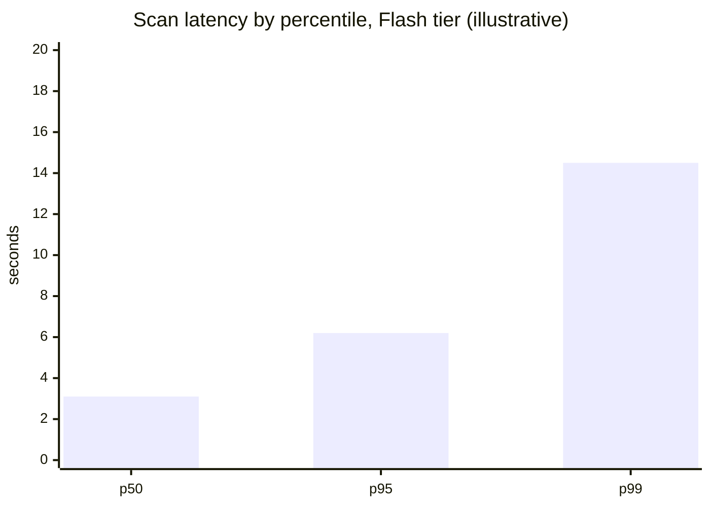

The portfolio line this earns: *"I measure latency and cost as distributions per model tier, and I gate quality but track performance — because one is deterministic and one is not."* That sentence is the entire Ops/Eval route in miniature.

**Shipped:** `eval/evaluate.py` wraps each live `--record` scan in LangChain's `get_usage_metadata_callback` (the same token signal `metrics.py` bills in production) and captures wall-clock + tokens + estimated cost into every cassette's `perf` block. `--bench` aggregates those into p50/p95/p99 latency and mean/p95 `$/scan` per model tier (percentiles in `eval/_stats.py`). Report-only, never gated; the `perf` field is optional, so cassettes recorded before it existed still replay.

### 5. Eval scorecard published from CI

#### What it is, in general

Right now your F1 gate emits a single pass/fail line into a CI log that scrolls away. A **scorecard** turns eval results into a durable, visible, comparable artifact: a report per commit, a trend over time, a dashboard. The principle is old and blunt — *if it is not visible, it is not managed* — and it catches a specific failure the gate cannot: a **slow regression**, where each PR drops F1 by half a point (individually passing the floor) until you have quietly lost five points over a quarter.

#### The ways people build it

Cheapest to fanciest:

- **CI job summary**: GitHub Actions lets you write Markdown to `$GITHUB_STEP_SUMMARY` and it renders on the run page. A per-run table with F1, per-image scores, and missed/hallucinated counts, for near-zero effort.
- **Artifact + history file**: write the results JSON as a build artifact, and append the aggregate to a committed history file (or a `gh-pages` / data branch) so you accumulate a time series.
- **Static dashboard**: render that history as a trend chart on a `gh-pages` site.
- **Badges**: a shields.io badge in the README shows current F1 / gate status at a glance.
- **Hosted platforms**: Braintrust, Langfuse, Weights & Biases, or Evidently if you want the managed version.

#### In SkinGraph

You already produce the data (`--save data/eval_results.json`, the manifest aggregates). The work is presentation:

1. In the `eval-replay` CI job, write the per-commit results to `$GITHUB_STEP_SUMMARY` as a table (aggregate F1, per-image P/R/F1, flash-vs-pro).
2. Append the aggregate to a history file so you can trend F1 across commits.
3. Add README badges for at-a-glance status.

What a published scorecard emits, at a glance (badges render on GitHub):

And the trend the history file lets you draw — the thing a single pass/fail line can never show:

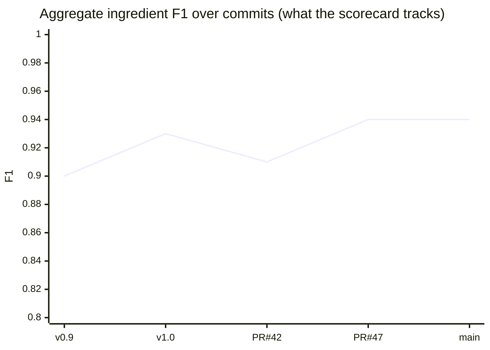

**Shipped:** `eval/scorecard.py` renders the replay results as a Markdown table onto `$GITHUB_STEP_SUMMARY`, appends the aggregate to `eval/history.jsonl` for trending across commits, and writes shields.io *endpoint* JSON to `docs/badges/` so the README badges track real numbers. It is wired into the `eval-replay` CI job with `if: always()`, so a regression still surfaces on the run summary even when the gate fails, and the history + badges upload as build artifacts.

### 6. Eval-diff PR bot

#### What it is, in general

This brings eval *into code review*. When a pull request changes something that affects quality — a prompt, a model id, the dataset — a CI job computes the eval on the base branch and on the PR, diffs them, and posts the before/after as a comment on the PR itself. The reviewer sees "this prompt change moved F1 from 0.94 to 0.91 and cost +12%" inline, and a probabilistic change becomes reviewable like any code change. This is the concrete meaning of "evals in the development loop," and it is the thing interviewers on the Ops/Eval route most want to see.

#### The ways people build it

- **Path-filtered PR trigger**: the job only runs when files that matter change (the prompt module, the cassettes, the dataset), so you do not diff on unrelated PRs.
- **Base vs. head scoring**: check out the base ref and score it, score the PR, compute the delta. Or store the base results as an artifact/history entry and diff against that.
- **Post the comment**: `actions/github-script`, the GitHub API, or an off-the-shelf action (Promptfoo ships one; the `reviewdog` pattern generalizes it).

#### In SkinGraph

Your staleness guard already *forces* a re-record when the scanner prompt changes — you are one step from surfacing the *impact* of that change instead of just demanding a re-record. The addition: on PRs touching `src/prompts/scanner.py` or `eval/cassettes/`, run the eval on both versions and post a comment with the F1 delta, the per-image regressions (which specific labels got worse), and the cost delta.

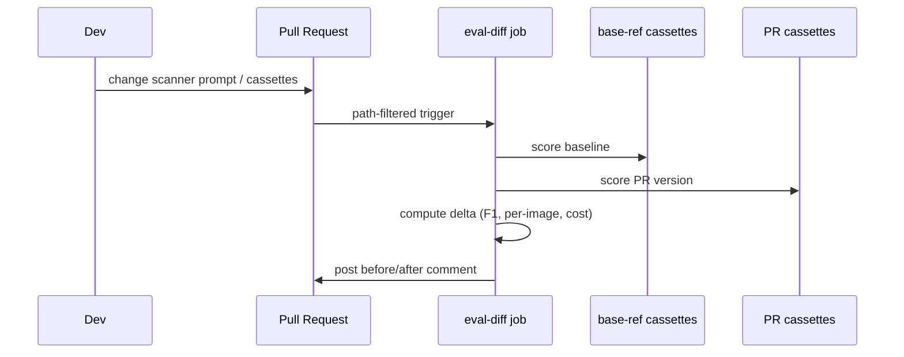

**Shipped:** `eval/diff.py` diffs two replay result sets (from `evaluate.py --replay --save`) into a before/after comment — aggregate F1 delta, per-image regressions ordered worst-first, and `$/scan` when timing is present. `.github/workflows/eval-diff.yml` is path-filtered to PRs touching `src/prompts/scanner.py`, `eval/cassettes/`, or the scoring data; it scores the base ref and the PR head offline (the staleness guard guarantees the head cassettes match the head prompt) and upserts a single PR comment.

### 7. Nightly live canary (drift detection)

#### What it is, in general

Your replay gate has one blind spot by construction: it never calls the API, so it cannot see the API *change*. But you do not control Gemini. Providers silently update models behind endpoints, and a `flash-lite` that read your labels perfectly last month can quietly regress. A **canary** is a small scheduled *live* run against a few known inputs, diffed against a committed baseline, whose entire job is to notice when the ground moves under you. The name is the coal-mine canary: a cheap early-warning sensor, not the full test suite.

#### The ways people build it

- **Scheduled live micro-eval**: a cron job runs a handful of golden inputs live, scores against the baseline (the cassette), and alerts on divergence. Cheap, targeted, runs nightly.
- **Statistical drift detection**: at production scale you monitor distributions — Kolmogorov-Smirnov tests, KL divergence, embedding-distribution shift (Evidently, Alibi Detect) — to flag drift without a labeled baseline.
- **The cheapest signal of all**: the pass/fail rate of your deterministic checks. A sudden spike in malformed / schema-invalid outputs is the earliest sign of silent provider-side change, and you already have the schema (`ProductExtraction`) to measure it.
- **Preventive hygiene**: pin model versions where possible, keep a compatibility matrix, and subscribe to provider changelogs so a version bump is a decision, not a surprise.
- **Canary/shadow deploy**: before adopting a new model version, run it against the golden set in shadow and compare, so you never roll a regression to users.

#### In SkinGraph

A scheduled GitHub Action, a few times a week, that runs 2–3 golden images live against Gemini, diffs the extraction against the committed cassette, and opens an issue (or pings a channel) on divergence, a latency regression, or a schema-validation failure. It needs the `GOOGLE_API_KEY` as a repo secret and costs pennies per run. The story writes itself: *"I do not control the model's versioning, so drift detection against a pinned baseline is an operational necessity, not a nice-to-have."*

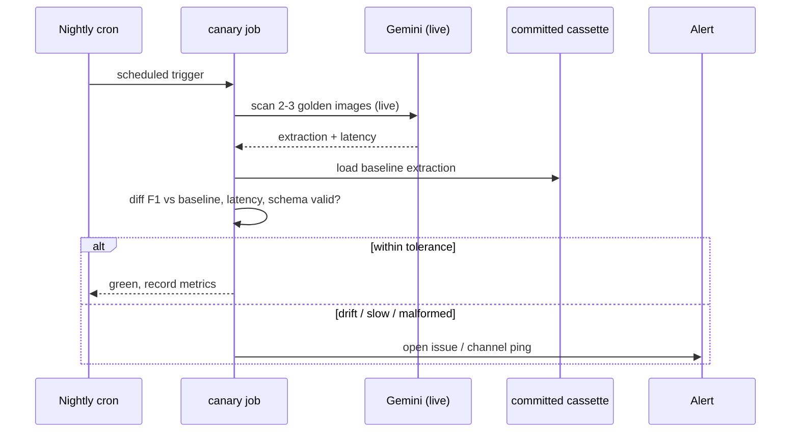

**Shipped:** `eval/canary.py` runs a couple of golden images live against Gemini, diffs each fresh read against its pinned cassette (F1 within a tolerance, latency ceiling, schema-valid `ProductExtraction`), and exits non-zero on divergence. `.github/workflows/canary.yml` runs it twice a week and on demand, opening (or commenting on) a `canary-drift` issue when it trips. Because the golden photos stay out of git, the job self-tests with `--dry-run` (replay the cassette as the "live" read) until the private canary images and `GOOGLE_API_KEY` secret are wired — the one component here that is genuinely online.

### 8. Coach faithfulness eval

#### What it is, in general

The coach generates free-flowing bilingual prose, so there is no single reference string to match — this is where reference-based F1 runs out and you evaluate **properties** of the output instead. For any system that must not make things up, the property that matters most is **faithfulness** (also called **groundedness**): *every claim in the output is supported by the source it was given.* It is consistently rated the single most important metric for retrieval- and tool-grounded generation, because it is the direct measure of hallucination.

For SkinGraph there is a second, stricter property that ordinary chatbots do not have: **mandated-content coverage.** The coach must not merely avoid inventing warnings — it must *include* every safety finding the deterministic auditor produced. A dropped warning is a safety defect, the exact failure mode the project brief calls "a defect, not a UI glitch."

#### The ways people build it

Two approaches, and the order matters:

- **Deterministic coverage check (do this first).** When the required content is a known set (your audit findings), faithfulness reduces to set inclusion: is every finding present in the rendered card? No model needed — it is a deterministic assertion, free, reproducible, and *gateable*. This is a far more defensible eval than a generic judge rubric because it cannot be gamed and it maps one-to-one onto the safety requirement.
- **LLM-as-judge (layer on later).** For the properties you cannot check with a rule — tone, 薬機法 (Pharmaceutical Affairs Law) compliance, whether the prose over-claims — you use a judge model. The RAGAS-style recipe: an LLM extracts discrete claims from the output, then an NLI step checks each claim against the grounded findings, and the score is supported-claims / total-claims. Remember the caveats from Section 0: judges are biased (length, position, self-preference) and non-deterministic, so you validate them against a human-labeled sample and never let a judge be the *only* thing standing between a hallucinated safety claim and a user.

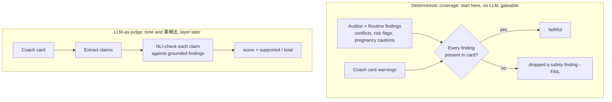

#### In SkinGraph

The coach is the only LLM in the safety path (per the key invariants) and had **zero** eval coverage — it was the highest-value gap in the repo. The deterministic version is well-defined against the existing structures: the auditor and routine advisor already emit findings deterministically (against `conflict_matrix.json`, `function_groups.json`, the pregnancy-flagged INCI set), and the coach's output contract (`CoachResponse` → `Recommendation.warnings`, `RoutineFitCard`) is structured. So the eval is: for a set of profile+product fixtures, assert every deterministic finding surfaces in the corresponding card's `warnings`. That is a **gateable groundedness metric with no model in the loop**, and it is the differentiator no other candidate's portfolio will have. The judge layer for 薬機法 tone is a strong follow-up, not a prerequisite.

**Shipped:** `eval/coach_eval.py` runs `coach_node` with the Gemini call stubbed to return *empty* warnings, so every caution left on the rendered card is the coach's code-injected deterministic one; it then asserts each mandated caution (pregnancy / dehydration / sun-sensitivity / introduction-pacing) survived. Coverage is set inclusion, gated at 1.0 in the `coach-faithfulness` CI job (offline, no key). The fixtures are an *independent* specification — `tests/test_coach_eval.py` proves the gate is not tautological by dropping a flag set and watching coverage fall below 1.0. The 薬機法-tone judge remains the documented follow-up.

### 9. Router threshold sweep (cost–accuracy Pareto)

#### What it is, in general

Whenever a system has a knob that trades quality for cost, that knob should be set *from data*, not by feel. SkinGraph's knob is the **Flash→Pro escalation confidence threshold**: below it, the cheap model's answer is rejected and the expensive model runs. A **threshold sweep** evaluates every setting of that knob over a recorded set, computes the resulting (accuracy, cost) pair for each, and plots the **Pareto frontier** — the set of settings where you cannot get more accuracy without paying more, or pay less without losing accuracy. You then pick the point that meets your quality bar at the lowest cost.

This is the most "Chip Huyen" artifact of the six, and the literature backs the payoff: well-tuned cascades routinely cut cost 30–85% while keeping ~95% of quality, and the papers are explicit that **confidence calibration matters more than raw accuracy** — the escalation decision is only as good as the confidence score it is thresholding.

#### The ways people build it

- **Offline sweep over recorded outputs**: record both the cheap and expensive model over the golden set once, then for each candidate threshold compute which items would escalate, and the resulting F1 and \$/scan. Pure post-processing, no new API calls per threshold.
- **Choosing the point**: either by SLA ("cheapest setting with F1 ≥ 0.92") or by a cost-sensitivity term λ, minimizing `error_rate + λ · cost`, where λ encodes how much a mistake is worth relative to a dollar.
- **Routing vs. cascading** (the two shapes of the idea): *routing* uses an upfront classifier to pick a model before running anything (adds classifier latency); *cascading* runs the cheap model first and escalates on low confidence (adds the latency of sometimes running twice). SkinGraph is a cascade.

#### In SkinGraph

The cassette machinery already supports `--model both`, so you can record Flash and Pro over the golden set and sweep the escalation threshold entirely offline, plotting F1 against \$/scan. The deliverable is a single defensible sentence: *"we ship threshold τ = 0.7 because it buys 0.90 F1 at \$0.009/scan, versus Pro-only's 0.92 at \$0.03."*

The Pareto plane, with the cascade pulling toward the cheap-and-accurate corner:

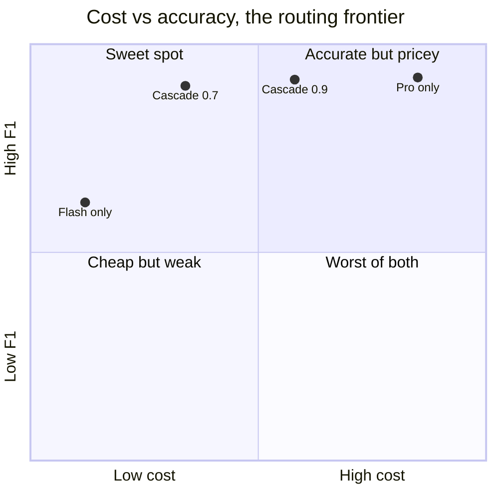

**Shipped:** `eval/sweep.py` replays the recorded Flash and Pro cassettes and, for each candidate threshold τ, decides per image which tier the cascade would have used, then computes the resulting aggregate F1 and `$/scan` (reusing `metrics.py`'s cost function). It prints the full curve, marks the currently-shipping `FLASH_ACCEPT_THRESHOLD`, flags the non-dominated Pareto points, and — given `--min-f1` — names the cheapest τ that clears the bar. Pure post-processing (no per-threshold API calls); it needs a `--model both` record first. Decision aid, never a gate.

## Part 3 — Sequencing and the one caveat

The six were built in the signal-per-effort order below; each is now live in the repo (see the **Shipped** pointers above), so this reads as the build log rather than a plan:

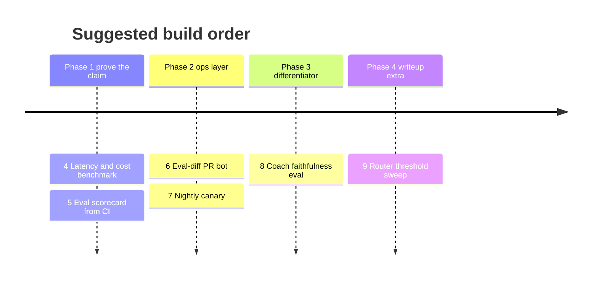

- **4 + 5 first.** They directly prove "I can measure accuracy *and* latency properly" and produce a *visible* artifact, which is the literal ask of the Ops/Eval route.
- **6 or 7 next** for the automation/ops story (evals in the dev loop; drift detection you do not control).
- **8 as the differentiator** — a gateable faithfulness metric on a safety-critical generative step is rare in a portfolio.
- **9 as a writeup** — a great README/blog section if you have time, reusing machinery you already have.

**The one caveat that touches all of them.** Per the project's own notes, the F1 gate currently covers only a handful of readable back-label photos. Small-N evals are a legitimate place to build the *machinery* from — every technique above works the same at N=4 or N=40 — but the writeup must be honest about the sample size, and the single highest-leverage piece of non-code work is growing the annotated set to roughly 15–20 readable back labels, **stratified by failure mode** (glare, bottle curvature, JP vs. KR script, embossed low-contrast text). That is cheap annotation labor with outsized credibility payoff: it makes every metric in this document mean more, and it turns "I built an eval harness" into "I built an eval harness and can show it discriminating across the failure modes that matter." It is also the flywheel from Section 0 turning once by hand — and the rejection store is already wired to feed it.

## Glossary

| Term | Meaning |
|------|---------|
| **INCI** | International Nomenclature of Cosmetic Ingredients — the canonical ingredient naming SkinGraph scores in, which makes the metric language-independent. |
| **Precision / Recall / F1** | Fraction of outputs that were correct / fraction of correct answers found / their harmonic mean. |
| **Golden set** | Curated inputs with hand-verified correct answers; the reference an eval scores against. |
| **Cassette** | A recorded model output replayed offline so tests are deterministic and free. |
| **Staleness guard** | A hash of the prompt/model that refuses to replay recordings made under a different prompt. |
| **Gate vs. track** | Block a merge on it, vs. record and trend it without blocking. |
| **Confusion matrix** | Table of predicted vs. actual class, exposing *which* errors a classifier makes. |
| **TTFT / E2E / TPOT / TPS** | Time to first token / end-to-end latency / time per output token / tokens per second. |
| **p50 / p95 / p99** | Median / 95th / 99th percentile — the distribution, not the average. |
| **RED / USE** | Rate-Errors-Duration (services) / Utilization-Saturation-Errors (resources) — which metrics to emit. |
| **Faithfulness / groundedness** | Every claim in generated output is supported by its source; the direct measure of hallucination. |
| **LLM-as-judge** | Using a model to score output when no single reference answer exists; flexible but biased. |
| **Drift** | Output quality changing over time, often from an upstream provider changing the model. |
| **Canary** | A small scheduled live check against a baseline, as an early-warning sensor for drift. |
| **Pareto frontier** | The set of configurations where you cannot improve one axis (accuracy) without worsening another (cost). |
| **Cascade / routing** | Run cheap-then-escalate-on-low-confidence / pick the model upfront with a classifier. |
| **EDD** | Evaluation-Driven Development — define "good" as evals first, let them drive the lifecycle. |

## Sources

- [Chip Huyen — Common pitfalls when building generative AI applications](https://huyenchip.com/2025/01/16/ai-engineering-pitfalls.html)
- [Chip Huyen's Evaluation-Driven Development (EDD) framework — notes](https://medium.com/@keerthanams1208/chip-huyens-evaluation-driven-development-edd-framework-from-ai-engineering-a2939cc9ecf8)
- [What is F1 Score? An Essential Metric in LLM Evaluation — Data Science Dojo](https://datasciencedojo.com/blog/understanding-f1-score/)
- [Understand LLM latency and throughput metrics — Anyscale Docs](https://docs.anyscale.com/llm/serving/benchmarking/metrics)
- [LLM API Provider Performance KPIs 101: TTFT, Throughput & End-to-End Goals — DeepInfra](https://deepinfra.com/blog/llm-api-provider-performance-kpis-101)
- [Faithfulness — DeepEval](https://deepeval.com/docs/metrics-faithfulness)
- [RAG evaluation — Anyscale Docs](https://docs.anyscale.com/rag/evaluation)
- [RAGAS, TruLens, DeepEval: LLM Evaluation Frameworks compared — Atlan](https://atlan.com/know/llm-evaluation-frameworks-compared/)
- [LLM-as-a-Judge — Langfuse](https://langfuse.com/docs/evaluation/evaluation-methods/llm-as-a-judge)
- [Eliminating Flaky Tests: Using VCR tests for LLMs — Anay Nayak](https://anaynayak.medium.com/eliminating-flaky-tests-using-vcr-tests-for-llms-a3feabf90bc5)
- [VCR — record and replay HTTP interactions](https://github.com/vcr/vcr)
- [CI/CD for Evals: Running Prompt & Agent Regression Tests in GitHub Actions — Kinde](https://www.kinde.com/learn/ai-for-software-engineering/ai-devops/ci-cd-for-evals-running-prompt-and-agent-regression-tests-in-github-actions/)
- [CI/CD for LLM apps with Evidently and GitHub Actions](https://www.evidentlyai.com/blog/llm-unit-testing-ci-cd-github-actions)
- [CI/CD Integration for LLM Eval — Promptfoo](https://www.promptfoo.dev/docs/integrations/ci-cd/)
- [How to Monitor LLM Drift in Production](https://dasroot.net/posts/2026/02/monitor-llm-drift-production/)
- [Detecting drift in production applications — AWS Prescriptive Guidance](https://docs.aws.amazon.com/prescriptive-guidance/latest/gen-ai-lifecycle-operational-excellence/prod-monitoring-drift.html)
- [LLM Routing and Model Cascades: How to Cut AI Costs Without Sacrificing Quality — TianPan](https://tianpan.co/blog/2025-11-03-llm-routing-model-cascades)
- [A Unified Approach to Routing and Cascading for LLMs — arXiv](https://arxiv.org/html/2410.10347v3)
- [Rational Tuning of LLM Cascades via Probabilistic Modeling — arXiv](https://arxiv.org/pdf/2501.09345)
