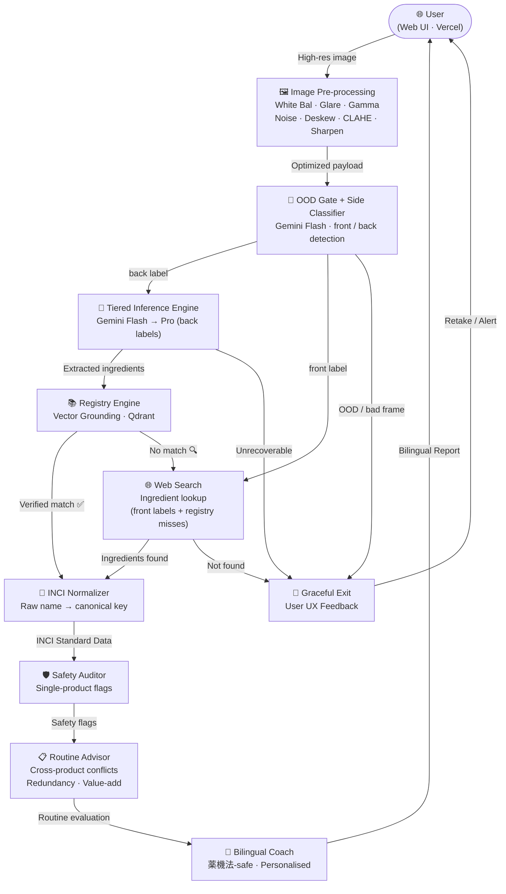

# 🌿 SkinGraph

> Snap a photo of any skincare label and get a bilingual, safety-checked, personalised recommendation in seconds.

[](https://github.com/ShinBellator/skingraph/actions/workflows/ci.yml)
[](https://github.com/ShinBellator/skingraph/actions/workflows/deploy.yml)


-FF9900?style=for-the-badge&logo=amazonaws&logoColor=white)

**[▶️ Live demo](https://skingraph-production.up.railway.app/docs)** · **[📖 Full docs](README.md)** · **[🐛 Report a bug](https://github.com/ShinBellator/skingraph/issues)** · **[💡 Request a feature](https://github.com/ShinBellator/skingraph/issues)**

---

## 📑 Table of Contents

- [Highlights](#-highlights)
- [Overview](#ℹ️-overview)
- [Tech stack](#-tech-stack)
- [Architecture](#-architecture)
- [Design decisions](#-design-decisions)
- [Installation](#️-installation)
- [Usage](#-usage)
- [Can you trust it?](#️-can-you-trust-it)
- [Limitations & roadmap](#-limitations--roadmap)
- [Contributing & Feedback](#-contributing--feedback)
- [Learn More](#-learn-more)
- [License](#-license)

---

## 🌟 Highlights

- 📸 **Scan, don't type** — point your camera at a Japanese, Korean, or English label and SkinGraph reads the ingredients for you.
- 🛡️ **Safety you can trust** — ingredient-conflict and irritant checks run on deterministic rules, *not* a language model's guess, so the verdict is reproducible.
- 🧠 **Smart, not expensive** — a fast model handles ~80% of labels; a heavier one is called only for the hard, blurry, low-contrast cases.
- 📋 **Knows your whole routine** — a new product is checked against everything already on your shelf for conflicts, redundancy, and value-add.
- 💬 **Bilingual coach** — advice in English *and* Japanese, written to stay within Japan's `薬機法` cosmetics-advertising rules.
- ▶️ **Live right now** — try the interactive API at the [live demo](https://skingraph-production.up.railway.app/docs) without installing anything.

---

## ℹ️ Overview

SkinGraph answers the questions you actually have when you pick up a new product: *Is it safe for me? Does it clash with what I already use? Can I use it while pregnant? When should I apply it?* Instead of asking you to decode a wall of katakana, it reads the label itself — runs the photo through an image pipeline and a vision-language model, grounds what it sees against a curated ingredient registry, runs a deterministic safety audit, and hands the result to a bilingual "coach" that explains it in plain English and Japanese.

**How it works (in one breath):** a pipeline of small steps — image cleanup → input gating (rejects blurry, empty, or multi-product photos) → tiered vision-language reading → registry grounding → ingredient-name normalisation → deterministic safety + routine audit → bilingual coaching.

### How it compares

Plain OCR can read the characters on a label but can't tell you that two of those ingredients shouldn't be layered. A raw vision-language model is far more capable, but will happily *invent* an ingredient list for a photo of your cat. SkinGraph sits deliberately in between: it uses the model for **reading**, but grounds every result against a verified registry and makes every **safety** decision with deterministic rules — so the parts that actually matter for your skin are reproducible, not probabilistic.

### ✍️ Author

SkinGraph is built by **David Valls** ([GitHub @ShinBellator](https://github.com/ShinBellator)). It started from a simple, recurring question — *"is this product actually right for me, and does it fit what I already use?"* — and grew into a system rigorous enough to be trusted with safety-critical data.

---

## 🧰 Tech stack

- **Orchestration** — LangGraph (StateGraph + conditional routing)
- **VLM inference** — Google Gemini Flash / Pro (`langchain-google-genai`)
- **Vector search** — Qdrant + fastembed / ONNX Runtime (`multilingual-e5-small`)
- **Data contracts** — Pydantic v2
- **Image processing** — Pillow + NumPy (7-step preprocessing)
- **Persistence** — SQLite (profiles + routine shelf)
- **API** — FastAPI + Uvicorn
- **Frontend** — React + Vite + TypeScript
- **Containerisation** — Docker (multi-stage) + docker-compose
- **Live hosting** — Railway (API) + Vercel (UI)
- **Cloud (reference)** — Terraform → AWS ECS Fargate
- **Observability** — LangSmith + Prometheus `/metrics`
- **Tooling** — Poetry · pytest · python-dotenv

> Full per-component breakdown and repo layout in the [full technical README](README.md).

---

## 🏗️ Architecture



The full LangGraph state-machine diagram (every node, router, and confidence threshold) is in the [full technical README](README.md).

---

## 🧭 Design decisions

The five calls that define the system — full reasoning in the [full technical README](README.md):

1. **Flash-first tiered inference** — ~80% of labels are read by Flash at 1/10 the cost of Pro; Pro is invoked only for low-confidence, visually hard cases. Routing is deterministic on the confidence score.
2. **Deterministic self-correction** — a dedicated Correction Node reads the failed extraction and injects targeted feedback into the next Flash prompt. Zero added LLM cost, up to 2 iterations before Pro escalation.
3. **Registry grounding** — Qdrant vector search snaps probabilistic VLM output to a verified ingredient list. Un-registered products auto-log to a worklist instead of failing silently.
4. **Deterministic safety chain (no LLM)** — the Auditor and Routine Advisor run rule-matching against a conflict matrix and function-group taxonomy. Only the Coach calls an LLM, to render grounded findings as `薬機法`-safe bilingual prose.
5. **Defense-in-depth input gating** — a zero-cost pixel pre-flight plus a content check folded into the side classifier reject no-product and multi-product frames *before* the scanner is forced to fabricate one.

---

## ⬇️ Installation

**Requirements:** Python 3.10+, [Poetry](https://python-poetry.org/docs/), and a Google AI (Gemini) API key. Runs on macOS, Linux, and Windows.

```bash
git clone https://github.com/ShinBellator/skingraph.git
cd skingraph
poetry install
```

Then copy `.env.example` to `.env` and add your `GOOGLE_API_KEY`.

> Prefer containers? `docker compose up api` brings the whole service up on `http://localhost:8000`.

---

## 🚀 Usage

Don't want to install anything? Try the **[live interactive demo](https://skingraph-production.up.railway.app/docs)** right in your browser.

Locally, scanning a label is a one-liner:

```bash
# Scan a single label — front/back is detected automatically
poetry run python run_pipeline.py data/golden_set/prod_001.jpg

# Personalise it to a saved user, and add the product to their routine
poetry run python run_pipeline.py data/golden_set/prod_001.jpg --user-id <id> --add-to-routine

# Or run the whole thing as an API
poetry run uvicorn src.api.main:app --reload   # → http://127.0.0.1:8000/docs
```

That's the elevator pitch — the [full docs](README.md) cover the architecture, the image pipeline, every CLI flag, and the API surface.

---

## 🛡️ Can you trust it?

- ✅ **Tested & green** — see the CI badge above; it runs on every push.
- 🔌 **Offline, deterministic tests** — every model and vector-store call is mocked, so `poetry run pytest` runs with no network, no API key, and no surprises.
- 📊 **Measured accuracy** — ingredient extraction scores **F1 0.94** (fast model) / **0.98** (pro model) on a hand-annotated set of Japanese, Korean, and English labels.
- 📄 **Open licence** — Apache 2.0 (see [LICENSE](LICENSE)).
- 📬 **Maintained** — check the commit history for the latest activity; questions and reports go through [GitHub Issues](https://github.com/ShinBellator/skingraph/issues).

---

## 🧭 Limitations & roadmap

**What's currently limited:**
- **Any label language accepted, JP best-tuned** — the registry/normalizer/audit data are JP-centric, so non-JP labels may leave some ingredients unmatched (surfaced, not fatal).
- **Registry covers the golden-set products** — 11 verified products; un-registered products are auto-logged to `registry_candidates.json`.
- **Persistence depends on the host** — on the live Railway deploy, `users.db` and the Qdrant index live on a volume and survive restarts. On the reference AWS/ECS path, SQLite can't mount on EFS, so profiles reset on task replacement (migrate to RDS Postgres for production there).

**Roadmap:**
- [ ] 🌐 **Semantic multilingual support** — map JP / KR / EN names to a single Universal INCI ID.
- [ ] 🏷️ **Barcode integration** — pre-scan JAN/UPC codes to skip the VLM entirely for known products.
- [x] 📱 API abstraction · [x] 🐳 containerisation · [x] 🚀 live deployment · [x] ☁️ cloud reference (Terraform → AWS ECS Fargate).

---

## 💭 Contributing & Feedback

Found a bug, or a label it misreads? **[Open an issue](https://github.com/ShinBellator/skingraph/issues)** — a photo of the label helps a lot. Ideas and pull requests are welcome too, including ingredient-registry additions and translations of this README.

---

## 📖 Learn More

- 📘 **[Full technical README](README.md)** — architecture diagrams, the 7-step image pipeline, deployment, and observability.
- 🧪 **[Live API docs](https://skingraph-production.up.railway.app/docs)** — interactive Swagger UI for the running service.
- 🐛 **[Issues & discussions](https://github.com/ShinBellator/skingraph/issues)** — the fastest way to reach the project.

---

## 📄 License

Released under the [Apache 2.0](LICENSE) license.

<div align="center">

Built with ❤️ and matcha 🍵 by [David Valls](https://github.com/ShinBellator)

</div>
