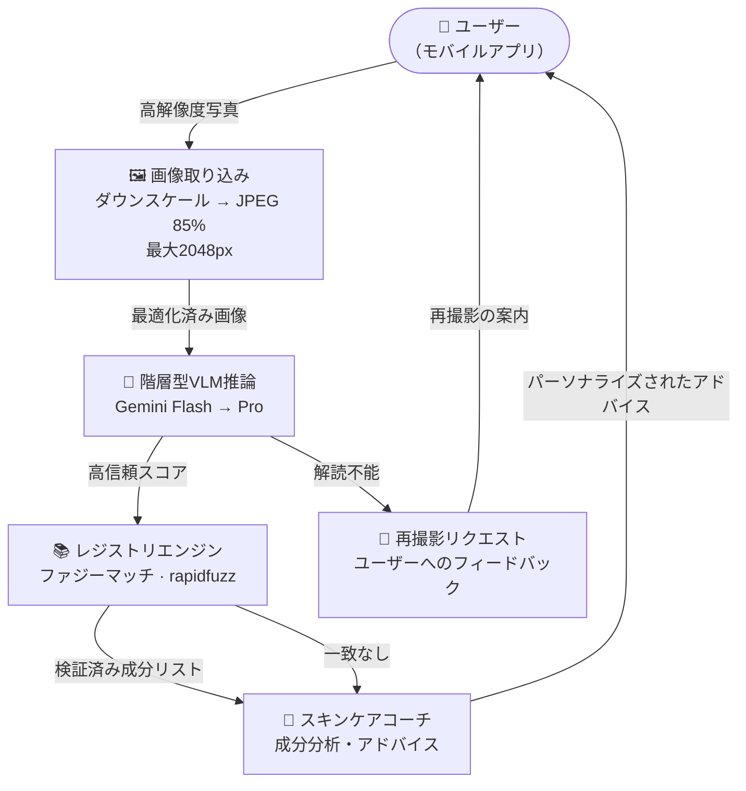
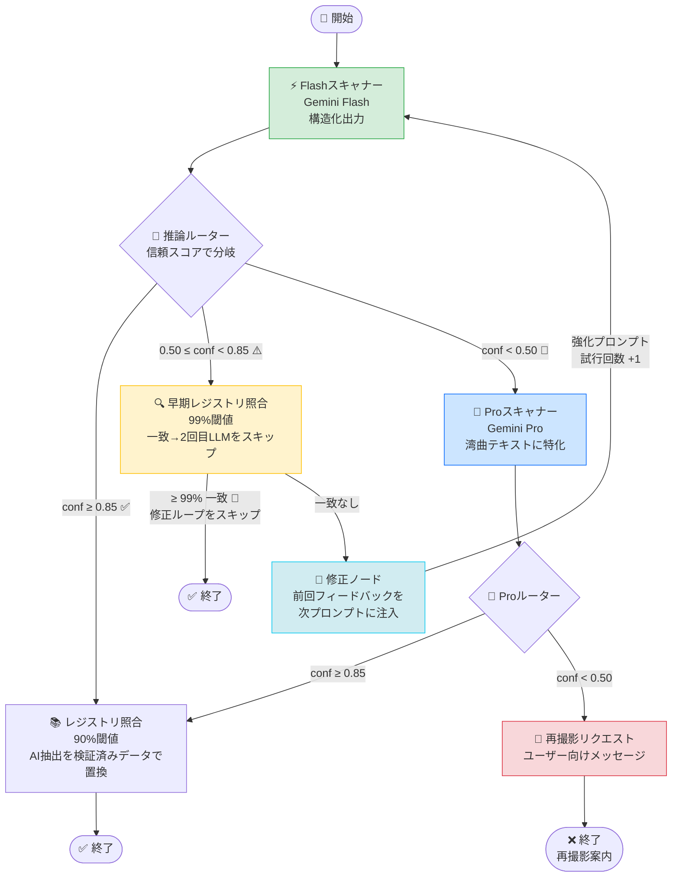
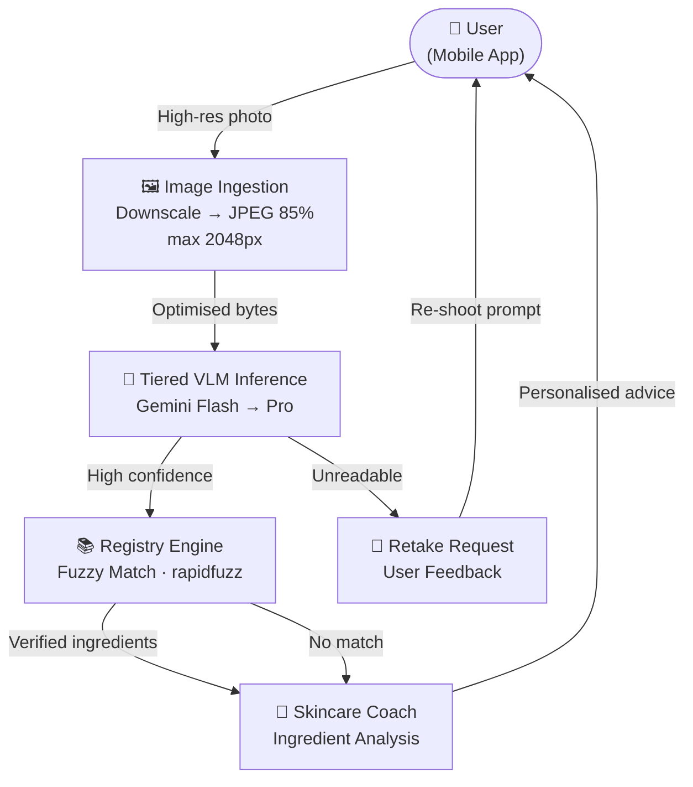
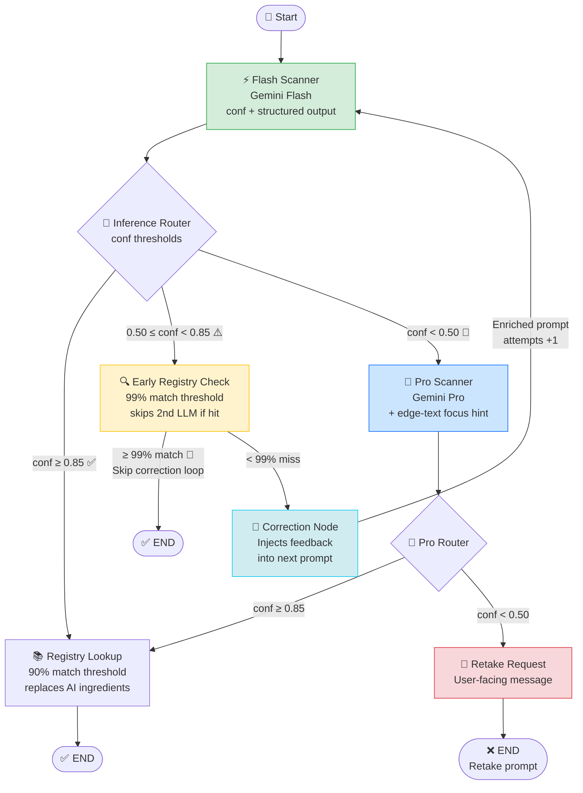

# 🌿 SkinGraph — AI日本語スキンケアラベル解析パイプライン

<div align="center">


**日本語スキンケア商品のラベルを、階層型VLM推論・自己修正ループ・ファジーマッチングで解析するエージェント型AIパイプラインです。**

[日本語](#japanese) · [English](#english)

</div>

---

<a name="japanese"></a>

## 🧠 このプロジェクトについて

SkinGraphは、単純なOCR APIコールではなく、**3つのエンジニアリング設計思想**をもとに構築されています。

1. **階層型推論によるコスト最適化** — 軽量なFlashモデルが全体の80%のケースを処理し、Proモデルは信頼スコアが不十分なときだけ起動します（コストは約10分の1）。
2. **自己修正ループによる精度向上** — 1回目の抽出が失敗した場合、その失敗内容を構造化フィードバックとして次のプロンプトに注入し、2回目の精度を測定可能な形で向上させます。
3. **レジストリ照合によるLLMコール削減** — 修正ループに入る前に、検証済み商品データベースとのファジーマッチングを実行します。99%以上の一致が得られた場合、2回目の推論をスキップし、約$0.007を節約します。

---

## 🏗️ システムアーキテクチャ

### Level 2 — コンポーネント概要



### Level 3 — LangGraphノードフロー



---

## ✨ 主な機能

| 機能 | 詳細 |
|---|---|
| ⚡ **階層型VLM推論** | Flash優先、信頼スコアに基づいてProへ自動エスカレーション |
| 🔄 **自己修正ループ** | 最大2回のフィードバック付き再試行 |
| 🔍 **早期レジストリ照合** | 初回スキャン後に99%ファジーマッチ → 修正LLMコールをスキップ |
| 📚 **検証済みレジストリマッチング** | rapidfuzz WRatioスコアリングによるキュレーション済みデータベース照合 |
| 🗾 **日本語ラベル特化** | JCIA基準成分正規化、医薬部外品検出 |
| 🖼️ **画像最適化** | 推論前に最大2048pxへ自動ダウンスケール（ペイロード60〜80%削減） |
| 🔭 **完全なオブザーバビリティ** | LangSmithトレーシング（ノード別レイテンシ・信頼スコア・ルーティング） |
| 🧩 **構造化出力契約** | Pydantic v2による`ProductExtraction`スキーマ強制 |

---

## 🚀 セットアップ

```bash
git clone <your-repo-url>
cd skincare-coach
poetry install
```

`.env`ファイルを作成:

```env
GOOGLE_API_KEY=your_key_here
LANGCHAIN_TRACING_V2=true
LANGCHAIN_API_KEY=your_langsmith_key
LANGCHAIN_PROJECT=skincare-architect-v1
LANGCHAIN_HIDE_INPUTS=true
```

実行:

```bash
# 単一画像（裏ラベル・デフォルト）
poetry run python run_pipeline.py data/golden_set/prod_001.jpg

# 表ラベル
poetry run python run_pipeline.py data/golden_set/prod_001.jpg --image-type front

# Flash vs Pro 比較テスト
poetry run python test_scanner.py
```

---

## 🗺️ ロードマップ

- [ ] 🔬 安全性監査ノード（EWG / CosIng 成分リスクスコアリング）
- [ ] 💬 コーチノード（パーソナライズされたルーティンアドバイス）
- [ ] 📱 モバイルAPIレイヤー（FastAPI）
- [ ] 🏷️ バーコード / JANコード事前照合（既知商品のVLMスキップ）
- [ ] 🌐 多言語ラベル対応（韓国語・中国語）

---

<div align="center">

Built with ❤️ and matcha 🍵

</div>

---
---

<a name="english"></a>

## 🧠 What Makes This Different

Most OCR pipelines are a single API call wrapped in a try/except. SkinGraph is architected around **three core engineering insights**:

1. **Tiered inference is cheaper than retry-on-failure** — a lightweight Flash model handles 80% of cases at 10× lower cost. Pro only activates when confidence is genuinely insufficient.
2. **Self-healing beats prompt engineering alone** — a correction feedback loop injects structured critique from failed attempts directly into the next prompt, measurably improving second-pass confidence.
3. **Registry short-circuit prevents redundant LLM calls** — a fuzzy match against a verified product database runs *before* the correction loop. A 99%+ hit skips the second inference entirely, saving ~$0.007 per image.

---

## 🏗️ System Architecture

### Level 2 — Component Overview



### Level 3 — LangGraph Node Flow



---

## ✨ Key Features

| Feature | Detail |
|---|---|
| ⚡ **Tiered VLM Inference** | Flash-first with automatic Pro escalation based on confidence score |
| 🔄 **Self-Correction Loop** | Up to 2 feedback-enriched retries before escalation |
| 🔍 **Early Registry Short-Circuit** | 99% fuzzy match after first scan skips the correction LLM call |
| 📚 **Verified Registry Matching** | rapidfuzz WRatio scoring against a curated product database |
| 🗾 **Japanese Label Specialisation** | JCIA-standard ingredient normalisation, quasi-drug (`医薬部外品`) detection |
| 🖼️ **Image Optimisation** | Auto-downscale to 2048px max before inference — cuts payload 60–80% |
| 🔭 **Full Observability** | LangSmith tracing with per-node latency, confidence scores, and routing decisions |
| 🧩 **Structured Output Contract** | Pydantic-enforced `ProductExtraction` schema — no prompt-parsing fragility |

---

## 🛠️ Tech Stack

```
Orchestration     LangGraph (StateGraph + conditional routing)
VLM Inference     Google Gemini Flash / Pro via langchain-google-genai
Fuzzy Matching    rapidfuzz (WRatio scorer)
Data Contracts    Pydantic v2
Image Processing  Pillow (LANCZOS downscale → JPEG 85)
Observability     LangSmith
Config            python-dotenv
Package Manager   Poetry
```

---

## 📁 Project Structure

```
skincare-coach/
├── src/
│   ├── graph.py          # LangGraph workflow definition & routers
│   ├── state.py          # AgentState TypedDict + Pydantic data contracts
│   ├── config.py         # Centralised thresholds & model IDs
│   └── nodes/
│       ├── scanner.py    # Flash & Pro VLM nodes + image optimisation
│       ├── registry.py   # Fuzzy registry match (early check + full lookup)
│       ├── auditor.py    # Safety audit node (in progress)
│       └── coach.py      # Advice generation node (in progress)
├── data/
│   ├── golden_set/       # 40 labelled product images for evaluation
│   ├── registry.json     # Verified product + ingredient database
│   └── ingredients.json  # JCIA ingredient reference
├── run_pipeline.py       # CLI entry point
└── test_scanner.py       # Flash vs Pro head-to-head test harness
```

---

## 🚀 Getting Started

### Prerequisites

- Python 3.10+
- [Poetry](https://python-poetry.org/docs/)
- Google AI API key (Gemini access)

### Installation

```bash
git clone <your-repo-url>
cd skincare-coach
poetry install
```

### Environment Setup

Create a `.env` file:

```env
GOOGLE_API_KEY=your_key_here
LANGCHAIN_TRACING_V2=true
LANGCHAIN_API_KEY=your_langsmith_key
LANGCHAIN_PROJECT=skincare-architect-v1
LANGCHAIN_HIDE_INPUTS=true
```

### Run

```bash
# Single image — back label (default)
poetry run python run_pipeline.py data/golden_set/prod_001.jpg

# Front label
poetry run python run_pipeline.py data/golden_set/prod_001.jpg --image-type front

# Flash vs Pro comparison
poetry run python test_scanner.py
```

---

## 📊 Performance Snapshot

| Model Path | Latency | Cost/image | Confidence |
|---|---|---|---|
| Flash only (registry hit) | ~8s | ~$0.0004 | 0.90 |
| Flash → correction → Flash | ~20s | ~$0.001 | 0.90 |
| Flash → Pro | ~35s | ~$0.007 | 0.85 |
| Retake triggered | <1s | $0 | — |

---

## 🗺️ Roadmap

- [ ] 🔬 Safety Audit node (EWG / CosIng ingredient risk scoring)
- [ ] 💬 Coach node (personalised routine advice)
- [ ] 📱 Mobile API layer (FastAPI)
- [ ] 🏷️ Barcode / JAN code pre-lookup (skip VLM entirely for known products)
- [ ] 🌐 Multi-language label support (KR, CN)
