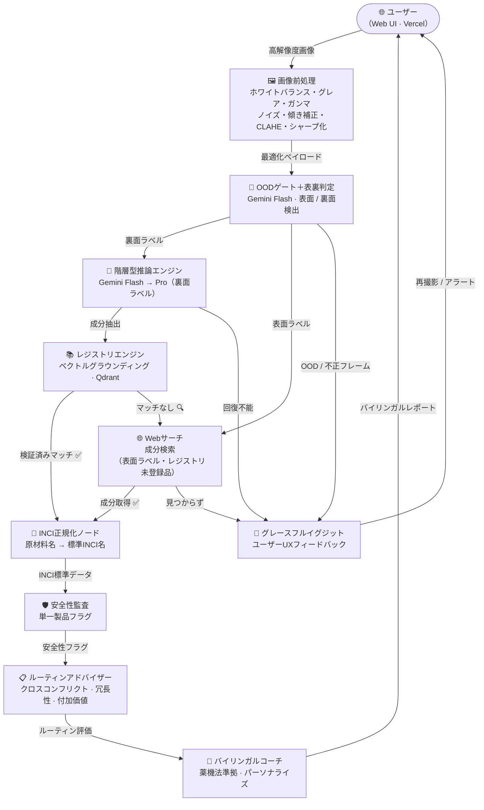
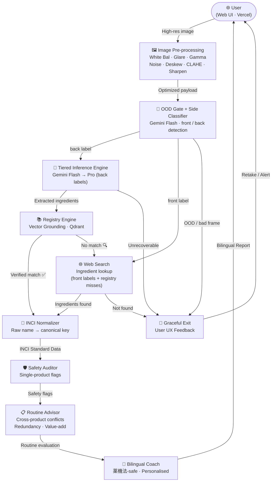

# 🌿 SkinGraph

<div align="center">

[](https://github.com/ShinBellator/skingraph/actions/workflows/ci.yml)
[](https://github.com/ShinBellator/skingraph/actions/workflows/deploy.yml)


-FF9900?style=for-the-badge&logo=amazonaws&logoColor=white)

[日本語](#japanese) · [English](#english)

</div>

---
---

<a name="japanese"></a>

# 🌿 SkinGraph — スキンケアラベル分析パイプライン

> スキンケア製品のラベルを撮影するだけで、バイリンガル・安全性チェック済み・パーソナライズされたレコメンドを数秒で。

**[▶️ ライブデモ](https://skingraph-production.up.railway.app/docs)** · **[📖 技術ドキュメント](legacy/README.md)** · **[🐛 バグ報告](https://github.com/ShinBellator/skingraph/issues)** · **[💡 機能リクエスト](https://github.com/ShinBellator/skingraph/issues)**

---

## 📑 目次

- [ハイライト](#-ハイライト)
- [概要](#ℹ️-概要)
- [テックスタック](#-テックスタック)
- [アーキテクチャ](#️-アーキテクチャ)
- [設計判断](#-設計判断)
- [インストール](#️-インストール)
- [使い方](#-使い方)
- [信頼性](#️-信頼性)
- [制限とロードマップ](#-制限とロードマップ)
- [コントリビュート & フィードバック](#-コントリビュート--フィードバック)
- [詳細情報](#-詳細情報)
- [ライセンス](#-ライセンス)

---

## 🌟 ハイライト

- 📸 **スキャンして、打ち込まない** — 日本語・韓国語・英語のラベルにカメラを向けるだけで、SkinGraphが成分を読み取ります。
- 🛡️ **信頼できる安全性** — 成分コンフリクトとリスク成分のチェックは決定論的ルールで実行され、LLMの推測ではないため、判定が再現可能です。
- 🧠 **賢く、安く** — 高速モデルが約80%のラベルを処理。重いモデルは難しい・ぼやけた・低コントラストのケースにのみ起動します。
- 📋 **ルーティン全体を把握** — 新製品は、既に棚にあるすべての製品に対してコンフリクト・冗長性・付加価値をチェックします。
- 💬 **バイリンガルコーチ** — 日本の `薬機法` 化粧品広告ルールに準拠した、英語 *and* 日本語のアドバイス。
- ▶️ **今すぐライブ** — インストール不要で[ライブデモ](https://skingraph-production.up.railway.app/docs)のインタラクティブAPIを試せます。

---

## ℹ️ 概要

SkinGraphは、新しい製品を手にしたときに実際に気になる疑問に答えます：*自分に安全か？ 今使っているものとぶつかるか？ 妊娠中でも使えるか？ いつ使うべきか？* カタカナの壁を自分で解読させるのではなく、ラベルそのものを読み取ります — 画像を画像パイプラインとビジョン言語モデルに通し、見えた内容をキュレーション済みの成分レジストリで接地し、決定論的な安全性監査を実行し、結果をバイリンガルの「コーチ」に渡して平易な英語と日本語で説明します。

**一息での仕組み:** 小さなステップのパイプライン — 画像クリーンアップ → 入力ゲーティング（ぼやけ・空・複数製品の写真を拒否） → 階層型ビジョン言語読み取り → レジストリグラウンディング → 成分名正規化 → 決定論的な安全性＋ルーティン監査 → バイリンガルコーチング。

### 比較位置

プレーンなOCRはラベルの文字を読めても、2つの成分を重ねてはいけないことは教えられません。生のビジョン言語モデルははるかに優秀ですが、猫の写真から成分リストを平気で*でっち上げ*ます。SkinGraphは意図的にその中間に位置します：モデルは**読み取り**に使い、結果はすべて検証済みレジストリで接地し、**安全性**の判断はすべて決定論的ルールで行います — 肌に実際に関わる部分は再現可能で、確率的ではありません。

### ✍️ 作者

SkinGraphは**David Valls**（[GitHub @ShinBellator](https://github.com/ShinBellator)）が構築しました。*「この製品は本当に自分に合うのか、いま使っているものと両立するのか」*という繰り返し浮かぶシンプルな問いから始まり、安全性データを任せられるだけの厳密さを持つシステムへと成長しました。

---

## 🧰 テックスタック

- **オーケストレーション** — LangGraph（StateGraph + 条件分岐ルーティング）
- **VLM推論** — Google Gemini Flash / Pro（`langchain-google-genai`）
- **ベクトル検索** — Qdrant + fastembed / ONNX Runtime（`multilingual-e5-small`）
- **データ契約** — Pydantic v2
- **画像処理** — Pillow + NumPy（7ステップ前処理）
- **永続化** — SQLite（プロファイル + ルーティン棚）
- **API** — FastAPI + Uvicorn
- **フロントエンド** — React + Vite + TypeScript
- **コンテナ** — Docker（マルチステージ）+ docker-compose
- **ライブ環境** — Railway（API）+ Vercel（UI）
- **クラウド（リファレンス）** — Terraform → AWS ECS Fargate
- **可観測性** — LangSmith + Prometheus `/metrics`
- **ツール** — Poetry · pytest · python-dotenv

> コンポーネント別の詳細な内訳とリポジトリ構成は[技術ドキュメント](legacy/README.md)を参照してください。

---

## 🏗️ アーキテクチャ



LangGraphの完全な状態機械図（すべてのノード・ルーター・信頼スコア閾値）は[技術ドキュメント](legacy/README.md)にあります。

---

## 🧭 設計判断

システムを定義する5つの判断 — 詳細な理由は[技術ドキュメント](legacy/README.md)を参照：

1. **Flash優先の階層型推論** — 約80%のラベルをFlashがProの1/10のコストで読み取り、Proは低信頼度・視覚的に困難なケースにのみ起動。ルーティングは信頼スコアで決定論的に制御。
2. **決定論的自己修正** — 専用の修正ノードが失敗した抽出を読み取り、次のFlashプロンプトに的確なフィードバックを注入。追加LLMコストゼロ、Proへエスカレーション前に最大2回反復。
3. **レジストリグラウンディング** — Qdrantベクトル検索が確率的なVLM出力を検証済み成分リストにスナップ。未登録製品はサイレント失敗ではなくワークリストに自動ログ。
4. **決定論的安全チェーン（LLM不使用）** — 監査とルーティンアドバイザーはコンフリクトマトリクスと機能グループ分類に対してルールマッチングを実行。LLMを使うのはコーチノードのみで、グラウンデッドな所見を薬機法準拠のバイリンガル散文に変換。
5. **多層的な入力ゲーティング** — コストゼロのピクセル事前チェックと表裏分類器に統合した内容チェックが、スキャナーが捏造を強いられる*前*に、製品なし・複数製品のフレームを拒否。

---

## ⬇️ インストール

**要件:** Python 3.10+、[Poetry](https://python-poetry.org/docs/)、Google AI（Gemini）APIキー。macOS・Linux・Windowsで動作。

```bash
git clone https://github.com/ShinBellator/skingraph.git
cd skingraph
poetry install
```

その後 `.env.example` を `.env` にコピーし、`GOOGLE_API_KEY` を記入。

> コンテナが好み？ `docker compose up api` でサービス全体が `http://localhost:8000` で立ち上がります。

---

## 🚀 使い方

インストールしたくない？ ブラウザで**[ライブインタラクティブデモ](https://skingraph-production.up.railway.app/docs)**をすぐ試せます。

ローカルでは、ラベルスキャンがワンライナーで：

```bash
# 単一ラベルをスキャン — 表/裏は自動検出
poetry run python run_pipeline.py data/golden_set/prod_001.jpg

# 保存済みユーザーとしてパーソナライズし、ルーティンに製品を追加
poetry run python run_pipeline.py data/golden_set/prod_001.jpg --user-id <id> --add-to-routine

# またはAPIとして全体を実行
poetry run uvicorn src.api.main:app --reload   # → http://127.0.0.1:8000/docs
```

これがエレベーターピッチです — [技術ドキュメント](legacy/README.md)がアーキテクチャ・画像パイプライン・全CLIフラグ・APIを網羅しています。

---

## 🛡️ 信頼性

- ✅ **テスト緑** — 上のCIバッジを参照。プッシュのたびに実行。
- 🔌 **オフラインの決定論的テスト** — すべてのモデル・ベクターストア呼び出しはモック化され、`poetry run pytest` はネットワーク・APIキー・サプライズなしで実行。
- 📊 **計測済み精度** — 成分抽出は日本語・韓国語・英語ラベルの手動アノテーションセットで **F1 0.94**（高速モデル）/ **0.98**（Proモデル）。
- 📄 **オープンライセンス** — Apache 2.0（[LICENSE](LICENSE)を参照）。
- 📬 **メンテ済み** — 最新の活動はコミット履歴で確認。質問・報告は[GitHub Issues](https://github.com/ShinBellator/skingraph/issues)へ。

---

## 🧭 制限とロードマップ

**現在の制限:**
- **全言語対応・JPが最適化済み** — レジストリ/正規化/監査データはJP中心のため、非JPラベルでは一部成分が未マッチになることがあります（失敗ではなく明示）。
- **レジストリはゴールデンセット製品をカバー** — 11製品が検証済み。未登録製品は `registry_candidates.json` に自動ログ。
- **永続化はホスト依存** — ライブのRailwayでは `users.db` とQdrantインデックスがボリュームに乗り再起動をまたいで永続化。リファレンスのAWS/ECSではSQLiteをEFSにマウントできず、タスク再起動でプロファイルがリセットされます（本番はRDS Postgresへの移行を推奨）。

**ロードマップ:**
- [ ] 🌐 **セマンティック多言語対応** — JP / KR / ENの名称を単一のUniversal INCI IDにマッピング。
- [ ] 🏷️ **バーコード統合** — JAN/UPCコードを事前スキャンし、既知商品のVLMを完全スキップ。
- [x] 📱 API抽象化 · [x] 🐳 コンテナ化 · [x] 🚀 ライブデプロイ · [x] ☁️ クラウドリファレンス（Terraform → AWS ECS Fargate）。

---

## 💭 コントリビュート & フィードバック

バグや読み間違えを見つけましたか？ **[Issueを開いてください](https://github.com/ShinBellator/skingraph/issues)** — ラベルの写真があると助かります。アイデアやプルリクエストも歓迎です（成分レジストリの追加や、このREADMEの翻訳も含む）。

---

## 📖 詳細情報

- 📘 **[技術ドキュメント](legacy/README.md)** — アーキテクチャ図・7ステップ画像パイプライン・デプロイ・可観測性。
- 🧪 **[ライブAPIドキュメント](https://skingraph-production.up.railway.app/docs)** — 実行中サービスのインタラクティブSwagger UI。
- 🐛 **[Issues & ディスカッション](https://github.com/ShinBellator/skingraph/issues)** — プロジェクトへの最速の連絡手段。

---

## 📄 ライセンス

[Apache 2.0](LICENSE)ライセンスで公開。

<div align="center">

Built with ❤️ and matcha 🍵 by [David Valls](https://github.com/ShinBellator)

</div>

---
---

<a name="english"></a>

# 🌿 SkinGraph — AI Skincare Label Analysis Pipeline

> Snap a photo of any skincare label and get a bilingual, safety-checked, personalised recommendation in seconds.

**[▶️ Live demo](https://skingraph-production.up.railway.app/docs)** · **[📖 Full docs](legacy/README.md)** · **[🐛 Report a bug](https://github.com/ShinBellator/skingraph/issues)** · **[💡 Request a feature](https://github.com/ShinBellator/skingraph/issues)**

---

## 📑 Table of Contents

- [Highlights](#-highlights)
- [Overview](#ℹ️-overview)
- [Tech stack](#-tech-stack)
- [Architecture](#-architecture)
- [Design decisions](#-design-decisions)
- [Installation](#️-installation)
- [Usage](#-usage)
- [Can you trust it?](#️-can-you-trust-it)
- [Limitations & roadmap](#-limitations--roadmap)
- [Contributing & Feedback](#-contributing--feedback)
- [Learn More](#-learn-more)
- [License](#-license)

---

## 🌟 Highlights

- 📸 **Scan, don't type** — point your camera at a Japanese, Korean, or English label and SkinGraph reads the ingredients for you.
- 🛡️ **Safety you can trust** — ingredient-conflict and irritant checks run on deterministic rules, *not* a language model's guess, so the verdict is reproducible.
- 🧠 **Smart, not expensive** — a fast model handles ~80% of labels; a heavier one is called only for the hard, blurry, low-contrast cases.
- 📋 **Knows your whole routine** — a new product is checked against everything already on your shelf for conflicts, redundancy, and value-add.
- 💬 **Bilingual coach** — advice in English *and* Japanese, written to stay within Japan's `薬機法` cosmetics-advertising rules.
- ▶️ **Live right now** — try the interactive API at the [live demo](https://skingraph-production.up.railway.app/docs) without installing anything.

---

## ℹ️ Overview

SkinGraph answers the questions you actually have when you pick up a new product: *Is it safe for me? Does it clash with what I already use? Can I use it while pregnant? When should I apply it?* Instead of asking you to decode a wall of katakana, it reads the label itself — runs the photo through an image pipeline and a vision-language model, grounds what it sees against a curated ingredient registry, runs a deterministic safety audit, and hands the result to a bilingual "coach" that explains it in plain English and Japanese.

**How it works (in one breath):** a pipeline of small steps — image cleanup → input gating (rejects blurry, empty, or multi-product photos) → tiered vision-language reading → registry grounding → ingredient-name normalisation → deterministic safety + routine audit → bilingual coaching.

### How it compares

Plain OCR can read the characters on a label but can't tell you that two of those ingredients shouldn't be layered. A raw vision-language model is far more capable, but will happily *invent* an ingredient list for a photo of your cat. SkinGraph sits deliberately in between: it uses the model for **reading**, but grounds every result against a verified registry and makes every **safety** decision with deterministic rules — so the parts that actually matter for your skin are reproducible, not probabilistic.

### ✍️ Author

SkinGraph is built by **David Valls** ([GitHub @ShinBellator](https://github.com/ShinBellator)). It started from a simple, recurring question — *"is this product actually right for me, and does it fit what I already use?"* — and grew into a system rigorous enough to be trusted with safety-critical data.

---

## 🧰 Tech stack

- **Orchestration** — LangGraph (StateGraph + conditional routing)
- **VLM inference** — Google Gemini Flash / Pro (`langchain-google-genai`)
- **Vector search** — Qdrant + fastembed / ONNX Runtime (`multilingual-e5-small`)
- **Data contracts** — Pydantic v2
- **Image processing** — Pillow + NumPy (7-step preprocessing)
- **Persistence** — SQLite (profiles + routine shelf)
- **API** — FastAPI + Uvicorn
- **Frontend** — React + Vite + TypeScript
- **Containerisation** — Docker (multi-stage) + docker-compose
- **Live hosting** — Railway (API) + Vercel (UI)
- **Cloud (reference)** — Terraform → AWS ECS Fargate
- **Observability** — LangSmith + Prometheus `/metrics`
- **Tooling** — Poetry · pytest · python-dotenv

> Full per-component breakdown and repo layout in the [full technical README](legacy/README.md).

---

## 🏗️ Architecture



The full LangGraph state-machine diagram (every node, router, and confidence threshold) is in the [full technical README](legacy/README.md).

---

## 🧭 Design decisions

The five calls that define the system — full reasoning in the [full technical README](legacy/README.md):

1. **Flash-first tiered inference** — ~80% of labels are read by Flash at 1/10 the cost of Pro; Pro is invoked only for low-confidence, visually hard cases. Routing is deterministic on the confidence score.
2. **Deterministic self-correction** — a dedicated Correction Node reads the failed extraction and injects targeted feedback into the next Flash prompt. Zero added LLM cost, up to 2 iterations before Pro escalation.
3. **Registry grounding** — Qdrant vector search snaps probabilistic VLM output to a verified ingredient list. Un-registered products auto-log to a worklist instead of failing silently.
4. **Deterministic safety chain (no LLM)** — the Auditor and Routine Advisor run rule-matching against a conflict matrix and function-group taxonomy. Only the Coach calls an LLM, to render grounded findings as `薬機法`-safe bilingual prose.
5. **Defense-in-depth input gating** — a zero-cost pixel pre-flight plus a content check folded into the side classifier reject no-product and multi-product frames *before* the scanner is forced to fabricate one.

---

## ⬇️ Installation

**Requirements:** Python 3.10+, [Poetry](https://python-poetry.org/docs/), and a Google AI (Gemini) API key. Runs on macOS, Linux, and Windows.

```bash
git clone https://github.com/ShinBellator/skingraph.git
cd skingraph
poetry install
```

Then copy `.env.example` to `.env` and add your `GOOGLE_API_KEY`.

> Prefer containers? `docker compose up api` brings the whole service up on `http://localhost:8000`.

---

## 🚀 Usage

Don't want to install anything? Try the **[live interactive demo](https://skingraph-production.up.railway.app/docs)** right in your browser.

Locally, scanning a label is a one-liner:

```bash
# Scan a single label — front/back is detected automatically
poetry run python run_pipeline.py data/golden_set/prod_001.jpg

# Personalise it to a saved user, and add the product to their routine
poetry run python run_pipeline.py data/golden_set/prod_001.jpg --user-id <id> --add-to-routine

# Or run the whole thing as an API
poetry run uvicorn src.api.main:app --reload   # → http://127.0.0.1:8000/docs
```

That's the elevator pitch — the [full docs](legacy/README.md) cover the architecture, the image pipeline, every CLI flag, and the API surface.

---

## 🛡️ Can you trust it?

- ✅ **Tested & green** — see the CI badge above; it runs on every push.
- 🔌 **Offline, deterministic tests** — every model and vector-store call is mocked, so `poetry run pytest` runs with no network, no API key, and no surprises.
- 📊 **Measured accuracy** — ingredient extraction scores **F1 0.94** (fast model) / **0.98** (pro model) on a hand-annotated set of Japanese, Korean, and English labels.
- 📄 **Open licence** — Apache 2.0 (see [LICENSE](LICENSE)).
- 📬 **Maintained** — check the commit history for the latest activity; questions and reports go through [GitHub Issues](https://github.com/ShinBellator/skingraph/issues).

---

## 🧭 Limitations & roadmap

**What's currently limited:**
- **Any label language accepted, JP best-tuned** — the registry/normalizer/audit data are JP-centric, so non-JP labels may leave some ingredients unmatched (surfaced, not fatal).
- **Registry covers the golden-set products** — 11 verified products; un-registered products are auto-logged to `registry_candidates.json`.
- **Persistence depends on the host** — on the live Railway deploy, `users.db` and the Qdrant index live on a volume and survive restarts. On the reference AWS/ECS path, SQLite can't mount on EFS, so profiles reset on task replacement (migrate to RDS Postgres for production there).

**Roadmap:**
- [ ] 🌐 **Semantic multilingual support** — map JP / KR / EN names to a single Universal INCI ID.
- [ ] 🏷️ **Barcode integration** — pre-scan JAN/UPC codes to skip the VLM entirely for known products.
- [x] 📱 API abstraction · [x] 🐳 containerisation · [x] 🚀 live deployment · [x] ☁️ cloud reference (Terraform → AWS ECS Fargate).

---

## 💭 Contributing & Feedback

Found a bug, or a label it misreads? **[Open an issue](https://github.com/ShinBellator/skingraph/issues)** — a photo of the label helps a lot. Ideas and pull requests are welcome too, including ingredient-registry additions and translations of this README.

---

## 📖 Learn More

- 📘 **[Full technical README](legacy/README.md)** — architecture diagrams, the 7-step image pipeline, deployment, and observability.
- 🧪 **[Live API docs](https://skingraph-production.up.railway.app/docs)** — interactive Swagger UI for the running service.
- 🐛 **[Issues & discussions](https://github.com/ShinBellator/skingraph/issues)** — the fastest way to reach the project.

---

## 📄 License

Released under the [Apache 2.0](LICENSE) license.

<div align="center">

Built with ❤️ and matcha 🍵 by [David Valls](https://github.com/ShinBellator)

</div>