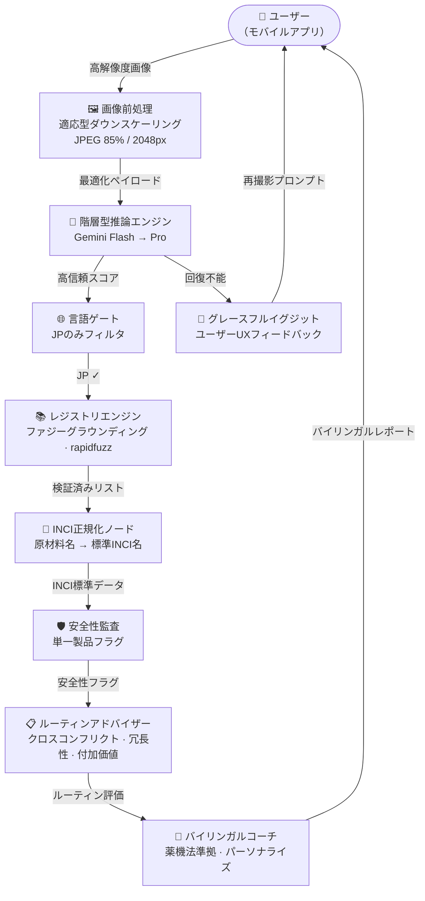
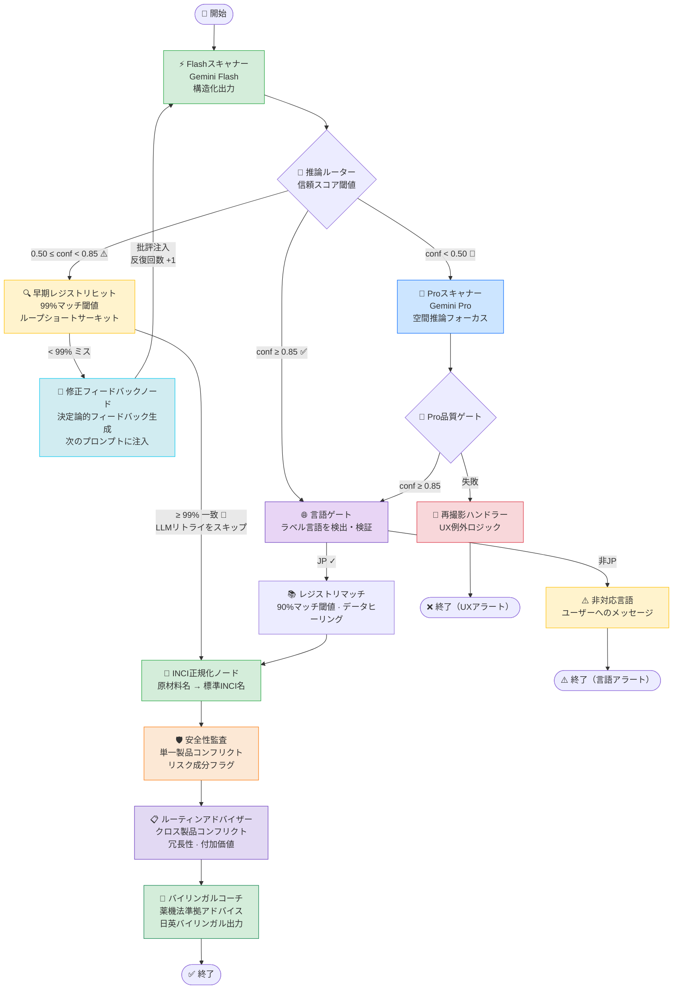
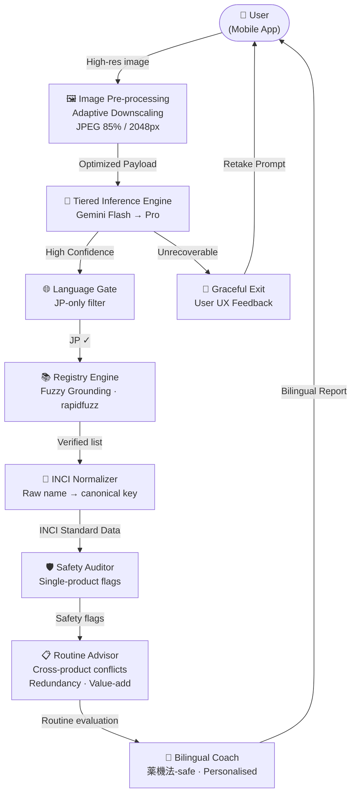
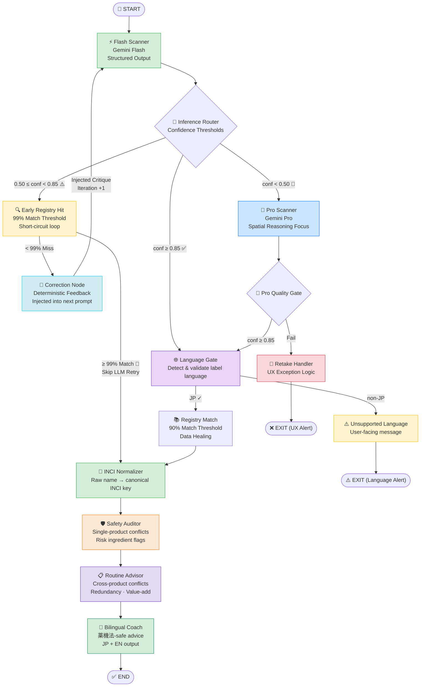

# 🌿 SkinGraph — AI Skincare Label Analysis Pipeline

<div align="center">


[日本語](#japanese) · [English](#english)

</div>

---

<a name="japanese"></a>

# 🌿 SkinGraph — AI マルチモーダル スキンケア解析パイプライン

Gemini VLMとLangGraphで構築した、日本語コスメラベルの成分抽出・INCI正規化パイプライン。

---

## なぜ難しいのか

日本語コスメラベルの機械読み取りには固有の難しさがある：**視覚的劣化**（円筒形ボトルの歪み・鏡面グレア・低コントラスト）、**文字の複雑さ**（漢字・カタカナ・ラテン文字の混在、全角/半角の揺れ）、そして**安全性への直結**（アレルゲンや禁忌成分の見落としは実害になる）。OCRは文字を読めてもINCIへの正規化ができず、VLMは高精度だが出力が確率的なため、安全性データへの利用は慎重なシステム設計が必要になる。

---

## 何をするのか

| 機能 | 詳細 |
|---|---|
| ⚡ **階層型VLM推論** | Flash優先、信頼スコアに基づいてProへ自動エスカレーション |
| 🔄 **自己修正ループ** | 最大2回のフィードバック付き再試行 |
| 🔍 **早期レジストリ照合** | 初回スキャン後に99%ファジーマッチ → 修正LLMコールをスキップ |
| 📚 **検証済みレジストリマッチング** | rapidfuzz WRatioによるキュレーション済みデータベース照合 |
| 🔬 **INCI正規化** | 原材料名 → 標準INCI名へのマッピング（ファジーフォールバック付き） |
| 🗾 **日本語ラベル特化** | JCIA基準成分正規化、医薬部外品検出 |
| 🖼️ **画像最適化** | 推論前に最大2048pxへ自動ダウンスケール（ペイロード60〜80%削減） |
| 🛡️ **安全性監査** | 単一製品内の成分コンフリクト・リスク成分フラグ（決定論的、LLM不使用） |
| 📋 **ルーティンメモリ** | ユーザーの「棚」をSQLiteに保存し、新製品との**クロスコンフリクト・冗長性・付加価値**を判定 |
| 👤 **ユーザープロファイル** | 肌タイプ・年齢・目標・肌の悩み・妊娠状況に基づくパーソナライズ |
| 💬 **バイリンガルコーチ** | 薬機法準拠の日英バイリンガルアドバイス |
| 🔭 **評価ハーネス** | `evaluate.py` — 成分F1・バイリンガルブランド照合・NFKC正規化による精度計測 |
| 🧩 **構造化出力契約** | Pydantic v2による`ProductExtraction`スキーマ強制 |

---

## 🏗️ アーキテクチャ

### 機能ブロック図



### LangGraphオーケストレーション



### 設計判断

**1. Flash優先 + 段階的エスカレーション**
標準的なラベルの約80%をFlash（コスト1/10）で処理。Proは視覚的に困難なケース（湾曲・グレア・低コントラスト）にのみ起動する。精度とコストのトレードオフは信頼スコアで制御する。

**2. 決定論的自己修正**
盲目的なリトライではなく、専用の修正ノードが失敗した抽出の信頼スコアを読み取り、具体的なフィードバックを生成して次のFlashプロンプトに注入する。追加のLLM呼び出しはゼロ。最大2回の修正後、自動的にProへエスカレーション。

**3. レジストリグラウンディング**
rapidfuzz WRatioを用いてVLMの確率的な出力を検証済み成分データと照合する。未登録製品は`registry_candidates.json`に自動ログされ、後続の追加ワークリストになる。

**4. 決定論的安全チェーン（LLM不使用）**
監査ノードとルーティンアドバイザーはLLMを一切使用しない。コンフリクトマトリクス（`data/conflict_matrix.json`）と機能グループ分類（`data/function_groups.json`）に対して確定的なルールマッチングを行う。コーチノードのみがLLMを使用し、監査・アドバイザーが生成したグラウンデッドな所見を薬機法準拠のバイリンガル散文に変換する。

---

## 🚀 セットアップ

```bash
git clone <your-repo-url>
cd skincare-coach
poetry install
```

`.env`ファイルを作成:

```env
GOOGLE_API_KEY=your_key_here
```

実行:

```bash
# 単一画像（表/裏は写真から自動判定）
poetry run python run_pipeline.py data/golden_set/prod_001.jpg

# ユーザープロファイル付き（パーソナライズされた注意事項）
poetry run python run_pipeline.py data/golden_set/prod_001.jpg --user-profile data/user_profile_sample.json

# ユーザープロファイルをDBに保存して id を表示
poetry run python run_pipeline.py data/golden_set/prod_001.jpg --user-profile data/user_profile_sample.json --save-user "Aiko"

# DBに保存済みのユーザーとして実行（プロファイル＋ルーティンを読み込み）
poetry run python run_pipeline.py data/golden_set/prod_001.jpg --user-id <id>

# スキャン後、製品をユーザーのルーティン棚に追加
poetry run python run_pipeline.py data/golden_set/prod_001.jpg --user-id <id> --add-to-routine

# 自動判定の代わりに面を明示指定
poetry run python run_pipeline.py data/golden_set/prod_001.jpg --image-type front

# 精度評価
poetry run python evaluate.py --model both

# ダミーユーザーとルーティン製品をDBにシード
poetry run python scripts/manage_users.py seed
poetry run python scripts/manage_users.py list
```

### API起動

パイプラインはFastAPIサービス（`src/api/main.py`）としても公開しています：

```bash
# サーバー起動（対話ドキュメント: http://127.0.0.1:8000/docs）
poetry run uvicorn src.api.main:app --reload

# ラベルをスキャン（multipartアップロード。image_type / user_id / add_to_routine は任意）
curl -F "image=@data/golden_set/prod_001.jpg" http://127.0.0.1:8000/scan
```

主なエンドポイント: `POST /scan`（スキャン）、`/users`・`/users/{id}`（プロファイルCRUD）、
`/users/{id}/routine`・`/routine/{id}`（ルーティン棚の追加・削除）、`GET /health`。

**ルーティング:** まず軽量な分類器が、写真が**表面**（ブランド情報のみ → 製品を特定し**成分をオンライン検索**）か**裏面**（成分表示 → ラベルから読み取り）かを判定します。両経路は単一のバイリンガル**レコメンドカード**に集約されます：製品名、用途（1文）、ユーザー個別の注意事項（乾燥・紫外線敏感性のリスクを含む）、使用タイミング（AM / PM / 両方）、使用頻度。

> **OCRについて:** `scripts/run_ocr.py` はYomiToku日本語OCRエンジンをゴールデンセット画像に対して実行し、プレーンテキストを `data/ocr_out/` に出力します。**Phase 0ベンチマーク**として、OCRとVLMの精度差を定量化するためだけに存在します。プロダクショングラフ（`src/graph.py`）には組み込まれておらず、グラフはGemini VLM推論のみを使用します。

---

## 🐳 Docker

マルチステージビルドで、本番APIイメージからYomiToku/OpenCVを分離しています。

| ステージ | ターゲット | 内容 |
|---|---|---|
| `builder` | （内部） | Poetryによる依存関係解決 + `/opt/venv` |
| `api` | `--target api` | FastAPI + LangGraph + CPUのみのtorch |
| `ocr-worker` | `--target ocr-worker` | `api` + opencv-headless + yomitoku |

```bash
# 初回: Qdrantベクターインデックスをビルド
docker compose run --rm api python scripts/build_index.py

# API起動
docker compose up api
# → http://localhost:8000/docs

# OCRベンチマーク（オプション — YomiToku層のみ別途ビルド）
docker compose --profile ocr run ocr-worker \
  python scripts/run_ocr.py data/golden_set/ --device cpu
```

永続化される状態（`./data/qdrant/` と `./data/users.db`）はバインドマウントで管理されます。

---

## ☁️ AWSデプロイ（Terraform）

`terraform/` に、AWS ECS Fargate上のサーバーレス構成を定義するTerraformファイルが含まれています。

| リソース | 目的 |
|---|---|
| ECR | Dockerイメージレジストリ |
| ECS Fargate | `api` コンテナの実行 |
| ALB | パブリックHTTPエンドポイント |
| EFS | Qdrantベクターストアの永続化（`/app/data/qdrant` にマウント） |
| Secrets Manager | `GOOGLE_API_KEY` をタスク起動時に注入 |

```bash
cd terraform
cp terraform.tfvars.example terraform.tfvars  # Gemini APIキーを記入
terraform init && terraform apply

# ECRにイメージをプッシュ
ECR=$(terraform output -raw ecr_repository_url)
aws ecr get-login-password --region us-east-1 \
  | docker login --username AWS --password-stdin $ECR
docker build --target api -t $ECR:latest ..
docker push $ECR:latest

# EFSにQdrantインデックスをシード（初回のみ）
eval "$(terraform output -raw build_index_command)"
```

---

## 🧪 テスト

```bash
# テストスイート全体を実行
poetry run pytest

# 詳細出力
poetry run pytest -v
```

テストはすべてオフライン・決定論的: Geminiコールはモック、Qdrant/sentence-transformersもパッチアウトされる。ネットワーク接続・APIキー・モデルダウンロードは不要。

| テストファイル | カバレッジ |
|---|---|
| `tests/test_scanner.py` | Flash / Pro スキャナーノード |
| `tests/test_registry.py` | ファジーレジストリマッチ |
| `tests/test_normalizer.py` | INCI正規化マッピング |
| `tests/test_auditor.py` | 単一製品安全性監査 |
| `tests/test_routine_advisor.py` | クロス製品コンフリクト・冗長性・付加価値 |
| `tests/test_user_store.py` | ルーティン棚のadd / get / remove |
| `tests/test_coach.py` | コーチアドバイス生成 |
| `tests/test_websearch.py` | Webサーチフォールバック |
| `tests/test_routers.py` | グラフルーターロジック |

---

## 🔬 精度評価

> ⚠️ **前提条件:** N=3（日本語ラベル、難易度7〜8、逆境的条件：円筒歪み・鏡面反射・高密度漢字）。グラウンドトゥルースは小規模であり、方向性の指標として解釈してください。スコアはINCIではなく生の抽出成分名ベースのF1です。

`evaluate.py` を使用し、手動アノテーション済み成分リストとのフィールドレベルF1で評価。NFKC正規化・バイリンガルファジーマッチングを使用。

| 指標 | Flash (`gemini-3.1-flash-lite`) | Pro (`gemini-3.1-pro-preview`) |
|---|---|---|
| 成分抽出 F1（平均） | **0.95** | **0.99** |
| 成分再現率（平均） | 0.93 | 0.99 |
| ブランド一致 | 100/100 | 100/100 |
| 製品名一致 | 93/100 | 90/100 |
| 医薬部外品検出 | 3/3 ✓ | 3/3 ✓ |
| 平均 API レイテンシ | ~8s | ~36s |

---

## ⚠️ 現在の制限とロードマップ

**現在の制限:**
- **全言語対応・JPが最適化済み** — レジストリ/正規化/監査データはJP中心のため、非JPラベルでは一部成分が未マッチになることがある（失敗ではなく明示）
- **グラウンドトゥルースはN=3** — 評価セットが小規模
- **レジストリは小規模** — 現在2製品。未登録製品は`registry_candidates.json`に自動ログ
- **ECS上のusers.dbは永続化されない** — SQLiteはファイルのためEFSマウント不可。タスク再起動でリセットされる。本番はRDS Postgresへの移行を推奨

**ロードマップ:**
- [ ] 🌐 **セマンティック多言語対応** — 日本語・韓国語・英語の名称を単一のUniversal INCI IDにマッピング
- [x] 📱 **API抽象化** — FastAPIラッパー（`/scan` ＋ ユーザー/ルーティンCRUD）
- [x] 🐳 **コンテナ化** — マルチステージDockerビルド + docker-compose
- [x] ☁️ **クラウドデプロイ** — AWS ECS Fargate Terraform構成
- [ ] 🏷️ **バーコード統合** — JAN/UPCコード事前照合で既知商品のVLMを完全スキップ

---

## 🛠️ テックスタックとプロジェクト構成

```
Orchestration     LangGraph (StateGraph + conditional routing)
VLM Inference     Google Gemini Flash / Pro via langchain-google-genai
Vector Retrieval  Qdrant (embedded/local) · sentence-transformers (multilingual-e5-small)
Fuzzy Matching    rapidfuzz (WRatio scorer)
String Matching   pyahocorasick (multi-pattern exact match)
Data Contracts    Pydantic v2
Image Processing  Pillow (LANCZOS downscale → JPEG 85) · OpenCV (CLAHE + cylindrical dewarping)
Persistence       SQLite (user profiles + routine shelf)
API               FastAPI + Uvicorn
Containerisation  Docker multi-stage build · docker-compose
Cloud Deploy      Terraform → AWS ECS Fargate / ALB / EFS / ECR / Secrets Manager
Config            python-dotenv
Package Manager   Poetry
Testing           pytest (fully offline, all LLM + vector-store calls mocked)
```

```
skincare-coach/
├── src/
│   ├── api/
│   │   ├── main.py           # FastAPIアプリ + エンドポイント定義
│   │   ├── service.py        # run_scan() — HTTPから分離されたオーケストレーション
│   │   └── schemas.py        # リクエスト/レスポンスのPydanticモデル
│   ├── graph.py              # LangGraphワークフロー定義・ルーター
│   ├── state.py              # AgentState TypedDict + Pydanticデータ契約
│   ├── config.py             # 閾値・モデルIDの集中管理
│   ├── conflicts.py          # 共有コンフリクトマトリクスヘルパー
│   ├── user_store.py         # SQLiteユーザープロファイル + ルーティン棚
│   └── nodes/
│       ├── scanner.py        # Flash & Pro VLMノード + 画像最適化
│       ├── registry.py       # ファジーレジストリマッチ
│       ├── normalizer.py     # 原材料名 → 標準INCIキーへのマッピング
│       ├── auditor.py        # 安全性監査ノード
│       ├── routine_advisor.py # クロス製品決定論的評価ノード
│       └── coach.py          # アドバイス生成
├── data/
│   ├── golden_set/              # 40製品ラベル画像（4件グラウンドトゥルース済み）
│   ├── ground_truth.json        # アノテーション済みグラウンドトゥルース
│   ├── registry.json            # 検証済み製品・成分データベース
│   ├── ingredient_master.json   # 標準INCIレジャー
│   ├── function_groups.json     # 機能/活性成分カテゴリー分類
│   ├── conflict_matrix.json     # 成分コンフリクトペア
│   ├── irritant_registry.json   # リスク成分フラグ
│   ├── registry_candidates.json # 未登録製品の自動ログ
│   └── ocr_out/                 # OCRテキスト出力（ベンチマーク成果物）
├── scripts/
│   ├── build_index.py       # QdrantベクターインデックスをJSONからビルド
│   ├── manage_users.py      # ユーザーCLI（seed / list / show / delete / add）
│   └── run_ocr.py           # ⚠️ スタンドアロンOCRベンチマーク — グラフ外
├── terraform/               # AWS ECS Fargate デプロイ構成
│   ├── main.tf, variables.tf, outputs.tf
│   ├── vpc.tf, security_groups.tf, iam.tf
│   ├── ecr.tf, secrets.tf, efs.tf, alb.tf, ecs.tf
│   └── terraform.tfvars.example
├── tests/
├── Dockerfile               # マルチステージ: builder / api / ocr-worker
├── docker-compose.yml       # ローカルスタック: api + OCRオプションプロファイル
├── run_pipeline.py          # CLIエントリーポイント
└── evaluate.py              # 抽出精度スコアラー
```

---

<div align="center">

Built with ❤️ and matcha 🍵

</div>

---
---

<a name="english"></a>

# 🌿 SkinGraph — AI Skincare Label Analysis Pipeline

A production-grade LangGraph pipeline for extracting and normalizing ingredients from Japanese cosmetics labels using Gemini VLM — with deterministic safety auditing, cross-product routine conflict detection, and personalised bilingual coaching.

---

## Why this is hard

Japanese cosmetics labels resist reliable machine reading for three compounding reasons: **visual degradation** (cylindrical bottle distortion, specular glare, low-contrast embossed text), **character complexity** (kanji, katakana, and Latin script interleaved; full-width vs. half-width variants of the same character), and **safety-critical output** — a missed allergen or contraindicated ingredient isn't a UI glitch, it's a product defect. OCR can read characters but cannot normalize ingredient names to INCI standards. VLMs are more accurate but probabilistic, which means using them directly for safety data requires deliberate system design to catch and handle failures.

---

## What it does

| Feature | Detail |
|---|---|
| ⚡ **Tiered VLM Inference** | Flash-first with automatic Pro escalation based on confidence score |
| 🔄 **Self-Correction Loop** | Up to 2 feedback-enriched retries before escalation |
| 🔍 **Early Registry Short-Circuit** | 99% fuzzy match after first scan skips the correction LLM call |
| 📚 **Verified Registry Matching** | rapidfuzz WRatio scoring against a curated product database |
| 🌐 **Language Gate** | Detects label language; unsupported languages exit early with a clear user message |
| 🔬 **INCI Normalizer** | Maps raw ingredient names to canonical INCI keys; fuzzy fallback included |
| 🗾 **Japanese Label Specialisation** | JCIA-standard ingredient normalisation, quasi-drug (`医薬部外品`) detection |
| 🖼️ **Image Optimisation** | Auto-downscale to 2048px max before inference — cuts payload 60–80% |
| 🛡️ **Safety Auditor** | Deterministic (no LLM) single-product conflict detection + risk ingredient flagging |
| 📋 **Routine Memory** | SQLite "shelf" of saved products per user; new scan evaluated for **cross-product conflicts, redundancy, and value-add** against the entire shelf |
| 👤 **User Profiles** | Personalised advice driven by skin type, age, goals, conditions, and pregnancy status |
| 💬 **Bilingual Coach** | `薬機法`-safe personalised advice in Japanese + English |
| 🔭 **Eval Harness** | `evaluate.py` — field-level ingredient F1, bilingual brand/product match, NFKC normalization |
| 🧩 **Structured Output Contract** | Pydantic-enforced `ProductExtraction` schema — no prompt-parsing fragility |

---

## 🏗️ Architecture

### Functional Block Diagram



### LangGraph Orchestration



### Four design decisions

**1. Flash-first tiered inference**
~80% of standard labels are handled by Flash at 1/10th the cost of Pro. Pro is invoked only when confidence falls below the accept threshold — adversarial conditions: cylindrical distortion, specular glare, low-contrast text. Routing is deterministic on the confidence score.

**2. Deterministic self-correction**
Failed extractions don't trigger a blind retry. A dedicated Correction Node reads the failed extraction's confidence score and system status, generates a targeted feedback string, and injects it into the next Flash prompt. Zero additional LLM cost. Up to 2 iterations before automatic Pro escalation.

**3. Registry grounding**
The Registry Engine uses rapidfuzz WRatio to snap probabilistic VLM output to a verified ingredient list. Products not yet in the registry are auto-logged to `registry_candidates.json` — missed products accumulate a worklist rather than silently failing.

**4. Deterministic safety chain (no LLM)**
The Auditor and Routine Advisor nodes use no LLM. Both run deterministic rule-matching against a shared conflict matrix (`data/conflict_matrix.json`) and a function-group taxonomy (`data/function_groups.json`). Only the Coach node calls an LLM — to render the grounded audit and advisor findings as `薬機法`-safe bilingual prose.

---

## 🚀 Getting Started

### Prerequisites

- Python 3.10+
- [Poetry](https://python-poetry.org/docs/)
- Google AI API key (Gemini access)

### Installation

```bash
git clone <your-repo-url>
cd skincare-coach
poetry install
```

### Environment Setup

Create a `.env` file:

```env
GOOGLE_API_KEY=your_key_here
```

### Run

```bash
# Single image — front/back side is auto-detected from the photo
poetry run python run_pipeline.py data/golden_set/prod_001.jpg

# With a user profile (personalised warnings)
poetry run python run_pipeline.py data/golden_set/prod_001.jpg --user-profile data/user_profile_sample.json

# Save a user profile to the DB and print its id
poetry run python run_pipeline.py data/golden_set/prod_001.jpg --user-profile data/user_profile_sample.json --save-user "Aiko"

# Run as a saved user — loads their profile + routine shelf from the DB
poetry run python run_pipeline.py data/golden_set/prod_001.jpg --user-id <id>

# Scan and add this product to the user's routine shelf afterwards
poetry run python run_pipeline.py data/golden_set/prod_001.jpg --user-id <id> --add-to-routine

# Force the side instead of auto-detecting
poetry run python run_pipeline.py data/golden_set/prod_001.jpg --image-type front

# Run accuracy evaluation
poetry run python evaluate.py --model both

# Seed dummy personas + their routine products into the DB
poetry run python scripts/manage_users.py seed
poetry run python scripts/manage_users.py list
```

### Run the API

The pipeline is also exposed as a FastAPI service (`src/api/main.py`):

```bash
# Start the server (interactive docs at http://127.0.0.1:8000/docs)
poetry run uvicorn src.api.main:app --reload

# Scan a label (multipart upload). image_type / user_id / add_to_routine are optional.
curl -F "image=@data/golden_set/prod_001.jpg" http://127.0.0.1:8000/scan

# Scan as a saved user and shelf the product
curl -F "image=@data/golden_set/prod_001.jpg" -F "user_id=<id>" -F "add_to_routine=true" \
     http://127.0.0.1:8000/scan
```

| Method | Path | Purpose |
|---|---|---|
| `GET` | `/health` | Liveness probe |
| `POST` | `/scan` | Run the pipeline on an uploaded photo |
| `POST` / `GET` | `/users` | Create / list user profiles |
| `GET` / `PUT` / `DELETE` | `/users/{id}` | Read / replace / delete a profile |
| `GET` / `POST` | `/users/{id}/routine` | List / add products to the routine shelf |
| `DELETE` | `/routine/{id}` | Remove a routine product |

**How it routes:** a lightweight classifier first decides whether the photo shows the **front** (branding only → identify the product and **search its ingredients online**) or the **back** (ingredient list → read it off the label). Both paths converge on a single bilingual **recommendation card**: product name, one-line purpose, user-tailored warnings (including dehydration / sun-sensitivity risk), best timing (AM / PM / both), and use frequency.

> **Note on OCR:** `scripts/run_ocr.py` runs a local YomiToku Japanese OCR engine on the golden-set images and writes plain-text output to `data/ocr_out/`. It exists purely as a **Phase 0 benchmark baseline** to quantify the OCR-vs-VLM accuracy gap — intentionally excluded from the production graph (`src/graph.py`). The graph uses Gemini VLM inference exclusively.

---

## 🐳 Docker

The Dockerfile uses a **three-stage build** to keep the production API image free of YomiToku and OpenCV, which are only needed for the OCR benchmark.

| Stage | Target | Contents |
|---|---|---|
| `builder` | (internal) | Poetry dep resolution + `/opt/venv`; CPU-only torch installed first to avoid CUDA wheels |
| `api` | `--target api` | FastAPI + LangGraph + sentence-transformers + pre-baked `multilingual-e5-small` model |
| `ocr-worker` | `--target ocr-worker` | `api` layer + `opencv-python-headless` + `yomitoku` |

### Local development

```bash
# First-time: build the Qdrant vector index (reads registry.json + ingredient_master.json)
docker compose run --rm api python scripts/build_index.py

# Start the API
docker compose up api
# → http://localhost:8000/docs

# Run the OCR benchmark — only builds the heavy YomiToku layer when you need it
docker compose --profile ocr run ocr-worker \
  python scripts/run_ocr.py data/golden_set/ --device cpu
```

State that persists between restarts is bind-mounted from your working tree:

| Mount | Container path | Contents |
|---|---|---|
| `./data/qdrant` | `/app/data/qdrant` | Qdrant vector store (built by `build_index.py`) |
| `./data/users.db` | `/app/data/users.db` | SQLite user profiles + routine shelf |

The static JSON reference files (`registry.json`, `ingredient_master.json`, etc.) are baked into the image and are not affected by the volume mounts.

---

## ☁️ AWS Deployment (Terraform)

`terraform/` provisions a fully serverless stack on AWS using ECS Fargate.

### Infrastructure

| Resource | Purpose |
|---|---|
| **ECR** | Docker image registry — stores the `api` image |
| **ECS Fargate** | Runs the containerised API; 1 vCPU / 2 GB RAM by default |
| **ALB** | Public HTTP endpoint (health check on `GET /health`) |
| **EFS** | Encrypted persistent volume; mounted at `/app/data/qdrant` in the task |
| **Secrets Manager** | `GOOGLE_API_KEY` fetched by the ECS agent and injected as an env var at task start |
| **VPC** | 2 public subnets across AZs; no NAT gateway (saves ~$32/mo) |

### Deploy (5 steps)

```bash
# 1. Provision all AWS resources
cd terraform
cp terraform.tfvars.example terraform.tfvars   # fill in your Gemini API key
terraform init && terraform apply

# 2. Build and push the API image to ECR
ECR=$(terraform output -raw ecr_repository_url)
aws ecr get-login-password --region us-east-1 \
  | docker login --username AWS --password-stdin $ECR
docker build --target api -t $ECR:latest ..
docker push $ECR:latest

# 3. Seed the Qdrant index on EFS (one-time — runs build_index.py as a Fargate task)
eval "$(terraform output -raw build_index_command)"

# 4. Get the public endpoint
terraform output api_endpoint
# → http://<alb-dns-name>
```

### Architecture notes

- **`desired_count = 1`** — Qdrant's on-disk EFS store is single-writer. Horizontal scaling requires switching to [Qdrant Cloud](https://cloud.qdrant.io/).
- **`users.db` is ephemeral on ECS** — SQLite is a file; EFS only mounts directories, so the DB cannot be persisted this way. User profiles reset on task replacement. For production persistence, migrate `user_store.py` to RDS Postgres.
- **HTTP only** — HTTPS requires an ACM certificate and an additional listener rule in `terraform/alb.tf`. Add once you have a domain.
- **Cold starts** — the embedding model (`multilingual-e5-small`) is pre-baked into the Docker image so Fargate tasks don't hit HuggingFace on startup. The first request after a task starts may still be slow while Qdrant opens the EFS-backed store.

### Teardown

```bash
terraform destroy
```

---

## 🧪 Testing

```bash
# Run the full test suite
poetry run pytest

# With verbose output
poetry run pytest -v
```

All tests are fully offline and deterministic: every Gemini call is mocked and every vector-store call (Qdrant + sentence-transformers) is patched out, so no network connection, API key, model download, or on-disk index is ever touched.

| Test file | Coverage |
|---|---|
| `tests/test_scanner.py` | Flash / Pro scanner nodes |
| `tests/test_registry.py` | Fuzzy registry matching |
| `tests/test_normalizer.py` | INCI normalization mapping |
| `tests/test_auditor.py` | Single-product safety audit |
| `tests/test_routine_advisor.py` | Cross-product conflicts, redundancy, value-add |
| `tests/test_user_store.py` | Routine shelf add / get / remove |
| `tests/test_coach.py` | Coach advice generation |
| `tests/test_websearch.py` | Web search fallback |
| `tests/test_routers.py` | Graph router logic |

---

## 🔬 Evaluation & Benchmarking

> ⚠️ **Caveat:** N=3 hand-annotated Japanese labels (difficulty 7–8, adversarial conditions: cylindrical distortion, specular reflection, dense kanji clusters). The ground truth set is small — treat these numbers as directional. Scores are F1 against raw extracted names, not post-INCI-normalization.

Accuracy measured with `evaluate.py` against hand-annotated ground truth, using field-level F1 with NFKC normalization and bilingual fuzzy matching.

| Metric | Flash (`gemini-3.1-flash-lite`) | Pro (`gemini-3.1-pro-preview`) |
|---|---|---|
| Ingredient F1 (avg) | **0.95** | **0.99** |
| Ingredient Recall (avg) | 0.93 | 0.99 |
| Brand Match | 100/100 | 100/100 |
| Product Name Match | 93/100 | 90/100 |
| Quasi-drug Detection | 3/3 ✓ | 3/3 ✓ |
| Avg. API Latency | ~8s | ~36s |

---

## ⚠️ Current Limitations & Roadmap

**What's currently limited:**
- **Any label language accepted, JP best-tuned** — the registry/normalizer/audit data are JP-centric, so non-JP labels may leave some ingredients unmatched (surfaced, not fatal)
- **Ground truth is N=3** — small eval set; scores are directional
- **Registry is small** — 2 verified products; un-registered products are auto-logged to `registry_candidates.json`
- **`users.db` is ephemeral on ECS** — SQLite file cannot be persisted on EFS; profiles reset on task replacement. Migrate to RDS for production

**Roadmap:**
- [ ] 🌐 **Semantic Multilingual Support** — map Japanese, Korean, and English names to a single Universal INCI ID
- [x] 📱 **API Abstraction** — FastAPI wrapper (`/scan` + user/routine CRUD)
- [x] 🐳 **Containerisation** — multi-stage Docker build + docker-compose with optional OCR profile
- [x] ☁️ **Cloud Deployment** — AWS ECS Fargate via Terraform (VPC / ALB / EFS / ECR / Secrets Manager)
- [ ] 🏷️ **Barcode Integration** — pre-scan JAN/UPC codes to skip VLM entirely for known products

---

## 🛠️ Tech Stack & Project Structure

```
Orchestration     LangGraph (StateGraph + conditional routing)
VLM Inference     Google Gemini Flash / Pro via langchain-google-genai
Vector Retrieval  Qdrant (embedded/local) · sentence-transformers (multilingual-e5-small, 384-dim)
Fuzzy Matching    rapidfuzz (WRatio scorer)
String Matching   pyahocorasick (multi-pattern exact match)
Data Contracts    Pydantic v2
Image Processing  Pillow (LANCZOS downscale → JPEG 85) · OpenCV (CLAHE + cylindrical dewarping)
Persistence       SQLite (user profiles + routine shelf)
API               FastAPI + Uvicorn
Containerisation  Docker multi-stage build (builder / api / ocr-worker) · docker-compose
Cloud Deploy      Terraform → AWS ECS Fargate / ALB / EFS / ECR / Secrets Manager
Config            python-dotenv
Package Manager   Poetry
Testing           pytest (fully offline, all LLM + vector-store calls mocked)
```

```
skincare-coach/
├── src/
│   ├── api/
│   │   ├── main.py           # FastAPI app + all endpoint definitions
│   │   ├── service.py        # run_scan() — orchestration decoupled from HTTP
│   │   └── schemas.py        # Request / response Pydantic models
│   ├── graph.py              # LangGraph workflow definition & routers
│   ├── state.py              # AgentState TypedDict + Pydantic data contracts
│   │                         #   └─ RoutineProduct / CrossConflict / RoutineFit models
│   ├── config.py             # Centralised thresholds & model IDs
│   ├── conflicts.py          # Shared conflict-matrix helpers
│   │                         #   (used by both auditor + routine_advisor)
│   ├── user_store.py         # SQLite user profiles + routine shelf
│   │                         #   └─ routine_products table / add · get · remove
│   ├── vectorstore.py        # Qdrant client + sentence-transformers embedding helpers
│   └── nodes/
│       ├── scanner.py        # Flash & Pro VLM nodes + image optimisation
│       ├── registry.py       # Fuzzy registry match (early check + full lookup)
│       ├── normalizer.py     # Maps raw ingredient names → canonical INCI keys
│       ├── auditor.py        # Safety audit node (uses src.conflicts)
│       ├── routine_advisor.py # Deterministic cross-product evaluation node
│       └── coach.py          # Advice generation (CoachResponse / Routine Fit render)
├── data/
│   ├── golden_set/              # 40 product label images (4 ground-truthed)
│   ├── ground_truth.json        # Annotated ground truth (brand, ingredients, safety triggers)
│   ├── registry.json            # Verified product + ingredient database
│   ├── ingredient_master.json   # Canonical INCI ledger (synonyms → INCI key)
│   ├── function_groups.json     # Function/active category taxonomy
│   ├── conflict_matrix.json     # Pairwise ingredient conflict rules
│   ├── irritant_registry.json   # Risk ingredient flags
│   ├── registry_candidates.json # Auto-logged products not yet in the registry
│   └── ocr_out/                 # Raw OCR text output (benchmark artefacts, not production)
├── scripts/
│   ├── build_index.py       # Build Qdrant vector index from JSON seed data
│   ├── manage_users.py      # User CLI: seed / list / show / delete / add
│   └── run_ocr.py           # ⚠️ Standalone OCR benchmark — NOT wired into the graph
├── terraform/               # AWS ECS Fargate deployment
│   ├── main.tf              # AWS provider
│   ├── variables.tf         # Region, app name, API key, task sizing
│   ├── outputs.tf           # ECR URL, ALB endpoint, build-index command
│   ├── vpc.tf               # VPC + 2 public subnets + IGW
│   ├── security_groups.tf   # ALB → ECS → EFS access rules
│   ├── iam.tf               # Execution role (ECR/logs/secrets) + Task role (EFS)
│   ├── ecr.tf               # ECR repository + lifecycle policy
│   ├── secrets.tf           # Secrets Manager entry for GOOGLE_API_KEY
│   ├── efs.tf               # Encrypted EFS + access point scoped to /qdrant
│   ├── alb.tf               # Application Load Balancer + target group + listener
│   ├── ecs.tf               # CloudWatch logs + ECS cluster + task definition + service
│   └── terraform.tfvars.example
├── tests/
│   ├── conftest.py, helpers.py
│   ├── test_scanner.py, test_registry.py, test_normalizer.py
│   ├── test_auditor.py, test_routine_advisor.py, test_user_store.py
│   ├── test_coach.py, test_websearch.py, test_routers.py
├── Dockerfile               # Multi-stage: builder / api / ocr-worker
├── docker-compose.yml       # Local stack: api service + optional ocr profile
├── .dockerignore
├── run_pipeline.py          # CLI entry point
│                            #   └─ --user-id / --add-to-routine / --image-type flags
└── evaluate.py              # Extraction accuracy scorer (VLM output vs ground truth)
```

---

<div align="center">

Built with ❤️ and matcha 🍵

</div>
