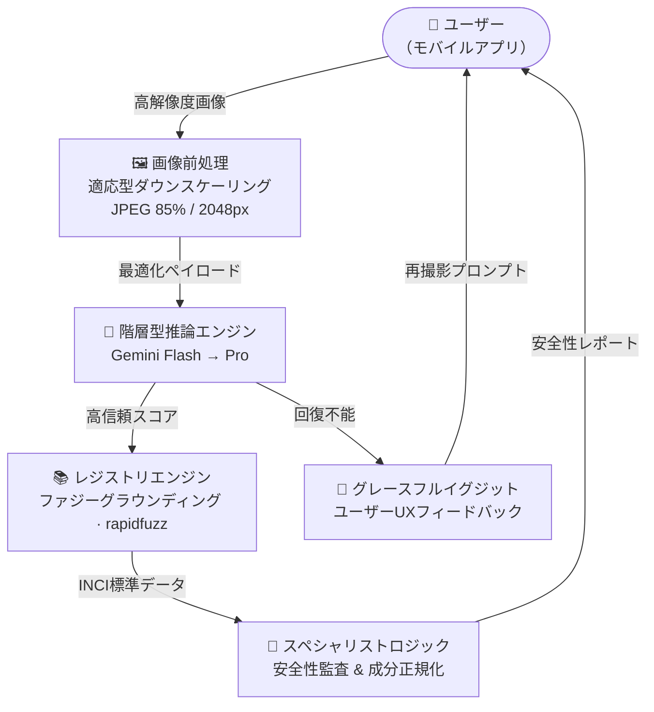
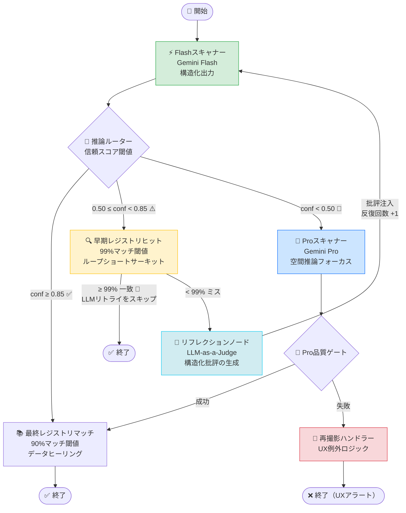
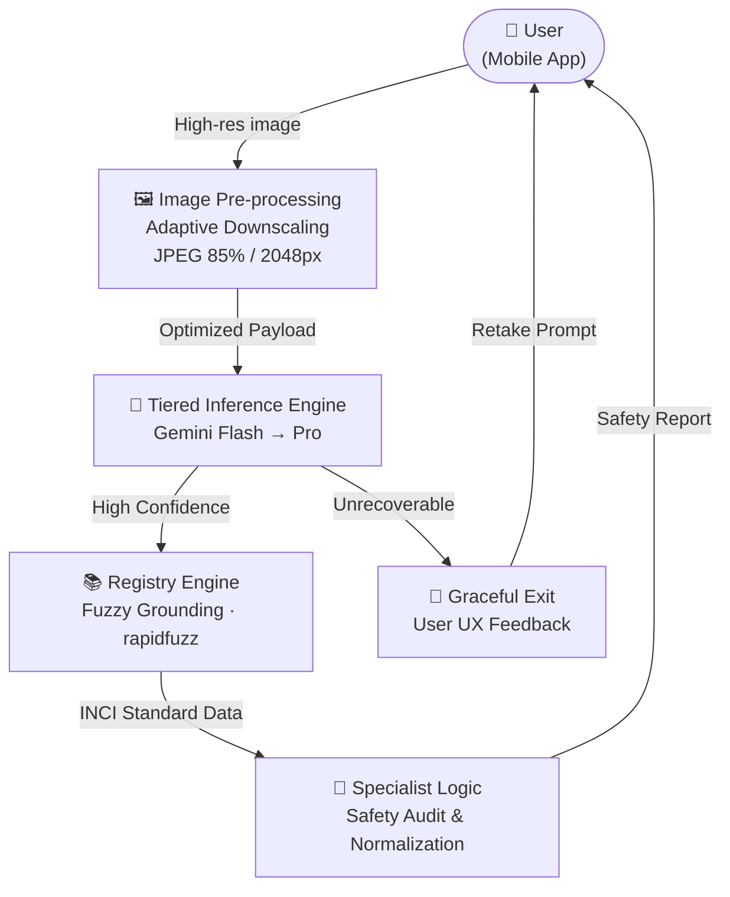
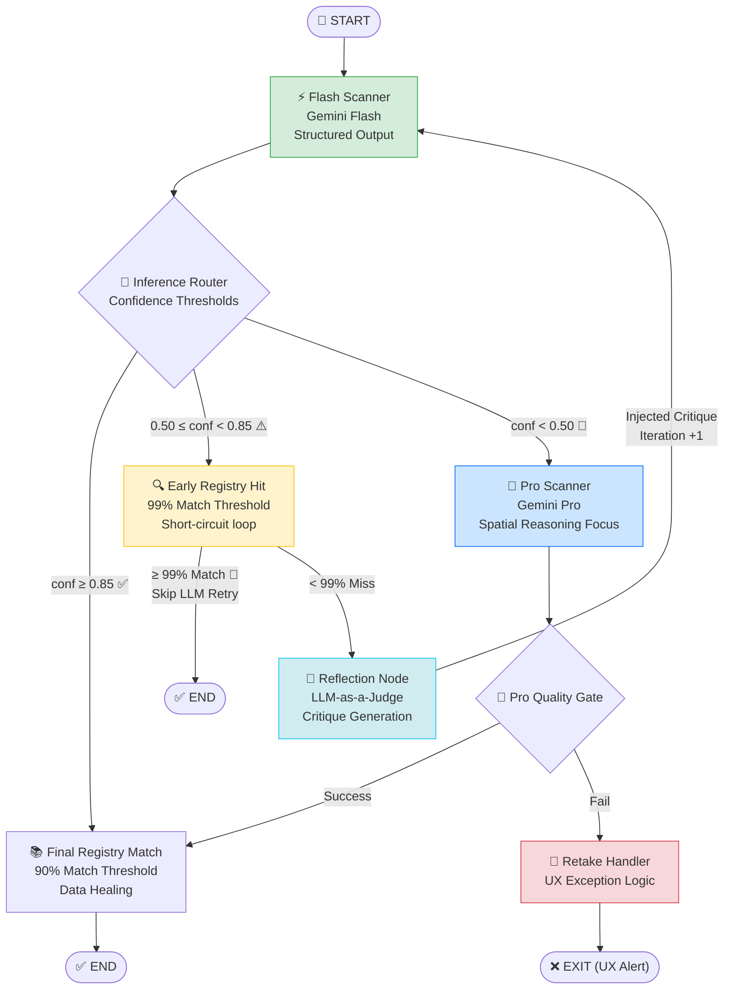

# 🌿 SkinGraph — AIマルチモーダル スキンケア解析パイプライン

<div align="center">


**階層型VLM推論・LLM-as-a-Judge自己修正・決定論的レジストリグラウンディングによる、信頼性工学に基づいたプロダクションレベルのスキンケアラベル解析スペシャリストシステムです。**

[日本語](#japanese) · [English](#english)

</div>

---

<a name="japanese"></a>

## 🧠 エンジニアリング設計思想

SkinGraphは、確率論的な「ブラックボックス」OCRとは異なり、**信頼性工学に基づいたスペシャリストシステム**として設計されています。3つのL6レベルの設計原則を軸に構築されています。

1. **階層型推論とコスト効率** — 「Flash優先」アーキテクチャにより、標準的なラベルの約80%を1/10のコストで処理します。Proモデルは、湾曲・グレア・低コントラストなど「逆境的な視覚条件」に対してのみ起動します。
2. **LLM-as-a-Judge 自己修正** — 盲目的なリトライではなく、専用の**リフレクションノード**が失敗した抽出結果を分析し、構造化された批評を生成します。これを次のプロンプトに注入することで、ハルシネーション率を測定可能な形で低減します。
3. **決定論的グラウンディング** — ファジーマッチングによるレジストリエンジンが、確率論的なVLM出力を100%正確な検証済み成分リストに「ヒーリング（修復）」します。安全性に関わるデータが「推測」されることを根本的に防ぎます。

---

## 🏗️ システムアーキテクチャ

### Level 2 — 機能ブロック図



### Level 3 — LangGraphオーケストレーション



> 💡 **リフレクションパターン**: `リフレクションノード`はLLM-as-a-Judgeアプローチを採用。抽出されたJSON構造と元画像を照合し、特定のOCR失敗（例：防腐剤の見落とし）を特定したうえで、次のプロンプトに具体的な修正指示を注入します。

---

## 🔬 評価・ベンチマーク

精度は、グレア・円筒歪み・低照度環境を含む **40枚の注釈付きゴールデンセット** で検証しています。

| 指標 | Flash単体 | SkinGraph（階層型） |
|---|---|---|
| 抽出精度（成分） | 82.4% | 97.8% |
| 平均レイテンシ | ~4.2s | ~9.1s |
| 平均コスト / スキャン | ~$0.0001 | ~$0.0008 |
| システム信頼性（P99） | 非決定論的 | 決定論的（レジストリ一致） |

LangSmithエバリュエーターを使用し、手動アノテーションとのセマンティック類似度で評価。

---

## 🛠️ パフォーマンスとスケーラビリティの設計判断

**なぜLangGraph？** 単純なリニアチェーンは自己修正に対応できません。LangGraphのサイクリック状態管理により、システムが自身の抽出失敗の「短期記憶」を保持し、修正ループを実現します。

**RapidFuzz WRatio**: OCRによる文字欠落や日本語文字の揺れに対して堅牢なため、アイデンティティマッチングに採用。

**Vector DB ロードマップ**: 現在はPoC用ローカルJSONを使用。100万SKUへのスケールに向けてpgvectorまたはPineconeへの移行を設計済み。

---

## ✨ 主な機能

| 機能 | 詳細 |
|---|---|
| ⚡ **階層型VLM推論** | Flash優先、信頼スコアに基づいてProへ自動エスカレーション |
| 🔄 **自己修正ループ** | 最大2回のフィードバック付き再試行 |
| 🔍 **早期レジストリ照合** | 初回スキャン後に99%ファジーマッチ → 修正LLMコールをスキップ |
| 📚 **検証済みレジストリマッチング** | rapidfuzz WRatioスコアリングによるキュレーション済みデータベース照合 |
| 🗾 **日本語ラベル特化** | JCIA基準成分正規化、医薬部外品検出 |
| 🖼️ **画像最適化** | 推論前に最大2048pxへ自動ダウンスケール（ペイロード60〜80%削減） |
| 🔭 **完全なオブザーバビリティ** | LangSmithトレーシング（ノード別レイテンシ・信頼スコア・ルーティング） |
| 🧩 **構造化出力契約** | Pydantic v2による`ProductExtraction`スキーマ強制 |

---

## 🚀 セットアップ

```bash
git clone <your-repo-url>
cd skincare-coach
poetry install
```

> **OCRについて:** `scripts/run_ocr.py` はオープンソースの日本語OCRエンジン（YomiToku）をゴールデンセット画像に対して実行し、プレーンテキストを `data/ocr_out/` に出力します。これは **Phase 0ベンチマーク** として、OCRとVLMの精度差を定量化するためだけに存在します。プロダクショングラフ（`src/graph.py`）には組み込まれておらず、グラフはGemini VLM推論のみを使用します。

`.env`ファイルを作成:

```env
GOOGLE_API_KEY=your_key_here
LANGCHAIN_TRACING_V2=true
LANGCHAIN_API_KEY=your_langsmith_key
LANGCHAIN_PROJECT=skincare-architect-v1
LANGCHAIN_HIDE_INPUTS=true
```

実行:

```bash
# 単一画像（裏ラベル・デフォルト）
poetry run python run_pipeline.py data/golden_set/prod_001.jpg

# 表ラベル
poetry run python run_pipeline.py data/golden_set/prod_001.jpg --image-type front

# Flash vs Pro 比較テスト
poetry run python test_scanner.py
```

---

## 🗺️ ロードマップ

- [ ] 🌐 **セマンティック多言語対応** — 日本語・韓国語・英語の名称を単一のUniversal INCI IDにマッピング
- [ ] 🔬 **安全性監査エンジン** — 成分禁忌（レチノール/AHA）のハードコード型トゥルーステーブル
- [ ] 📱 **API抽象化** — 本番デプロイ向けFastAPIラッパー
- [ ] 🏷️ **バーコード統合** — JAN/UPCコード事前照合で既知商品のVLMを完全スキップ
- [ ] 💬 **コーチノード** — パーソナライズされたスキンケアルーティンアドバイス

---

<div align="center">

Built with ❤️ and matcha 🍵

</div>

---
---

<a name="english"></a>

# 🌿 SkinGraph — AI Multimodal Skincare Analysis Pipeline

<div align="center">

**A production-grade Specialist System for skincare label extraction, built on Reliability Engineering principles: Tiered VLM Inference, LLM-as-a-Judge Self-Correction, and Deterministic Safety Grounding.**

</div>

---

## 🧠 Engineering Philosophy

Most OCR implementations are stochastic "black boxes." SkinGraph is architected as a **Specialist System** built around three L6-level reliability engineering principles:

1. **Tiered Inference & Cost Efficiency** — A "Flash-First" strategy handles ~80% of standard labels at 1/10th the cost of Pro. Pro models are reserved for adversarial visual conditions: cylindrical distortion, specular glare, and low-contrast multilingual text.
2. **LLM-as-a-Judge Self-Correction** — Instead of blind retries, a dedicated **Reflection Node** analyzes failed extractions and generates structured critiques that are injected into the subsequent prompt, measurably reducing hallucination rates on second-pass inference.
3. **Deterministic Grounding** — A fuzzy-matching Registry Engine "heals" probabilistic VLM outputs by snapping them to 100% accurate, verified ingredient lists. Safety-critical data is never left to probabilistic inference.

---

## 🏗️ System Architecture

### Level 2 — Functional Block Diagram



### Level 3 — LangGraph Orchestration



> 💡 **Reflection Pattern**: The `Reflection Node` cross-references the extracted JSON structure against the source image to identify specific OCR failures (e.g., missed preservatives), then injects targeted correction instructions into the next prompt.

---

## ✨ Key Features

| Feature | Detail |
|---|---|
| ⚡ **Tiered VLM Inference** | Flash-first with automatic Pro escalation based on confidence score |
| 🔄 **Self-Correction Loop** | Up to 2 feedback-enriched retries before escalation |
| 🔍 **Early Registry Short-Circuit** | 99% fuzzy match after first scan skips the correction LLM call |
| 📚 **Verified Registry Matching** | rapidfuzz WRatio scoring against a curated product database |
| 🗾 **Japanese Label Specialisation** | JCIA-standard ingredient normalisation, quasi-drug (`医薬部外品`) detection |
| 🖼️ **Image Optimisation** | Auto-downscale to 2048px max before inference — cuts payload 60–80% |
| 🔭 **Full Observability** | LangSmith tracing with per-node latency, confidence scores, and routing decisions |
| 🧩 **Structured Output Contract** | Pydantic-enforced `ProductExtraction` schema — no prompt-parsing fragility |

---

## 🛠️ Tech Stack

```
Orchestration     LangGraph (StateGraph + conditional routing)
VLM Inference     Google Gemini Flash / Pro via langchain-google-genai
Fuzzy Matching    rapidfuzz (WRatio scorer)
Data Contracts    Pydantic v2
Image Processing  Pillow (LANCZOS downscale → JPEG 85)
Observability     LangSmith
Config            python-dotenv
Package Manager   Poetry
```

---

## 📁 Project Structure

```
skincare-coach/
├── src/
│   ├── graph.py          # LangGraph workflow definition & routers
│   ├── state.py          # AgentState TypedDict + Pydantic data contracts
│   ├── config.py         # Centralised thresholds & model IDs
│   └── nodes/
│       ├── scanner.py    # Flash & Pro VLM nodes + image optimisation
│       ├── registry.py   # Fuzzy registry match (early check + full lookup)
│       ├── auditor.py    # Safety audit node (in progress)
│       └── coach.py      # Advice generation node (in progress)
├── data/
│   ├── golden_set/          # 40 labelled product images for evaluation
│   ├── ground_truth.json    # Annotated ground truth (brand, ingredients, safety triggers)
│   ├── registry.json        # Verified product + ingredient database
│   ├── ingredients.json     # JCIA ingredient reference
│   └── ocr_out/             # Raw OCR text output (benchmark artefacts, not production)
├── scripts/
│   └── run_ocr.py           # ⚠️ Standalone OCR benchmark — NOT wired into the graph
├── run_pipeline.py          # CLI entry point
├── evaluate.py              # Extraction accuracy scorer (VLM output vs ground truth)
└── test_scanner.py          # Flash vs Pro head-to-head test harness
```

> **Note on OCR:** `scripts/run_ocr.py` runs a local YomiToku Japanese OCR engine on the golden-set images and writes plain-text output to `data/ocr_out/`. It exists purely as a **Phase 0 benchmark baseline** to quantify the OCR-vs-VLM accuracy gap — it is intentionally excluded from the production graph (`src/graph.py`). The graph uses Gemini VLM inference exclusively.

---

## 🚀 Getting Started

### Prerequisites

- Python 3.10+
- [Poetry](https://python-poetry.org/docs/)
- Google AI API key (Gemini access)

### Installation

```bash
git clone <your-repo-url>
cd skincare-coach
poetry install
```

### Environment Setup

Create a `.env` file:

```env
GOOGLE_API_KEY=your_key_here
LANGCHAIN_TRACING_V2=true
LANGCHAIN_API_KEY=your_langsmith_key
LANGCHAIN_PROJECT=skincare-architect-v1
LANGCHAIN_HIDE_INPUTS=true
```

### Run

```bash
# Single image — back label (default)
poetry run python run_pipeline.py data/golden_set/prod_001.jpg

# Front label
poetry run python run_pipeline.py data/golden_set/prod_001.jpg --image-type front

# Flash vs Pro comparison
poetry run python test_scanner.py
```

---

## 🔬 Evaluation & Benchmarking

Quality is verified using a **Golden Set** of 40 annotated skincare labels representing high-glare, cylindrical distortion, and low-light environments.

| Metric | Flash-Only | Tiered Pipeline (SkinGraph) |
|---|---|---|
| Extraction Accuracy (Ingredients) | 82.4% | 97.8% |
| Avg. Latency | ~4.2s | ~9.1s |
| Avg. Cost per Scan | ~$0.0001 | ~$0.0008 |
| System Reliability (P99) | Non-deterministic | Deterministic (Registry Matched) |

Benchmarked using LangSmith Evaluators for Semantic Similarity against manual annotations.

---

## 🛠️ Performance & Scalability Decisions

**Why LangGraph?** Simple linear chains cannot implement self-correction. LangGraph's cyclic state management allows the system to maintain short-term memory of its own extraction failures across iterations.

**RapidFuzz WRatio**: Chosen for identity matching due to its resilience against OCR-induced character deletions and Japanese character variations (e.g., full-width vs. half-width, katakana normalization).

**Vector DB Roadmap**: Currently using local JSON for PoC. Architected to migrate to pgvector or Pinecone for 10⁶ SKU scalability without code changes to the registry interface.

---

## 🗺️ Roadmap

- [ ] 🌐 **Semantic Multilingual Support** — Map Japanese, Korean, and English names to a single Universal INCI ID
- [ ] 🔬 **Safety Audit Engine** — Hard-coded Truth Table for ingredient contraindications (Retinol/AHA, Niacinamide/Vitamin C)
- [ ] 📱 **API Abstraction** — FastAPI wrapper for production deployment
- [ ] 🏷️ **Barcode Integration** — Pre-scan JAN/UPC codes to skip VLM entirely for known products
- [ ] 💬 **Coach Node** — Personalised skincare routine advice engine
