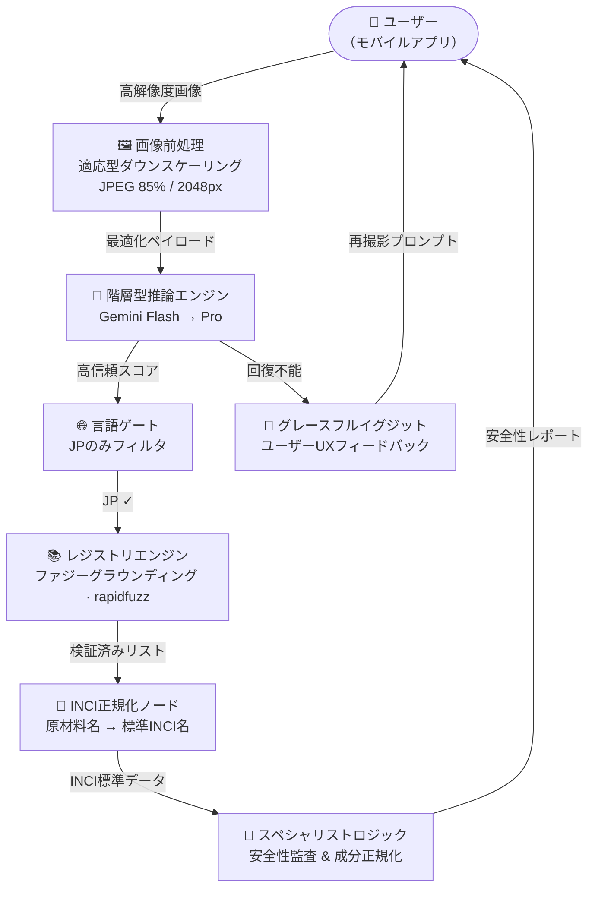
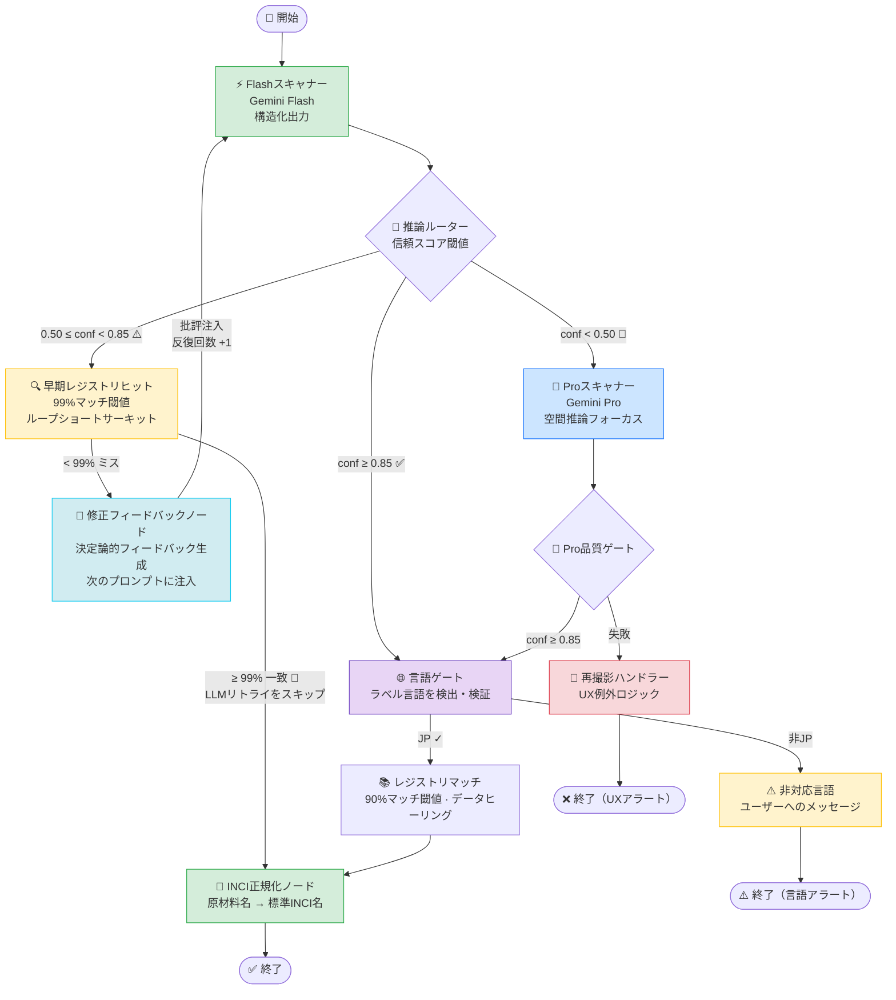
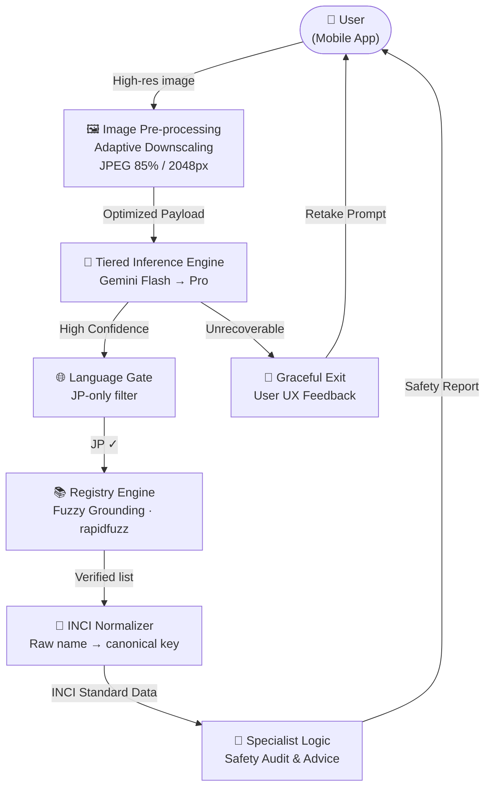
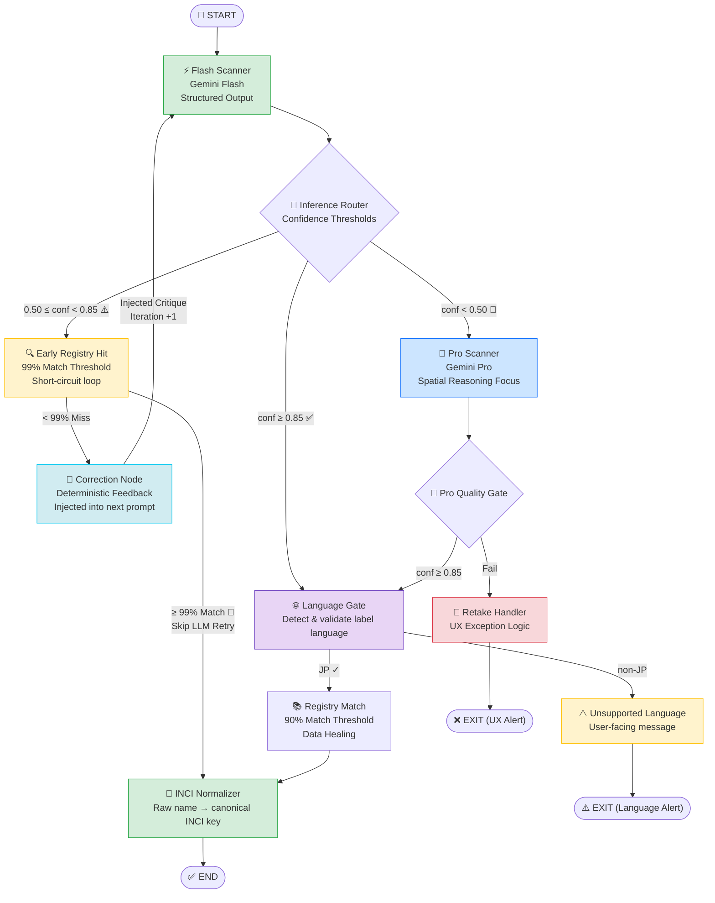

# 🌿 SkinGraph — AI Skincare Label Analysis Pipeline

<div align="center">


[日本語](#japanese) · [English](#english)

</div>

---

<a name="japanese"></a>

# 🌿 SkinGraph — AI マルチモーダル スキンケア解析パイプライン

Gemini VLMとLangGraphで構築した、日本語コスメラベルの成分抽出・INCI正規化パイプライン。

---

## なぜ難しいのか

日本語コスメラベルの機械読み取りには固有の難しさがある：**視覚的劣化**（円筒形ボトルの歪み・鏡面グレア・低コントラスト）、**文字の複雑さ**（漢字・カタカナ・ラテン文字の混在、全角/半角の揺れ）、そして**安全性への直結**（アレルゲンや禁忌成分の見落としは実害になる）。OCRは文字を読めてもINCIへの正規化ができず、VLMは高精度だが出力が確率的なため、安全性データへの利用は慎重なシステム設計が必要になる。

---

## 何をするのか

| 機能 | 詳細 |
|---|---|
| ⚡ **階層型VLM推論** | Flash優先、信頼スコアに基づいてProへ自動エスカレーション |
| 🔄 **自己修正ループ** | 最大2回のフィードバック付き再試行 |
| 🔍 **早期レジストリ照合** | 初回スキャン後に99%ファジーマッチ → 修正LLMコールをスキップ |
| 📚 **検証済みレジストリマッチング** | rapidfuzz WRatioによるキュレーション済みデータベース照合 |
| 🌐 **言語ゲート** | 非対応言語を検出し、明確なメッセージで早期終了 |
| 🔬 **INCI正規化** | 原材料名 → 標準INCI名へのマッピング（ファジーフォールバック付き） |
| 🗾 **日本語ラベル特化** | JCIA基準成分正規化、医薬部外品検出 |
| 🖼️ **画像最適化** | 推論前に最大2048pxへ自動ダウンスケール（ペイロード60〜80%削減） |
| 🔭 **評価ハーネス** | `evaluate.py` — 成分F1・バイリンガルブランド照合・NFKC正規化による精度計測 |
| 🧩 **構造化出力契約** | Pydantic v2による`ProductExtraction`スキーマ強制 |

---

## 🏗️ アーキテクチャ

### 機能ブロック図



### LangGraphオーケストレーション



### 3つの設計判断

**1. Flash優先 + 段階的エスカレーション**
標準的なラベルの約80%をFlash（コスト1/10）で処理。Proは視覚的に困難なケース（湾曲・グレア・低コントラスト）にのみ起動する。精度とコストのトレードオフは信頼スコアで制御する。

**2. 決定論的自己修正**
盲目的なリトライではなく、専用の修正ノードが失敗した抽出の信頼スコアを読み取り、具体的なフィードバックを生成して次のFlashプロンプトに注入する。追加のLLM呼び出しはゼロ。最大2回の修正後、自動的にProへエスカレーション。

**3. レジストリグラウンディング**
rapidfuzz WRatioを用いてVLMの確率的な出力を検証済み成分データと照合する。未登録製品は`registry_candidates.json`に自動ログされ、後続の追加ワークリストになる。

---

## 🚀 セットアップ

```bash
git clone <your-repo-url>
cd skincare-coach
poetry install
```

`.env`ファイルを作成:

```env
GOOGLE_API_KEY=your_key_here
```

実行:

```bash
# 単一画像（表/裏は写真から自動判定）
poetry run python run_pipeline.py data/golden_set/prod_001.jpg

# ユーザープロファイル付き（パーソナライズされた注意事項）
poetry run python run_pipeline.py data/golden_set/prod_001.jpg --user-profile data/user_profile_sample.json

# 自動判定の代わりに面を明示指定
poetry run python run_pipeline.py data/golden_set/prod_001.jpg --image-type front

# 精度評価
poetry run python evaluate.py --model both
```

**ルーティング:** まず軽量な分類器が、写真が**表面**（ブランド情報のみ → 製品を特定し**成分をオンライン検索**）か**裏面**（成分表示 → ラベルから読み取り）かを判定します。両経路は単一のバイリンガル**レコメンドカード**に集約されます：製品名、用途（1文）、ユーザー個別の注意事項（乾燥・紫外線敏感性のリスクを含む）、使用タイミング（AM / PM / 両方）、使用頻度。

> **OCRについて:** `scripts/run_ocr.py` はYomiToku日本語OCRエンジンをゴールデンセット画像に対して実行し、プレーンテキストを `data/ocr_out/` に出力します。**Phase 0ベンチマーク**として、OCRとVLMの精度差を定量化するためだけに存在します。プロダクショングラフ（`src/graph.py`）には組み込まれておらず、グラフはGemini VLM推論のみを使用します。

---

## 🔬 精度評価

> ⚠️ **前提条件:** N=3（日本語ラベル、難易度7〜8、逆境的条件：円筒歪み・鏡面反射・高密度漢字）。グラウンドトゥルースは小規模であり、方向性の指標として解釈してください。スコアはINCIではなく生の抽出成分名ベースのF1です。

`evaluate.py` を使用し、手動アノテーション済み成分リストとのフィールドレベルF1で評価。NFKC正規化・バイリンガルファジーマッチングを使用。

| 指標 | Flash (`gemini-3.1-flash-lite`) | Pro (`gemini-3.1-pro-preview`) |
|---|---|---|
| 成分抽出 F1（平均） | **0.95** | **0.99** |
| 成分再現率（平均） | 0.93 | 0.99 |
| ブランド一致 | 100/100 | 100/100 |
| 製品名一致 | 93/100 | 90/100 |
| 医薬部外品検出 | 3/3 ✓ | 3/3 ✓ |
| 平均 API レイテンシ | ~8s | ~36s |

---

## ⚠️ 現在の制限とロードマップ

**現在の制限:**
- **全言語対応・JPが最適化済み** — レジストリ/正規化/監査データはJP中心のため、非JPラベルでは一部成分が未マッチになることがある（失敗ではなく明示）
- **グラウンドトゥルースはN=3** — 評価セットが小規模
- **レジストリは小規模** — 現在2製品。未登録製品は`registry_candidates.json`に自動ログ
- **本番APIなし** — FastAPI / Docker / CI/CD は未実装

**ロードマップ:**
- [ ] 🌐 **セマンティック多言語対応** — 日本語・韓国語・英語の名称を単一のUniversal INCI IDにマッピング
- [ ] 📱 **API抽象化** — 本番デプロイ向けFastAPIラッパー
- [ ] 🏷️ **バーコード統合** — JAN/UPCコード事前照合で既知商品のVLMを完全スキップ

---

## 🛠️ テックスタックとプロジェクト構成

```
Orchestration     LangGraph (StateGraph + conditional routing)
VLM Inference     Google Gemini Flash / Pro via langchain-google-genai
Fuzzy Matching    rapidfuzz (WRatio scorer)
String Matching   pyahocorasick (multi-pattern exact match)
Data Contracts    Pydantic v2
Image Processing  Pillow (LANCZOS downscale → JPEG 85) · OpenCV (CLAHE + cylindrical dewarping)
Config            python-dotenv
Package Manager   Poetry
```

```
skincare-coach/
├── src/
│   ├── graph.py          # LangGraphワークフロー定義・ルーター
│   ├── state.py          # AgentState TypedDict + Pydanticデータ契約
│   ├── config.py         # 閾値・モデルIDの集中管理
│   └── nodes/
│       ├── scanner.py    # Flash & Pro VLMノード + 画像最適化
│       ├── registry.py   # ファジーレジストリマッチ（早期チェック + フルルックアップ）
│       ├── normalizer.py # 原材料名 → 標準INCIキーへのマッピング
│       ├── auditor.py    # 安全性監査ノード（開発中）
│       └── coach.py      # アドバイス生成ノード（開発中）
├── data/
│   ├── golden_set/              # 40製品ラベル画像（4件グラウンドトゥルース済み）
│   ├── ground_truth.json        # アノテーション済みグラウンドトゥルース
│   ├── registry.json            # 検証済み製品・成分データベース
│   ├── ingredient_master.json   # 標準INCIレジャー（シノニム → INCIキー）
│   ├── registry_candidates.json # 未登録製品の自動ログ（後続追加ワークリスト）
│   └── ocr_out/                 # OCRテキスト出力（ベンチマーク成果物、非プロダクション）
├── scripts/
│   └── run_ocr.py           # ⚠️ スタンドアロンOCRベンチマーク — グラフに組み込まれていない
├── run_pipeline.py          # CLIエントリーポイント
├── evaluate.py              # 抽出精度スコアラー
└── test_scanner.py          # Flash vs Pro ヘッドトゥヘッドテストハーネス
```

---

<div align="center">

Built with ❤️ and matcha 🍵

</div>

---
---

<a name="english"></a>

# 🌿 SkinGraph — AI Skincare Label Analysis Pipeline

A production-grade LangGraph pipeline for extracting and normalizing ingredients from Japanese cosmetics labels using Gemini VLM.

---

## Why this is hard

Japanese cosmetics labels resist reliable machine reading for three compounding reasons: **visual degradation** (cylindrical bottle distortion, specular glare, low-contrast embossed text), **character complexity** (kanji, katakana, and Latin script interleaved; full-width vs. half-width variants of the same character), and **safety-critical output** — a missed allergen or contraindicated ingredient isn't a UI glitch, it's a product defect. OCR can read characters but cannot normalize ingredient names to INCI standards. VLMs are more accurate but probabilistic, which means using them directly for safety data requires deliberate system design to catch and handle failures.

---

## What it does

| Feature | Detail |
|---|---|
| ⚡ **Tiered VLM Inference** | Flash-first with automatic Pro escalation based on confidence score |
| 🔄 **Self-Correction Loop** | Up to 2 feedback-enriched retries before escalation |
| 🔍 **Early Registry Short-Circuit** | 99% fuzzy match after first scan skips the correction LLM call |
| 📚 **Verified Registry Matching** | rapidfuzz WRatio scoring against a curated product database |
| 🌐 **Language Gate** | Detects label language; unsupported languages exit early with a clear user message |
| 🔬 **INCI Normalizer** | Maps raw ingredient names to canonical INCI keys; fuzzy fallback included |
| 🗾 **Japanese Label Specialisation** | JCIA-standard ingredient normalisation, quasi-drug (`医薬部外品`) detection |
| 🖼️ **Image Optimisation** | Auto-downscale to 2048px max before inference — cuts payload 60–80% |
| 🔭 **Eval Harness** | `evaluate.py` — field-level ingredient F1, bilingual brand/product match, NFKC normalization |
| 🧩 **Structured Output Contract** | Pydantic-enforced `ProductExtraction` schema — no prompt-parsing fragility |

---

## 🏗️ Architecture

### Functional Block Diagram



### LangGraph Orchestration



### Three design decisions

**1. Flash-first tiered inference**
~80% of standard labels are handled by Flash at 1/10th the cost of Pro. Pro is invoked only when confidence falls below the accept threshold — adversarial conditions: cylindrical distortion, specular glare, low-contrast text. Routing is deterministic on the confidence score.

**2. Deterministic self-correction**
Failed extractions don't trigger a blind retry. A dedicated Correction Node reads the failed extraction's confidence score and system status, generates a targeted feedback string, and injects it into the next Flash prompt. Zero additional LLM cost. Up to 2 iterations before automatic Pro escalation.

**3. Registry grounding**
The Registry Engine uses rapidfuzz WRatio to snap probabilistic VLM output to a verified ingredient list. Products not yet in the registry are auto-logged to `registry_candidates.json` — missed products accumulate a worklist rather than silently failing.

---

## 🚀 Getting Started

### Prerequisites

- Python 3.10+
- [Poetry](https://python-poetry.org/docs/)
- Google AI API key (Gemini access)

### Installation

```bash
git clone <your-repo-url>
cd skincare-coach
poetry install
```

### Environment Setup

Create a `.env` file:

```env
GOOGLE_API_KEY=your_key_here
```

### Run

```bash
# Single image — front/back side is auto-detected from the photo
poetry run python run_pipeline.py data/golden_set/prod_001.jpg

# With a user profile (personalised warnings)
poetry run python run_pipeline.py data/golden_set/prod_001.jpg --user-profile data/user_profile_sample.json

# Force the side instead of auto-detecting
poetry run python run_pipeline.py data/golden_set/prod_001.jpg --image-type front

# Run accuracy evaluation
poetry run python evaluate.py --model both
```

**How it routes:** a lightweight classifier first decides whether the photo shows the **front** (branding only → identify the product and **search its ingredients online**) or the **back** (ingredient list → read it off the label). Both paths converge on a single bilingual **recommendation card**: product name, one-line purpose, user-tailored warnings (including dehydration / sun-sensitivity risk), best timing (AM / PM / both), and use frequency.

> **Note on OCR:** `scripts/run_ocr.py` runs a local YomiToku Japanese OCR engine on the golden-set images and writes plain-text output to `data/ocr_out/`. It exists purely as a **Phase 0 benchmark baseline** to quantify the OCR-vs-VLM accuracy gap — intentionally excluded from the production graph (`src/graph.py`). The graph uses Gemini VLM inference exclusively.

---

## 🔬 Evaluation & Benchmarking

> ⚠️ **Caveat:** N=3 hand-annotated Japanese labels (difficulty 7–8, adversarial conditions: cylindrical distortion, specular reflection, dense kanji clusters). The ground truth set is small — treat these numbers as directional. Scores are F1 against raw extracted names, not post-INCI-normalization.

Accuracy measured with `evaluate.py` against hand-annotated ground truth, using field-level F1 with NFKC normalization and bilingual fuzzy matching.

| Metric | Flash (`gemini-3.1-flash-lite`) | Pro (`gemini-3.1-pro-preview`) |
|---|---|---|
| Ingredient F1 (avg) | **0.95** | **0.99** |
| Ingredient Recall (avg) | 0.93 | 0.99 |
| Brand Match | 100/100 | 100/100 |
| Product Name Match | 93/100 | 90/100 |
| Quasi-drug Detection | 3/3 ✓ | 3/3 ✓ |
| Avg. API Latency | ~8s | ~36s |

---

## ⚠️ Current Limitations & Roadmap

**What's currently missing or limited:**
- **Any label language accepted, JP best-tuned** — the registry/normalizer/audit data are JP-centric, so non-JP labels may leave some ingredients unmatched (surfaced, not fatal)
- **Ground truth is N=3** — small eval set; scores are directional
- **Registry is small** — 2 verified products; un-registered products are auto-logged to `registry_candidates.json`
- **No production API** — FastAPI / Docker / CI/CD not yet implemented

**Next:**
- [ ] 🌐 **Semantic Multilingual Support** — map Japanese, Korean, and English names to a single Universal INCI ID
- [ ] 📱 **API Abstraction** — FastAPI wrapper for production deployment
- [ ] 🏷️ **Barcode Integration** — pre-scan JAN/UPC codes to skip VLM entirely for known products

---

## 🛠️ Tech Stack & Project Structure

```
Orchestration     LangGraph (StateGraph + conditional routing)
VLM Inference     Google Gemini Flash / Pro via langchain-google-genai
Fuzzy Matching    rapidfuzz (WRatio scorer)
String Matching   pyahocorasick (multi-pattern exact match)
Data Contracts    Pydantic v2
Image Processing  Pillow (LANCZOS downscale → JPEG 85) · OpenCV (CLAHE + cylindrical dewarping)
Config            python-dotenv
Package Manager   Poetry
```

```
skincare-coach/
├── src/
│   ├── graph.py          # LangGraph workflow definition & routers
│   ├── state.py          # AgentState TypedDict + Pydantic data contracts
│   ├── config.py         # Centralised thresholds & model IDs
│   └── nodes/
│       ├── scanner.py    # Flash & Pro VLM nodes + image optimisation
│       ├── registry.py   # Fuzzy registry match (early check + full lookup)
│       ├── normalizer.py # Maps raw ingredient names -> canonical INCI keys
│       ├── auditor.py    # Safety audit node (in progress)
│       └── coach.py      # Advice generation node (in progress)
├── data/
│   ├── golden_set/              # 40 product label images (4 ground-truthed)
│   ├── ground_truth.json        # Annotated ground truth (brand, ingredients, safety triggers)
│   ├── registry.json            # Verified product + ingredient database
│   ├── ingredient_master.json   # Canonical INCI ledger (synonyms -> INCI key)
│   ├── registry_candidates.json # Auto-logged products not yet in the registry
│   └── ocr_out/                 # Raw OCR text output (benchmark artefacts, not production)
├── scripts/
│   └── run_ocr.py           # ⚠️ Standalone OCR benchmark — NOT wired into the graph
├── run_pipeline.py          # CLI entry point
├── evaluate.py              # Extraction accuracy scorer (VLM output vs ground truth)
└── test_scanner.py          # Flash vs Pro head-to-head test harness
```
