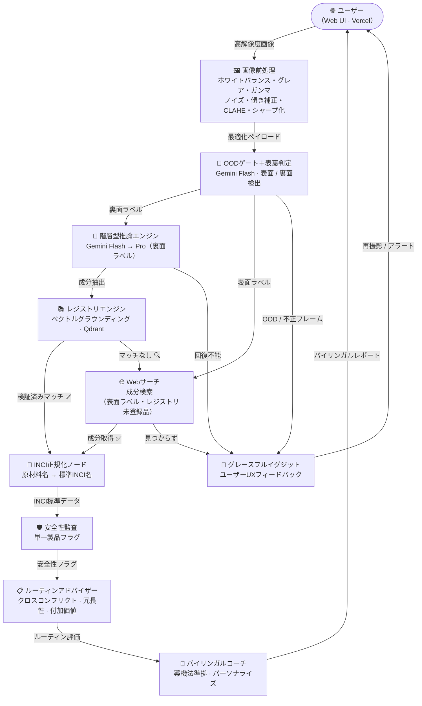
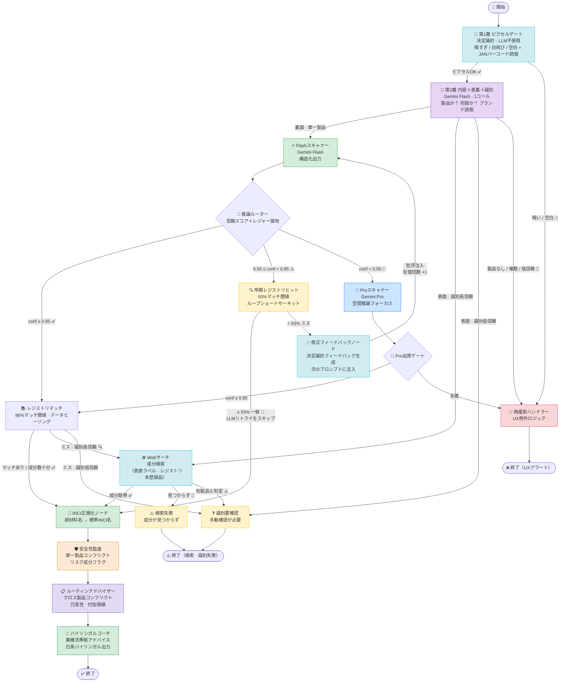
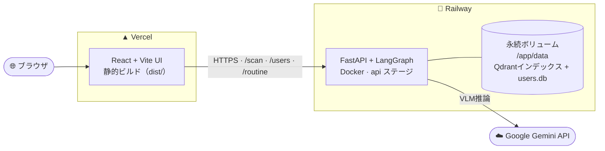
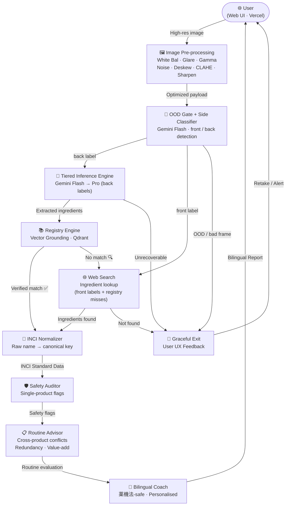
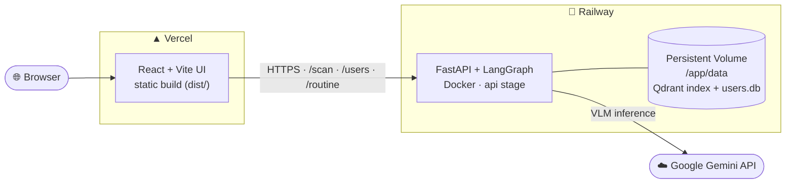

# 🌿 SkinGraph — Technical Documentation

<div align="center">

[](https://github.com/ShinBellator/skingraph/actions/workflows/ci.yml)
[](https://github.com/ShinBellator/skingraph/actions/workflows/deploy.yml)

[日本語](#japanese) · [English](#english)

</div>

---

<a name="japanese"></a>

# 🌿 SkinGraph — 技術ドキュメント

> 本書はSkinGraphの技術的ディープダイブです。プロダクト紹介・クイックスタート・作者情報は[README](../README.md)を参照してください。

**技術概要:** SkinGraphはLangGraph StateGraphパイプラインです。コスメラベルの写真を階層型ビジョン言語モデル（Gemini Flash → Pro）で読み取り、成分を抽出・正規化します。Qdrantベクトルストアが確率的なVLM出力をキュレーション済みレジストリで接地します。2段の入力ゲート（決定論的ピクセル事前チェック＋内容分類器）が抽出前に使用不可能な画像を弾きます。安全性監査とクロスプロダクトのルーティン評価は完全に決定論的（LLM不使用）。コーチノードが監査結果を薬機法準拠のバイリンガルアドバイスに変換します。

> コンポーネント別の詳細な内訳とリポジトリ構成は、末尾の「🛠️ テックスタックとプロジェクト構成」セクションを参照してください。

---

## なぜ難しいのか

日本語コスメラベルの機械読み取りには固有の難しさがある：**視覚的劣化**（円筒形ボトルの歪み・鏡面グレア・低コントラスト）、**文字の複雑さ**（漢字・カタカナ・ラテン文字の混在、全角/半角の揺れ）、そして**安全性への直結**（アレルゲンや禁忌成分の見落としは実害になる）。OCRは文字を読めてもINCIへの正規化ができず、VLMは高精度だが出力が確率的なため、安全性データへの利用は慎重なシステム設計が必要になる。

---

## 何をするのか

| 機能 | 詳細 |
|---|---|
| ⚡ **階層型VLM推論** | Flash優先、信頼スコアに基づいてProへ自動エスカレーション |
| 🔄 **自己修正ループ** | 最大2回のフィードバック付き再試行 |
| 🔍 **早期レジストリ照合** | 初回スキャン後に99%ファジーマッチ → 修正LLMコールをスキップ |
| 📚 **検証済みレジストリマッチング** | Qdrantベクトル検索（コサイン類似度）によるキュレーション済みデータベース照合 |
| 🔬 **INCI正規化** | 原材料名 → 標準INCI名へのマッピング（ファジーフォールバック付き） |
| 🗾 **日本語ラベル特化** | JCIA基準成分正規化、医薬部外品検出 |
| 🖼️ **画像前処理** | VLM推論前の7ステップパイプライン：リサイズ → ホワイトバランス → グレア除去 → ガンマ補正 → ノイズ除去 → 傾き補正 → CLAHE → シャープ化 |
| 🚦 **入力ゲーティング（OOD検出）** | 抽出前の2段ガードで使用不可能な画像を拒否：決定論的ピクセル事前チェック（ほぼ真っ黒・白飛び・空白）＋ VLMによる内容判定（製品なし・複数製品）。OODフレームから製品を捏造させない |
| 🛡️ **安全性監査** | 単一製品内の成分コンフリクト・リスク成分フラグ（決定論的、LLM不使用） |
| 📋 **ルーティンメモリ** | ユーザーの「棚」をSQLiteに保存し、新製品との**クロスコンフリクト・冗長性・付加価値**を判定 |
| 📊 **ルーティンダッシュボード** | 「マイルーティン」ダッシュボード — **スキャンで製品追加**（手動入力はフォールバック）、**AM / PM列**と製品ごとの使い方ノート、**月額コスト概算**（USD・日本市場価格をオンライン取得）、目標カバレッジを**5枚の葉**でスコア表示 |
| 👤 **ユーザープロファイル** | 肌タイプ・年齢・目標・肌の悩み・妊娠状況、そしてアジア系肌への配慮（Fitzpatrickのアンダートーンから）に基づくパーソナライズ |
| 💬 **バイリンガルコーチ** | 薬機法準拠の日英バイリンガルアドバイス |
| 💭 **フォローアップQ&A** | スキャン結果への追加質問（「ビタミンCと併用できる？」）にステートレスで回答 — 検証済みスキャン結果に接地し、安全所見は決定論的計算を再利用 |
| 🔭 **評価ハーネス** | `eval/evaluate.py` — 成分F1・バイリンガルブランド照合・NFKC正規化による精度計測。CIでは記録済みカセットのリプレイでF1フロアを強制 |
| 🧩 **構造化出力契約** | Pydantic v2による`ProductExtraction`スキーマ強制 |

---

## 🏗️ アーキテクチャ

### 機能ブロック図



### LangGraphオーケストレーション



> Phase 4で `verify_identity`（第3のFlashコール）と `tag_language` ノードは削除された。ブランド・製品名の識別読取は表裏分類器の同一コールに統合され（追加コストゼロ）、レジストリミス時の裏面経路はスキャナーの抽出信頼度を識別ゲートとして再利用する。

### 設計判断

**1. Flash優先 + 段階的エスカレーション**
標準的なラベルの約80%をFlash（コスト1/10）で処理。Proは視覚的に困難なケース（湾曲・グレア・低コントラスト）にのみ起動する。精度とコストのトレードオフは信頼スコアで制御する。

**2. 決定論的自己修正**
盲目的なリトライではなく、専用の修正ノードが失敗した抽出の信頼スコアを読み取り、具体的なフィードバックを生成して次のFlashプロンプトに注入する。追加のLLM呼び出しはゼロ。最大2回の修正後、自動的にProへエスカレーション。

**3. レジストリグラウンディング**
Qdrantのベクトル検索（multilingual-e5埋め込みのコサイン類似度）を用いてVLMの確率的な出力を検証済み成分データと照合する。未登録製品は`registry_candidates.json`に自動ログされ、後続の追加ワークリストになる。

**4. 決定論的安全チェーン（LLM不使用）**
監査ノードとルーティンアドバイザーはLLMを一切使用しない。コンフリクトマトリクス（`data/conflict_matrix.json`）と機能グループ分類（`data/function_groups.json`）に対して確定的なルールマッチングを行う。コーチノードのみがLLMを使用し、監査・アドバイザーが生成したグラウンデッドな所見を薬機法準拠のバイリンガル散文に変換する。

**5. 多層的な入力ゲーティング（2段のOOD検出）— なぜ必要か**
スキャナーの構造化出力契約では `brand` と `ingredients` が**必須フィールド**である。つまり製品が写っていない画像（ほぼ真っ黒なフレーム、猫、スクリーンショットなど）を渡されても、VLMは「何も写っていない」と答えられず、もっともらしい製品名と成分リストを**構造的に捏造させられる**。その捏造はそのまま安全性監査・コーチングへ流れ込み、実在しない製品についてのアドバイスを生成してしまう。これを抽出が走る**前**に断ち切るため、2つの安価なガードを設けた：

- **第1層 — 決定論的ピクセル事前チェック（LLM不使用）。** Gemini呼び出しの前に、Pillowの`ImageStat`で平均輝度とコントラスト分散を計算し、ほぼ真っ黒・白飛び・空白・デコード不能なフレームを弾く。コストゼロ・完全に決定論的でテスト可能であり、**グラフのエントリーノード**として走るため、分類器をスキップするCLI/APIの`image_type`オーバーライド経路もカバーする。信頼度ループでも黒画像はいずれ拒否できるが、それには2〜4回の無駄なVLM呼び出しを要する。本チェックは同じ結論を無料で得る。
- **第2層 — 表裏分類器への内容判定の統合。** 表裏分類器はもともと全スキャンで最初に走るため、**同じVLM呼び出し・追加レイテンシ／コストはゼロ**で「製品1個か・製品なしか・複数製品か」も報告するよう拡張した。`not_a_product` と `multiple_products` は専用メッセージ付きの再撮影グレースフルイグジットへルーティングする。これがハルシネーションの穴（製品なし → 捏造スキャナーが走る**前**に拒否）と、複数製品の無言ブレンド（2製品が1つの誤った成分リストに混ざる問題）を実際に塞ぐ。

両層とも既存の `retake_required` イグジット／UX配線を再利用するため、クライアント契約の変更は不要。

---

## 🔭 可観測性（LangSmith + Prometheus）

各実行は[LangSmith](https://smith.langchain.com)にエンドツーエンドでトレースされる。グラフ実行・各ノード・各Gemini呼び出し（表裏判定、スキャナ、Web検索、コーチ、フォローアップ）が、トークン数・レイテンシ・構造化出力のペイロードとともに1つのツリーにネストされる。

APIは`GET /metrics`（Prometheus形式）も公開しており、リクエスト数・レイテンシ・エラー率を標準のスクレイパー（Grafana Cloudなど）で収集できる。

### カスタムメトリクスとスキャン単価（`src/metrics.py`）

HTTPレベルの標準メトリクスに加えて、パイプライン固有のカウンターを同じ`/metrics`エンドポイントで公開している：

| メトリクス | 内容 |
|---|---|
| `scans_total{status,entrypoint}` | 最終ステータス・エントリポイント別のスキャン数 |
| `scan_node_duration_seconds{node}` | グラフノード別の実測時間ヒストグラム |
| `scan_escalations_total` | Flash → Proへのエスカレーション回数 |
| `scan_corrections_total` | 修正ループのリトライ回数 |
| `scan_tokens_total{model,direction}` | モデル・方向（入力/出力）別のLLMトークン数 |
| `scan_cost_usd_total{model}` | モデル別の推定LLMコスト（USD・定価ベース） |

トークン数は`UsageMetadataCallbackHandler`を実行コンフィグに付与して収集する（ノードコードの変更ゼロで、実行中の全Gemini呼び出しに伝播）。コストは`src/config.py`の`MODEL_PRICES_USD_PER_MTOK`定価表で算出。さらに各スキャンのAPIレスポンスには`usage`ブロック（`input_tokens`・`output_tokens`・`model_calls`・`estimated_cost_usd`）が含まれ、**1スキャンあたりのコストがレスポンスで直接確認できる**。

トレースは**環境変数だけで有効化**され、コード変更は不要（LangGraph と Gemini チャットモデルを自動計装）。`.env`に設定する（`.env.example`参照）:

| 変数 | 役割 |
|---|---|
| `LANGCHAIN_TRACING_V2=true` | トレースを有効化 |
| `LANGCHAIN_API_KEY` | LangSmith のキー |
| `LANGCHAIN_PROJECT` | 送信先プロジェクト（`skincare-architect-v1`） |
| `LANGCHAIN_HIDE_INPUTS=true` | base64ラベル画像・成分リストをトレースから除外 |

自動トレースに加えて、各スキャンには UI で絞り込めるよう情報を付与している（[src/observability.py](src/observability.py)、CLI と API の invoke 箇所に組み込み済み）:

- **実行名** — `skincare-scan`
- **タグ** — `entry:cli` / `entry:api`、`side:front` / `side:back`、`personalised` / `anonymous`、`with-routine`
- **メタデータ** — `entrypoint`、`image_type`、`personalised`、`has_routine`

`LANGSMITH_*` という変数名でも動作する（SDKはどちらの接頭辞も読む）。起動時、CLIとAPIはトレースが有効かどうかと送信先プロジェクトをログ出力する。

---

## 🚀 セットアップ

### ⌨️ 主要コマンド早見表

よく使うコマンドの早見表です（いずれも `poetry install` 後に実行）：

| コマンド | 内容 |
|---|---|
| `poetry install` | Python依存関係をすべてインストール |
| `poetry run python run_pipeline.py <画像>` | ラベルを1枚スキャン（CLI） |
| `poetry run python run_pipeline.py <画像> --user-id <id> --add-to-routine` | 保存済みユーザーとしてスキャンし、ルーティン棚に追加 |
| `poetry run python -m eval.evaluate --model both` | 精度評価ハーネスを実行 |
| `poetry run python scripts/manage_users.py seed` | デモ用ユーザー＋ルーティンをDBにシード |
| `poetry run python scripts/build_index.py` | QdrantベクトルインデックスをJSONからビルド |
| `poetry run uvicorn src.api.main:app --reload` | FastAPIサーバーを起動（`http://127.0.0.1:8000/docs`） |
| `poetry run pytest` | オフラインのテストスイートを実行 |
| `docker compose up api` | DockerでAPIを起動（→ `http://localhost:8000`） |
| `cd ui && npm install && npm run dev` | React + Vite のUI開発サーバーを起動 |

各コマンドの詳しい使い方は以下のとおりです。

```bash
git clone <your-repo-url>
cd skincare-coach
poetry install
```

`.env`ファイルを作成（`.env.example`をコピー）:

```env
GOOGLE_API_KEY=your_key_here

# 可観測性（LangSmith）— 任意。下記2つを設定すると、LangGraphとGeminiの
# 全実行が自動でLangSmithにトレースされます（コード変更は不要）。
LANGCHAIN_TRACING_V2=true
LANGCHAIN_API_KEY=lsv2_pt_...
LANGCHAIN_PROJECT=skincare-architect-v1
LANGCHAIN_HIDE_INPUTS=true   # ラベル画像・成分などの入力をトレースから除外
```

各スキャンの実行は `skincare-scan` という名前でトレースされ、
`entry:cli|api` / `side:front|back` / `personalised` などのタグと
メタデータが付与されるため、LangSmith UI で絞り込みできます。

実行:

```bash
# 単一画像（表/裏は写真から自動判定）
poetry run python run_pipeline.py data/golden_set/prod_001.jpg

# ユーザープロファイル付き（パーソナライズされた注意事項）
poetry run python run_pipeline.py data/golden_set/prod_001.jpg --user-profile data/user_profile_sample.json

# ユーザープロファイルをDBに保存して id を表示
poetry run python run_pipeline.py data/golden_set/prod_001.jpg --user-profile data/user_profile_sample.json --save-user "Aiko"

# DBに保存済みのユーザーとして実行（プロファイル＋ルーティンを読み込み）
poetry run python run_pipeline.py data/golden_set/prod_001.jpg --user-id <id>

# スキャン後、製品をユーザーのルーティン棚に追加
poetry run python run_pipeline.py data/golden_set/prod_001.jpg --user-id <id> --add-to-routine

# 自動判定の代わりに面を明示指定
poetry run python run_pipeline.py data/golden_set/prod_001.jpg --image-type front

# 精度評価
poetry run python -m eval.evaluate --model both

# ダミーユーザーとルーティン製品をDBにシード
poetry run python scripts/manage_users.py seed
poetry run python scripts/manage_users.py list
```

### API起動

パイプラインはFastAPIサービス（`src/api/main.py`）としても公開しています：

```bash
# サーバー起動（対話ドキュメント: http://127.0.0.1:8000/docs）
poetry run uvicorn src.api.main:app --reload

# ラベルをスキャン（multipartアップロード。image_type / user_id / add_to_routine は任意）
curl -F "image=@data/golden_set/prod_001.jpg" http://127.0.0.1:8000/scan
```

主なエンドポイント: `POST /scan`（スキャン・ブロッキング）、`POST /scan/stream`（Server-Sent Eventsでノードごとの進捗をストリーミング）、`POST /scan/followup`（スキャン結果への**フォローアップ質問** — ステートレス：クライアントが保持するスキャン結果を接地情報として送り返す。会話の保存も再スキャンもなし）、`/users`・`/users/{id}`（プロファイルCRUD）、
`/users/{id}/routine`・`/routine/{id}`（ルーティン棚の追加・削除）、
`GET /users/{id}/routine/dashboard`（ルーティンダッシュボード）、`GET /health`、`GET /metrics`（Prometheus）。

**ルーティング:** すべてのアップロードは、抽出が走る前にまず2つの安価な入力ゲートを通過します — 決定論的ピクセル事前チェック（VLM呼び出しなしでほぼ真っ黒・白飛び・空白のフレームを弾く）と、分類器の内容チェック（製品なし・複数製品の写真を弾く）。有効な単一製品の写真の場合、その同じ軽量分類器が、写真が**表面**（ブランド情報のみ → 製品を特定し**成分をオンライン検索**）か**裏面**（成分表示 → ラベルから読み取り）かを判定します。両経路は単一のバイリンガル**レコメンドカード**に集約されます：製品名、用途（1文）、ユーザー個別の注意事項（乾燥・紫外線敏感性のリスクを含む）、使用タイミング（AM / PM / 両方）、使用頻度。

> **OCRについて:** `scripts/run_ocr.py` はYomiToku日本語OCRエンジンをゴールデンセット画像に対して実行し、プレーンテキストを `data/ocr_out/` に出力します。**Phase 0ベンチマーク**として、OCRとVLMの精度差を定量化するためだけに存在します。プロダクショングラフ（`src/graph.py`）には組み込まれておらず、グラフはGemini VLM推論のみを使用します。

---

## 🐳 Docker

4ステージのマルチステージビルドで、本番APIイメージからYomiToku/OpenCVを分離しています。

| ステージ | ターゲット | 内容 |
|---|---|---|
| `builder` | （内部） | Poetryによる依存関係解決 + `/opt/venv` |
| `base` | （内部） | ONNX埋め込みモデル（`multilingual-e5-small`）とQdrantインデックスを事前ベイク |
| `ocr-worker` | `--target ocr-worker` | `base` + opencv-headless + yomitoku（ベンチマーク専用） |
| `api` | `--target api` | FastAPI + LangGraph + fastembed/ONNX Runtime（torchなし） |

```bash
# 初回: Qdrantベクターインデックスをビルド
docker compose run --rm api python scripts/build_index.py

# API起動
docker compose up api
# → http://localhost:8000/docs

# OCRベンチマーク（オプション — YomiToku層のみ別途ビルド）
docker compose --profile ocr run ocr-worker \
  python scripts/run_ocr.py data/golden_set/ --device cpu
```

永続化される状態（`./data/qdrant/` と `./data/users.db`）はバインドマウントで管理されます。

---

## 🚀 ライブデプロイ（Railway + Vercel）

ライブデモは **Railway**（バックエンドAPI）と **Vercel**（フロントエンドUI）で稼働しています。下記のAWS/Terraform構成が「設計上の本番ターゲット」である一方、実際に動いている環境はこちらです。



| 役割 | ホスト | 内容 |
|---|---|---|
| バックエンドAPI | **Railway** | `Dockerfile` の最終 `api` ステージをビルド・デプロイ（`railway.toml`）。`GOOGLE_API_KEY` はRailway Variablesで注入。ヘルスチェックは `GET /health` |
| 永続ストレージ | **Railway Volume** | `/app/data` に単一ボリュームをマウント。Qdrantインデックスと `users.db` を保持し再起動をまたいで永続化（`entrypoint.sh` がseedデータを同期） |
| フロントエンドUI | **Vercel** | `ui/` の静的ビルドをホスト。`VITE_API_BASE_URL` をRailwayの公開URLに設定 |

**接続の設定:**
- Railway側で `CORS_ORIGINS` にVercelのデプロイURLを設定（カンマ区切り）。
- Vercel側で環境変数 `VITE_API_BASE_URL` にRailwayの公開URLを設定。

> 💡 Railwayは**最終Dockerステージ**をビルドします。`Dockerfile` では `api` が最終ステージ、`ocr-worker`（torchvision/yomitokuを含む重いレイヤー）はその手前に置かれているため、デプロイ対象から自動的に除外されます。

---

## ☁️ AWSデプロイ（Terraform · リファレンス構成）

> **このアプリは元々AWS向けに設計されています。** `terraform/` のAWS ECS Fargate構成はAWS/IaC設計力を示すための**リファレンス（ポートフォリオ）構成**として維持しており、ライブ環境は上記のRailway + Vercelで稼働しています。

`terraform/` に、AWS ECS Fargate上のサーバーレス構成を定義するTerraformファイルが含まれています。

| リソース | 目的 |
|---|---|
| ECR | Dockerイメージレジストリ |
| ECS Fargate | `api` コンテナの実行 |
| ALB | パブリックHTTPエンドポイント |
| EFS | Qdrantベクターストアの永続化（`/app/data/qdrant` にマウント） |
| Secrets Manager | `GOOGLE_API_KEY` をタスク起動時に注入 |

```bash
cd terraform
cp terraform.tfvars.example terraform.tfvars  # Gemini APIキーを記入
terraform init && terraform apply

# ECRにイメージをプッシュ
ECR=$(terraform output -raw ecr_repository_url)
aws ecr get-login-password --region us-east-1 \
  | docker login --username AWS --password-stdin $ECR
docker build --target api -t $ECR:latest ..
docker push $ECR:latest

# EFSにQdrantインデックスをシード（初回のみ）
eval "$(terraform output -raw build_index_command)"
```

---

## 🧪 テスト

```bash
# テストスイート全体を実行
poetry run pytest

# 詳細出力
poetry run pytest -v
```

テストはすべてオフライン・決定論的: Geminiコールはモック、Qdrant/ONNX埋め込みモデルもパッチアウトされる。ネットワーク接続・APIキー・モデルダウンロードは不要。

| テストファイル | カバレッジ |
|---|---|
| `tests/test_scanner.py` | Flash / Pro スキャナーノード |
| `tests/test_registry.py` | ファジーレジストリマッチ |
| `tests/test_normalizer.py` | INCI正規化マッピング |
| `tests/test_auditor.py` | 単一製品安全性監査 |
| `tests/test_routine_advisor.py` | クロス製品コンフリクト・冗長性・付加価値 |
| `tests/test_user_store.py` | ルーティン棚のadd / get / remove |
| `tests/test_coach.py` | コーチアドバイス生成 |
| `tests/test_followup.py` | フォローアップQ&A（接地・決定論的安全所見） |
| `tests/test_websearch.py` | Webサーチフォールバック |
| `tests/test_routers.py` | グラフルーターロジック |
| `tests/test_api.py` | FastAPIエンドポイント（scan / stream / followup / users / routine） |
| `tests/test_render.py` | CLIレンダリング |
| `tests/test_eval_replay.py` | 評価リプレイゲート（カセット・ステールネスガード） |

---

## 🔬 精度評価

`eval/evaluate.py` を使用し、手動アノテーション済みグラウンドトゥルース（`data/ground_truth.json` — 日本語・韓国語・英語ラベル、表裏ショットを含む14枚）に対し評価。成分は**正規化後のINCI空間**でスコアリングする — 各抽出結果を翻訳・正規化レイヤー（VLMの`name_standardized` INCI ＋ 正規化レジャーのフォールバック）に通し、製品ごとに保存された`ingredient_inci`翻訳と照合する。これにより指標は**言語非依存**となり、韓国語ラベルも日本語ラベルと同じ基準でスコアリングされる。

**成分抽出** — 全成分が印字されたバックラベル（日本語＋韓国語）:

| 指標 | Flash (`gemini-3.1-flash-lite`) | Pro (`gemini-3.1-pro-preview`) |
|---|---|---|
| 成分抽出 F1（平均） | **0.94** | **0.98** |
| 成分再現率（平均） | 0.89 | 0.98 |
| 成分適合率（平均） | 1.00 | 0.98 |
| 平均 API レイテンシ | ~8s | ~36s |

**識別・安全フラグ検出** — JP/KR/EN・表裏を含む全14枚:

| 指標 | Flash | Pro |
|---|---|---|
| ブランド一致 | 96/100 | 96/100 |
| 製品名一致 | 90/100 | 89/100 |
| 医薬部外品検出 | 12/14 | 9/14 |

> **成分指標のスコープ.** この指標はVLMの**抽出忠実度**を測る — ラベルに**印字された**成分をどれだけ正確に読み取りINCIへ正規化できるか。一部のラベルは全成分リストではなく強調成分のみを印字する（例：シカテノールクリームはパンテノールとツボクサエキスのみ表示）。VLMはそれらを正しく抽出するが、ラベル上に全リストが存在しないため忠実度指標からは除外する。こうしたケースでは**Web検索フォールバック**が公式の全成分リストを取得し、レジストリが完全な処方を保持する。エンドツーエンドの網羅性は素のVLM抽出とは別の能力として扱う。

### CI回帰ゲート（record / replay）

上のF1テーブルは「一度実行した数字」ではなく、**すべてのPRで強制されるオフライン品質ゲート**になっている。ローカルで一度だけ実APIに対して記録した結果レベルのカセット（`eval/cassettes/*.json`、コミット済み）を、CIの`eval-replay`ジョブが`python -m eval.evaluate --replay --min-f1 0.90`で再生する — APIキーも画像も不要。リプレイは記録済みの抽出結果を**実際の**スコアリングパス（正規INCI解決 → 正規化レジャー → ファジーP/R/F1）に通すため、正規化・成分マスター・グラウンドトゥルース・スコアリング自体の回帰を毎PRで検出する。カセットにはスキャナープロンプトのSHA-256とモデルIDが記録され、現在のコードと**不一致ならゲートが失敗**する — プロンプト変更が古い評価数値のままマージされることはない。詳細は[eval/README.md](../eval/README.md)を参照。

---

## ⚠️ 現在の制限とロードマップ

**現在の制限:**
- **全言語対応・JPが最適化済み** — レジストリ/正規化/監査データはJP中心のため、非JPラベルでは一部成分が未マッチになることがある（失敗ではなく明示）。成分抽出は言語非依存のINCI空間でJP＋KRバックラベルを評価（フロントラベルや一部印字ラベルはWeb検索フォールバックで網羅）
- **レジストリは中核製品をカバー** — 現在11製品。未登録製品は`registry_candidates.json`に自動ログ
- **永続化はホストに依存** — ライブのRailwayでは `/app/data` のボリュームに `users.db` とQdrantインデックスが乗り、再起動をまたいで永続化される。一方リファレンスのAWS/ECS構成ではSQLiteファイルをEFSにマウントできず、タスク再起動でプロファイルがリセットされる（本番はRDS Postgresへの移行を推奨）

**ロードマップ:**
- [ ] 🌐 **セマンティック多言語対応** — 日本語・韓国語・英語の名称を単一のUniversal INCI IDにマッピング
- [x] 📱 **API抽象化** — FastAPIラッパー（`/scan` ＋ ユーザー/ルーティンCRUD）
- [x] 🐳 **コンテナ化** — マルチステージDockerビルド + docker-compose
- [x] 🚀 **ライブデプロイ** — Railway（API）+ Vercel（UI）で稼働中
- [x] ☁️ **クラウドデプロイ（リファレンス）** — AWS ECS Fargate Terraform構成
- [x] 🏷️ **バーコード統合** — JAN/UPCコードでレジストリを決定論的に照合（pyzbar導入時はフレームから直接デコード、未導入時はVLMのラベル読取り `jan_code` を利用）

---

## 🔒 画像データの取り扱いとリテンション（Image data handling）

ユーザーがアップロードする製品写真には、顔・手・室内など**個人を特定しうる情報**が写り込みうる。本パイプラインの既定の挙動は「**何も保存しない**」:

- **アップロード画像** — 一時ファイルに書き出され、スキャン終了時（ストリーミングはストリーム終了時）に必ず削除される。前処理済みbase64はプロセス内の`lru_cache`（最大8件）にのみ存在し、ディスクには書かれない。
- **LangSmithトレース** — `LANGCHAIN_HIDE_INPUTS=true` を推奨（`.env.example` 参照）。base64画像と成分リストをトレースペイロードから除外する。
- **リジェクションストア（オプトイン）** — `REJECTION_STORE_ENABLED=1` を設定した場合のみ、リテイクで弾かれたフレームが理由・スコア付きで `data/rejections/`（gitignore済み）に保存される。保存数は `REJECTION_STORE_MAX`（既定200件）で上限され、古いものから削除。**目的はOODゲートの較正のみ**: 保存したフレームは手作業でラベリングして `data/vision_eval_set.json` に取り込み、`eval/vision_eval.py` で閾値を検証したら削除すること。顔が写ったフレームは取り込まずに破棄する。
- **Web検索キャッシュ** — `data/web_cache.json`（gitignore済み）にはブランド名・製品名・成分リスト・出典URLのみが入る。画像・ユーザー情報は含まれない。TTLは30日。

---

## 🛠️ テックスタックとプロジェクト構成

```
Orchestration     LangGraph (StateGraph + conditional routing)
VLM Inference     Google Gemini Flash / Pro via langchain-google-genai
Vector Retrieval  Qdrant (embedded/local) · fastembed/ONNX Runtime (multilingual-e5-small)
                  — レジストリ照合とINCI正規化の両方を駆動
Eval Scoring      rapidfuzz (WRatio) — 抽出精度評価ハーネス専用 (eval/evaluate.py)
Data Contracts    Pydantic v2
Image Processing  Pillow + NumPy (7-step pipeline: resize · white balance · glare reduction · gamma · noise · deskew · CLAHE · sharpen → JPEG 85)
Persistence       SQLite (user profiles + routine shelf)
API               FastAPI + Uvicorn
Containerisation  Docker multi-stage build · docker-compose
Live Hosting      Railway (API + persistent volume) · Vercel (React UI)
Cloud Deploy      Terraform → AWS ECS Fargate / ALB / EFS / ECR / Secrets Manager (リファレンス構成)
Observability     LangSmith (auto-traced LangGraph + Gemini runs) · Prometheus /metrics endpoint
Config            python-dotenv
Package Manager   Poetry
Testing           pytest (fully offline, all LLM + vector-store calls mocked)
```

```
skincare-coach/
├── src/
│   ├── api/
│   │   ├── main.py           # FastAPIアプリ + エンドポイント定義
│   │   ├── service.py        # run_scan() / run_followup() — HTTPから分離されたオーケストレーション
│   │   └── schemas.py        # リクエスト/レスポンスのPydanticモデル
│   ├── graph.py              # LangGraphワークフロー定義・ルーター
│   ├── state.py              # AgentState TypedDict + Pydanticデータ契約
│   ├── config.py             # 閾値・モデルID・価格表の集中管理
│   ├── preprocess.py         # 決定論的画像前処理 + ピクセル品質事前チェック + JAN読取
│   ├── prompts/              # 全プロンプト（coach / scanner / websearch / followup）
│   ├── messages.py           # バイリンガルのグレースフルイグジット文言テーブル
│   ├── followup.py           # スキャン後のフォローアップQ&A（ステートレス）
│   ├── metrics.py            # カスタムPrometheusメトリクス + コスト見積り
│   ├── observability.py      # LangSmith実行タグ・メタデータ
│   ├── rejection_store.py    # オプトインのリテイクフレーム保存（OODゲート較正用）
│   ├── conflicts.py          # 共有コンフリクトマトリクスヘルパー
│   ├── user_store.py         # SQLiteユーザープロファイル + ルーティン棚
│   ├── vectorstore.py        # Qdrantクライアント + fastembed/ONNX埋め込み
│   ├── pricing.py            # ルーティン製品の価格をWeb検索で取得（日本市場 → USD）
│   ├── routine_dashboard.py  # ルーティンダッシュボード：月額コスト・目標カバレッジ・葉スコア
│   ├── render.py             # CLI専用のカードレンダリング
│   └── nodes/
│       ├── scanner.py        # 表裏＋内容＋識別分類 + Flash & Pro VLMノード
│       ├── registry.py       # ファジーレジストリマッチ（早期チェック + 本照合）
│       ├── normalizer.py     # 原材料名 → 標準INCIキーへのマッピング
│       ├── websearch.py      # Web検索フォールバック + グレースフルイグジット
│       ├── auditor.py        # 安全性監査ノード
│       ├── routine_advisor.py # クロス製品決定論的評価ノード
│       └── coach.py          # アドバイス生成
├── data/
│   ├── golden_set/              # 40製品ラベル画像（14件グラウンドトゥルース済み）
│   ├── ground_truth.json        # アノテーション済みグラウンドトゥルース
│   ├── registry.json            # 検証済み製品・成分データベース
│   ├── ingredient_master.json   # 標準INCIレジャー
│   ├── function_groups.json     # 機能/活性成分カテゴリー分類
│   ├── conflict_matrix.json     # 成分コンフリクトペア
│   ├── irritant_registry.json   # リスク成分フラグ
│   ├── registry_candidates.json # 未登録製品の自動ログ
│   └── ocr_out/                 # OCRテキスト出力（ベンチマーク成果物）
├── scripts/
│   ├── build_index.py       # QdrantベクターインデックスをJSONからビルド
│   ├── manage_users.py      # ユーザーCLI（seed / list / show / delete / add）
│   └── run_ocr.py           # ⚠️ スタンドアロンOCRベンチマーク — グラフ外
├── terraform/               # AWS ECS Fargate デプロイ構成
│   ├── main.tf, variables.tf, outputs.tf
│   ├── vpc.tf, security_groups.tf, iam.tf
│   ├── ecr.tf, secrets.tf, efs.tf, alb.tf, ecs.tf
│   └── terraform.tfvars.example
├── tests/
├── ui/                      # React + Vite + TypeScript フロントエンド
├── Dockerfile               # マルチステージ: builder / base / ocr-worker / api
├── docker-compose.yml       # ローカルスタック: api + OCRオプションプロファイル
├── run_pipeline.py          # CLIエントリーポイント
└── eval/                    # 抽出精度スコアラー + リプレイ・カセット (CI回帰ゲート)
```

---

<div align="center">

Built with ❤️ and matcha 🍵

</div>

---
---

<a name="english"></a>

# 🌿 SkinGraph — Technical Documentation

> This is the technical deep-dive. For the product pitch, quick start, and author info, see the [README](../README.md).

**Technical overview:**
SkinGraph is a LangGraph StateGraph pipeline that reads cosmetics-label photos with a tiered vision-language model (Gemini Flash → Pro) to extract and normalise ingredients. A Qdrant vector store grounds probabilistic VLM output against a curated registry. Two OOD gates — a deterministic pixel pre-flight and a content classifier — block unusable images before extraction runs. Safety auditing and cross-product routine evaluation are fully deterministic, no LLM. A bilingual Coach node renders the grounded findings as `薬機法`-safe personalised advice.

> Full per-component breakdown and repo layout in [Tech Stack & Project Structure](#-tech-stack--project-structure) below.

---

## Why this is hard

Japanese cosmetics labels resist reliable machine reading for three compounding reasons: **visual degradation** (cylindrical bottle distortion, specular glare, low-contrast embossed text), **character complexity** (kanji, katakana, and Latin script interleaved; full-width vs. half-width variants of the same character), and **safety-critical output** — a missed allergen or contraindicated ingredient isn't a UI glitch, it's a product defect. OCR can read characters but cannot normalize ingredient names to INCI standards. VLMs are more accurate but probabilistic, which means using them directly for safety data requires deliberate system design to catch and handle failures.

---

## What it does

| Feature | Detail |
|---|---|
| ⚡ **Tiered VLM Inference** | Flash-first with automatic Pro escalation based on confidence score |
| 🔄 **Self-Correction Loop** | Up to 2 feedback-enriched retries before escalation |
| 🔍 **Early Registry Short-Circuit** | 99% fuzzy match after first scan skips the correction LLM call |
| 📚 **Verified Registry Matching** | Qdrant vector search (cosine similarity) against a curated product database |
| 🌐 **Language Gate** | Detects label language; unsupported languages exit early with a clear user message |
| 🔬 **INCI Normalizer** | Maps raw ingredient names to canonical INCI keys; fuzzy fallback included |
| 🗾 **Japanese Label Specialisation** | JCIA-standard ingredient normalisation, quasi-drug (`医薬部外品`) detection |
| 🖼️ **Image Preprocessing** | 7-step pipeline before VLM inference: resize → white balance → glare reduction → gamma correction → noise reduction → deskew → CLAHE → sharpen |
| 🚦 **Input Gating (OOD)** | Two pre-extraction guards reject unusable photos: a deterministic pixel pre-check (near-black / blown-out / blank) and a VLM content check (no product / multiple products) — so the scanner never fabricates a product from an out-of-distribution frame |
| 🛡️ **Safety Auditor** | Deterministic (no LLM) single-product conflict detection + risk ingredient flagging |
| 📋 **Routine Memory** | SQLite "shelf" of saved products per user; new scan evaluated for **cross-product conflicts, redundancy, and value-add** against the entire shelf |
| 📊 **Routine Dashboard** | "My Routine" dashboard — add products by **scanning** (manual entry as fallback), an **AM / PM split** with per-product how-to-apply notes, an **amortized monthly cost** (USD, Japanese-market prices looked up online), and a **goal-coverage score** out of 5 leaves |
| 👤 **User Profiles** | Personalised advice driven by skin type, age, goals, conditions, pregnancy status, and Asian-skin awareness (from the Fitzpatrick undertone) |
| 💬 **Bilingual Coach** | `薬機法`-safe personalised advice in Japanese + English |
| 💭 **Follow-up Q&A** | Ask the coach one-off questions about a completed scan ("can I use this with my vitamin C?") — answered statelessly, grounded in the verified scan results, with safety findings reused from the deterministic guards |
| 🔭 **Eval Harness** | `eval/evaluate.py` — field-level ingredient F1, bilingual brand/product match, NFKC normalization; CI replays recorded cassettes to enforce an F1 floor |
| 🧩 **Structured Output Contract** | Pydantic-enforced `ProductExtraction` schema — no prompt-parsing fragility |

---

## 🏗️ Architecture

### Functional Block Diagram



### LangGraph Orchestration

```mermaid
flowchart TD
    Start(["🚀 START"])
    Quality["🚦 Tier-1 Pixel Gate<br/>Deterministic · no LLM<br/>dark / blown-out / blank + JAN decode"]
    Classify["🔀 Tier-2 Content + Side + Identity<br/>Gemini Flash · one call<br/>product? how many? brand read"]
    Flash["⚡ Flash Scanner<br/>Gemini Flash<br/>Structured Output"]
    Router{"🔀 Inference Router<br/>Confidence + Ledger Grounding"}
    EarlyCheck["🔍 Early Registry Hit<br/>93% Match Threshold<br/>Short-circuit loop"]
    Correction["📝 Correction Node<br/>Deterministic Feedback<br/>Injected into next prompt"]
    Pro["🧠 Pro Scanner<br/>Gemini Pro<br/>Spatial Reasoning Focus"]
    RegLookup["📚 Registry Match<br/>86% Match Threshold<br/>Data Healing"]
    WebSearch["🌐 Web Search<br/>Ingredient lookup<br/>(front labels · registry misses)"]
    ConfirmId["❓ Confirm Identity<br/>Manual verification needed"]
    SearchFailed["⚠️ Search Failed<br/>No ingredient list found"]
    Normalizer["🔬 INCI Normalizer<br/>Raw name → canonical INCI key"]
    Auditor["🛡️ Safety Auditor<br/>Single-product conflicts<br/>Risk ingredient flags"]
    RoutineAdvisor["📋 Routine Advisor<br/>Cross-product conflicts<br/>Redundancy · Value-add"]
    Coach["💬 Bilingual Coach<br/>薬機法-safe advice<br/>JP + EN output"]
    ProRouter{"🔀 Pro Quality Gate"}
    Retake["🔁 Retake Handler<br/>UX Exception Logic"]
    EndOK(["✅ END"])
    EndRetake(["❌ EXIT (UX Alert)"])
    EndSearch(["⚠️ EXIT (Search / Identity)"])

    Start --> Quality
    Quality -->|"pixels OK ✅"| Classify
    Quality -->|"dark / blank 🚫"| Retake
    Classify -->|"back · single product"| Flash
    Classify -->|"front · identity confident"| WebSearch
    Classify -->|"front · identity uncertain"| ConfirmId
    Classify -->|"no product / multiple / low conf 🚫"| Retake
    Flash --> Router

    Router -->|"conf ≥ 0.85 ✅"| RegLookup
    Router -->|"0.50 ≤ conf < 0.85 ⚠️"| EarlyCheck
    Router -->|"conf < 0.50 🚨"| Pro

    EarlyCheck -->|"≥ 93% Match 🎯<br/>Skip LLM Retry"| Normalizer
    EarlyCheck -->|"< 93% Miss"| Correction
    Correction -->|"Injected Critique<br/>Iteration +1"| Flash

    Pro --> ProRouter
    ProRouter -->|"conf ≥ 0.85"| RegLookup
    ProRouter -->|"Fail"| Retake
    Retake --> EndRetake

    RegLookup -->|"match / enough label ingredients ✅"| Normalizer
    RegLookup -->|"miss · identity confident 🔍"| WebSearch
    RegLookup -->|"miss · identity uncertain"| ConfirmId

    WebSearch -->|"ingredients found ✅"| Normalizer
    WebSearch -->|"not found 🚫"| SearchFailed
    WebSearch -->|"identity mismatch ⚠️"| ConfirmId
    ConfirmId --> EndSearch
    SearchFailed --> EndSearch

    Normalizer --> Auditor
    Auditor --> RoutineAdvisor
    RoutineAdvisor --> Coach
    Coach --> EndOK

    style Quality fill:#d1ecf1,stroke:#0dcaf0
    style Classify fill:#e8d5f5,stroke:#6f42c1
    style EarlyCheck fill:#fff3cd,stroke:#ffc107
    style Correction fill:#d1ecf1,stroke:#0dcaf0
    style Retake fill:#f8d7da,stroke:#dc3545
    style Flash fill:#d4edda,stroke:#28a745
    style Pro fill:#cce5ff,stroke:#0d6efd
    style Normalizer fill:#d4edda,stroke:#28a745
    style Auditor fill:#fce8d5,stroke:#fd7e14
    style RoutineAdvisor fill:#e2d9f3,stroke:#6f42c1
    style Coach fill:#d4edda,stroke:#198754
    style WebSearch fill:#d1ecf1,stroke:#0dcaf0
    style ConfirmId fill:#fff3cd,stroke:#ffc107
    style SearchFailed fill:#fff3cd,stroke:#ffc107
```



> Phase 4 removed the `verify_identity` (third Flash call) and `tag_language` nodes: the brand/product identity read is folded into the same side-classifier call (zero added cost), and the back-path registry-miss route reuses the scanner's extraction confidence as its identity gate.

### Five design decisions

**1. Flash-first tiered inference**
~80% of standard labels are handled by Flash at 1/10th the cost of Pro. Pro is invoked only when confidence falls below the accept threshold — adversarial conditions: cylindrical distortion, specular glare, low-contrast text. Routing is deterministic on the confidence score.

**2. Deterministic self-correction**
Failed extractions don't trigger a blind retry. A dedicated Correction Node reads the failed extraction's confidence score and system status, generates a targeted feedback string, and injects it into the next Flash prompt. Zero additional LLM cost. Up to 2 iterations before automatic Pro escalation.

**3. Registry grounding**
The Registry Engine uses Qdrant vector search (cosine similarity over multilingual-e5 embeddings) to snap probabilistic VLM output to a verified ingredient list. Products not yet in the registry are auto-logged to `registry_candidates.json` — missed products accumulate a worklist rather than silently failing.

**4. Deterministic safety chain (no LLM)**
The Auditor and Routine Advisor nodes use no LLM. Both run deterministic rule-matching against a shared conflict matrix (`data/conflict_matrix.json`) and a function-group taxonomy (`data/function_groups.json`). Only the Coach node calls an LLM — to render the grounded audit and advisor findings as `薬機法`-safe bilingual prose.

**5. Defense-in-depth input gating (two OOD tiers) — *why* it exists**
The scanner's structured-output contract makes `brand` and `ingredients` **required** fields. That has a sharp edge: handed a photo with *no product* — a near-black frame, a pet, a screenshot — the VLM cannot answer "there's nothing here." It is structurally **forced to fabricate** a plausible product and ingredient list, which then flows downstream into a safety audit and coaching advice about a product that was never in frame. Two cheap guards close this off *before* extraction runs:

- **Tier 1 — deterministic pixel pre-flight (no LLM).** Before any Gemini call, a pixel-level check (mean luminance + contrast spread via Pillow `ImageStat`) bounces near-black, blown-out, blank, and undecodable frames. It costs nothing, is fully deterministic and unit-tested, and — because it's the graph's **entry node** — it also guards the CLI/API `image_type` override path that skips the classifier. The confidence loop *would* eventually reject a black frame, but only after 2–4 wasted VLM calls; this reaches the same verdict for free.
- **Tier 2 — content classification folded into the existing side classifier.** The front/back classifier already runs first on every scan, so it was extended to *also* report whether the frame shows one product, no product, or multiple products — **same VLM call, zero added latency or cost**. `not_a_product` and `multiple_products` route to the same graceful retake exit with a tailored message. This is what actually closes the hallucination gap (no product → rejected *before* the forced-fabrication scanner) and the silent multi-product blend (two products merged into one bogus ingredient list).

Both tiers reuse the existing `retake_required` exit and UX plumbing, so no client contract changes.

---

## 🖼️ Image Preprocessing Pipeline

Every image passes through a 7-step deterministic preprocessing chain inside `preprocess_image()` ([src/preprocess.py](src/preprocess.py)) before being base64-encoded and sent to Gemini. The steps run in order and are designed to be safe on already-clean images (each has a guard that makes it a near-no-op when the input doesn't need correction).

### Step-by-step

**1. Resize — cap at 2048 px (LANCZOS)**
The longest edge is rescaled to 2048 px using LANCZOS resampling. Larger images don't improve VLM accuracy but increase JPEG payload size and API latency by 60–80%. All subsequent steps operate on the scaled image.

**2. White balance normalization (gray-world, ±20 % cap)**
Applies the gray-world assumption: scales each RGB channel so its mean equals the overall channel average, correcting orange/blue casts from artificial lighting. The correction is capped at a ±20 % multiplier per channel so brand colors (gold, pink, navy) are not distorted.

**3. Glare reduction — specular highlight clamping**
Specular highlights on glossy packaging (plastic, glass, foil pouches) appear as blown-out near-white patches that hide the text underneath. Any pixel where all three RGB channels are ≥ 245 is clamped to 245, softening the highlight while preserving the surrounding label texture.

**4. Gamma correction — dark-label brightening**
Computes the mean luminance of the greyscale image. If it is below 100/255 (darker than ~39 % grey), a gamma curve is applied to bring the mean toward that target. The correction exponent is clamped to [0.5, 2.0] so severely underexposed frames are not over-brightened into grey mush. Well-lit images are untouched.

**5. Noise reduction — 3×3 median filter**
A single-pass median filter (kernel size 3) removes impulse noise and camera sensor grain. Median filtering preserves sharp edges (unlike Gaussian blur) so ingredient-list text boundaries remain crisp going into the sharpening step.

**6. Deskewing — projection-profile variance**
Detects and corrects label tilt up to ±10°. The image is downscaled to a 400 px thumbnail, binarised at the local mean, then rotated at 0.5° steps over the search range. The angle whose horizontal projection histogram has the highest variance is selected (text lines produce sharp spikes when horizontal). The full-resolution image is then rotated by that angle with bilinear resampling and a white fill for out-of-bounds pixels. Skips rotation if the detected angle is < 0.5°.

**7. CLAHE — Contrast-Limited Adaptive Histogram Equalisation**
Standard global histogram equalisation can over-amplify noise in uniform regions and blow out already-bright areas. CLAHE operates on an 8×8 grid of tiles: for each tile it computes a local histogram, clips it at a limit of 2.0× the average bin height (to control amplification), redistributes the clipped excess uniformly, and builds an equalisation LUT. Pixels are then remapped using bilinear interpolation between the four surrounding tile LUTs, eliminating hard tile boundaries. Applied to the Y channel in YCbCr space so Cb/Cr (colour) channels are untouched and brand colours are preserved.

**8. Sharpening — unsharp mask**
An unsharp mask (radius 1.5, strength 120 %, threshold 3 levels) enhances high-frequency edges — the most impactful step for ingredient-list OCR quality. Applied last so it sharpens the contrast-enhanced, denoised result rather than amplifying raw sensor noise. The threshold of 3 levels prevents the filter from boosting flat background noise while still crisping text strokes.

**9. JPEG encode at quality 85**
The final RGB image is encoded as JPEG at quality 85, balancing payload size against colour fidelity. The 60–80 % payload reduction versus a full-resolution PNG directly reduces Gemini API latency and token cost.

### Why this order

| Stage | Why here |
|---|---|
| Resize first | Reduces computation for all later steps |
| White balance before glare/gamma | Correct the colour cast before any intensity manipulation |
| Glare before CLAHE | Remove blown highlights before local contrast enhancement would try to equalise them |
| Gamma before noise reduction | Brightening increases apparent noise; filter it out immediately after |
| Deskew before CLAHE | Rotate on the denoised image; CLAHE and sharpening operate on the already-aligned result |
| Sharpen last | Sharpens the fully processed image; applying earlier would amplify noise |

---

## 🔭 Observability (LangSmith + Prometheus)

Every run is traced end-to-end to [LangSmith](https://smith.langchain.com) — the graph run, each node, and each Gemini call (side classification, scanner, web search, coach, follow-up) nested in one tree, with token counts, latency, and the structured-output payloads.

The API also exposes `GET /metrics` in Prometheus format (request count, latency histograms, error rates) — compatible with any standard scraper such as Grafana Cloud's free tier.

### Custom metrics & cost-per-scan (`src/metrics.py`)

On top of the standard HTTP-level metrics, pipeline-specific counters are published on the same `/metrics` endpoint:

| Metric | What it tracks |
|---|---|
| `scans_total{status,entrypoint}` | Scans by final status and entrypoint |
| `scan_node_duration_seconds{node}` | Wall-clock histogram per graph node |
| `scan_escalations_total` | Flash → Pro escalations |
| `scan_corrections_total` | Correction-loop retries |
| `scan_tokens_total{model,direction}` | LLM tokens by model and direction (input/output) |
| `scan_cost_usd_total{model}` | Estimated LLM spend per model (USD, list prices) |

Token counts come from a `UsageMetadataCallbackHandler` attached to the run config — zero node-code changes; langchain propagates it to every Gemini call in the run. Cost is priced from the `MODEL_PRICES_USD_PER_MTOK` table in `src/config.py`. Each scan's API response also carries a `usage` block (`input_tokens`, `output_tokens`, `model_calls`, `estimated_cost_usd`) — **cost-per-scan is visible directly in the response payload**.

Tracing is **enabled purely by environment** — no code change (LangGraph and the Gemini chat models auto-instrument). Set the vars in `.env` (see `.env.example`):

| Variable | Purpose |
|---|---|
| `LANGCHAIN_TRACING_V2=true` | Turn tracing on |
| `LANGCHAIN_API_KEY` | Your LangSmith key |
| `LANGCHAIN_PROJECT` | Project to report to (`skincare-architect-v1`) |
| `LANGCHAIN_HIDE_INPUTS=true` | Keep base64 label images + ingredient lists out of traces |

On top of the auto-traces, each scan is enriched so runs are filterable in the UI ([src/observability.py](src/observability.py), wired into the CLI and API invoke sites):

- **Run name** — `skincare-scan`
- **Tags** — `entry:cli` / `entry:api`, `side:front` / `side:back`, `personalised` / `anonymous`, `with-routine`
- **Metadata** — `entrypoint`, `image_type`, `personalised`, `has_routine`

The `LANGSMITH_*` variable names work too — the SDK reads either prefix. On startup the CLI and API log whether tracing is live and which project it reports to.

---

## 🚀 Getting Started

### ⌨️ Essential commands

A quick reference for the most common commands (all run after `poetry install`):

| Command | What it does |
|---|---|
| `poetry install` | Install all Python dependencies |
| `poetry run python run_pipeline.py <image>` | Scan a single label (CLI) |
| `poetry run python run_pipeline.py <image> --user-id <id> --add-to-routine` | Scan as a saved user and shelf the product |
| `poetry run python -m eval.evaluate --model both` | Run the accuracy evaluation harness |
| `poetry run python scripts/manage_users.py seed` | Seed demo users + routines into the DB |
| `poetry run python scripts/build_index.py` | Build the Qdrant vector index from JSON |
| `poetry run uvicorn src.api.main:app --reload` | Start the FastAPI server (`http://127.0.0.1:8000/docs`) |
| `poetry run pytest` | Run the full offline test suite |
| `docker compose up api` | Run the API in Docker (→ `http://localhost:8000`) |
| `cd ui && npm install && npm run dev` | Start the React + Vite UI dev server |

Each command is explained in context below.

### Prerequisites

- Python 3.10+
- [Poetry](https://python-poetry.org/docs/)
- Google AI API key (Gemini access)

### Installation

```bash
git clone <your-repo-url>
cd skincare-coach
poetry install
```

### Environment Setup

Create a `.env` file (copy `.env.example`):

```env
GOOGLE_API_KEY=your_key_here

# Observability (LangSmith) — optional. Set these two and LangGraph + the Gemini
# chat models auto-report every run to LangSmith. No code change required.
LANGCHAIN_TRACING_V2=true
LANGCHAIN_API_KEY=lsv2_pt_...
LANGCHAIN_PROJECT=skincare-architect-v1
LANGCHAIN_HIDE_INPUTS=true   # keep label images / ingredients out of traces
```

Each scan is traced under the run name `skincare-scan`, tagged with
`entry:cli|api`, `side:front|back`, and `personalised`/`anonymous`, plus
matching metadata — so runs are filterable in the LangSmith UI. On startup the
CLI and API log a line confirming whether tracing is live and which project it
reports to.

### Run

```bash
# Single image — front/back side is auto-detected from the photo
poetry run python run_pipeline.py data/golden_set/prod_001.jpg

# With a user profile (personalised warnings)
poetry run python run_pipeline.py data/golden_set/prod_001.jpg --user-profile data/user_profile_sample.json

# Save a user profile to the DB and print its id
poetry run python run_pipeline.py data/golden_set/prod_001.jpg --user-profile data/user_profile_sample.json --save-user "Aiko"

# Run as a saved user — loads their profile + routine shelf from the DB
poetry run python run_pipeline.py data/golden_set/prod_001.jpg --user-id <id>

# Scan and add this product to the user's routine shelf afterwards
poetry run python run_pipeline.py data/golden_set/prod_001.jpg --user-id <id> --add-to-routine

# Force the side instead of auto-detecting
poetry run python run_pipeline.py data/golden_set/prod_001.jpg --image-type front

# Run accuracy evaluation
poetry run python -m eval.evaluate --model both

# Seed dummy personas + their routine products into the DB
poetry run python scripts/manage_users.py seed
poetry run python scripts/manage_users.py list
```

### Run the API

The pipeline is also exposed as a FastAPI service (`src/api/main.py`):

```bash
# Start the server (interactive docs at http://127.0.0.1:8000/docs)
poetry run uvicorn src.api.main:app --reload

# Scan a label (multipart upload). image_type / user_id / add_to_routine are optional.
curl -F "image=@data/golden_set/prod_001.jpg" http://127.0.0.1:8000/scan

# Scan as a saved user and shelf the product
curl -F "image=@data/golden_set/prod_001.jpg" -F "user_id=<id>" -F "add_to_routine=true" \
     http://127.0.0.1:8000/scan
```

| Method | Path | Purpose |
|---|---|---|
| `GET` | `/health` | Liveness probe (returns version + deployed commit) |
| `GET` | `/metrics` | Prometheus metrics (HTTP + custom scan/cost counters) |
| `POST` | `/scan` | Run the pipeline on an uploaded photo (blocking) |
| `POST` | `/scan/stream` | Same scan, streamed as Server-Sent Events with per-node progress |
| `POST` | `/scan/followup` | Answer one follow-up question about a completed scan — stateless: the client sends back the scan grounding it already holds; no conversation store, no re-scan |
| `POST` / `GET` | `/users` | Create / list user profiles |
| `GET` / `PUT` / `DELETE` | `/users/{id}` | Read / replace / delete a profile |
| `GET` / `POST` | `/users/{id}/routine` | List / add products to the routine shelf |
| `GET` | `/users/{id}/routine/dashboard` | Routine dashboard: products, amortized monthly cost, AM/PM split, goal-coverage leaf score |
| `DELETE` | `/routine/{id}` | Remove a routine product |

**How it routes:** every upload first clears two cheap input gates — a deterministic pixel pre-check (bounces near-black / blown-out / blank frames with no VLM call) and the classifier's content check (bounces non-product or multi-product photos) — before any extraction runs. For a valid single-product photo, that same lightweight classifier decides whether it shows the **front** (branding only → identify the product and **search its ingredients online**) or the **back** (ingredient list → read it off the label). Both paths converge on a single bilingual **recommendation card**: product name, one-line purpose, user-tailored warnings (including dehydration / sun-sensitivity risk), best timing (AM / PM / both), and use frequency.

> **Note on OCR:** `scripts/run_ocr.py` runs a local YomiToku Japanese OCR engine on the golden-set images and writes plain-text output to `data/ocr_out/`. It exists purely as a **Phase 0 benchmark baseline** to quantify the OCR-vs-VLM accuracy gap — intentionally excluded from the production graph (`src/graph.py`). The graph uses Gemini VLM inference exclusively.

---

## 🐳 Docker

The Dockerfile uses a **four-stage build** to keep the production API image free of YomiToku and OpenCV, which are only needed for the OCR benchmark.

| Stage | Target | Contents |
|---|---|---|
| `builder` | (internal) | Poetry dep resolution + `/opt/venv` (no torch — embeddings run on ONNX Runtime) |
| `base` | (internal) | Pre-bakes the `multilingual-e5-small` ONNX model + the Qdrant index |
| `ocr-worker` | `--target ocr-worker` | `base` + `opencv-python-headless` + `yomitoku` (benchmark only) |
| `api` | `--target api` | FastAPI + LangGraph + fastembed/ONNX Runtime |

### Local development

```bash
# First-time: build the Qdrant vector index (reads registry.json + ingredient_master.json)
docker compose run --rm api python scripts/build_index.py

# Start the API
docker compose up api
# → http://localhost:8000/docs

# Run the OCR benchmark — only builds the heavy YomiToku layer when you need it
docker compose --profile ocr run ocr-worker \
  python scripts/run_ocr.py data/golden_set/ --device cpu
```

State that persists between restarts is bind-mounted from your working tree:

| Mount | Container path | Contents |
|---|---|---|
| `./data/qdrant` | `/app/data/qdrant` | Qdrant vector store (built by `build_index.py`) |
| `./data/users.db` | `/app/data/users.db` | SQLite user profiles + routine shelf |

The static JSON reference files (`registry.json`, `ingredient_master.json`, etc.) are baked into the image and are not affected by the volume mounts.

---

## 🚀 Live Deployment (Railway + Vercel)

The live demo runs on **Railway** (backend API) and **Vercel** (frontend UI). The AWS/Terraform stack below is the *design target*, but this is what's actually serving traffic today.



| Role | Host | What it runs |
|---|---|---|
| Backend API | **Railway** | Builds & deploys the `Dockerfile`'s final `api` stage (`railway.toml`); `GOOGLE_API_KEY` injected via Railway Variables; health check on `GET /health` |
| Persistence | **Railway Volume** | A single volume mounted at `/app/data` holds the Qdrant index and `users.db`, so **profiles and routines persist across restarts** (`entrypoint.sh` syncs seed data on boot) |
| Frontend UI | **Vercel** | Hosts the static `ui/` build; `VITE_API_BASE_URL` points at the Railway public URL |

**Wiring the two together:**
- On Railway, set `CORS_ORIGINS` to your Vercel deployment URL (comma-separated list).
- On Vercel, set the `VITE_API_BASE_URL` environment variable to the Railway public URL.

> 💡 Railway builds the **last Dockerfile stage**. In `Dockerfile`, `api` is the final stage and `ocr-worker` (the heavy torchvision/yomitoku layer) sits earlier, so it's automatically excluded from the deploy. AWS builds with an explicit `--target api`.

---

## ☁️ AWS Deployment (Terraform · reference architecture)

> **The app was originally designed for AWS.** The ECS Fargate stack under `terraform/` is kept as a **reference / portfolio architecture** demonstrating AWS + IaC competency — the live environment runs on Railway + Vercel (above). Both paths build the same `api` image, so they stay in sync.

`terraform/` provisions a fully serverless stack on AWS using ECS Fargate.

### Infrastructure

| Resource | Purpose |
|---|---|
| **ECR** | Docker image registry — stores the `api` image |
| **ECS Fargate** | Runs the containerised API; 1 vCPU / 2 GB RAM by default |
| **ALB** | Public HTTP endpoint (health check on `GET /health`) |
| **EFS** | Encrypted persistent volume; mounted at `/app/data/qdrant` in the task |
| **Secrets Manager** | `GOOGLE_API_KEY` fetched by the ECS agent and injected as an env var at task start |
| **VPC** | 2 public subnets across AZs; no NAT gateway (saves ~$32/mo) |

### Deploy (5 steps)

```bash
# 1. Provision all AWS resources
cd terraform
cp terraform.tfvars.example terraform.tfvars   # fill in your Gemini API key
terraform init && terraform apply

# 2. Build and push the API image to ECR
ECR=$(terraform output -raw ecr_repository_url)
aws ecr get-login-password --region us-east-1 \
  | docker login --username AWS --password-stdin $ECR
docker build --target api -t $ECR:latest ..
docker push $ECR:latest

# 3. Seed the Qdrant index on EFS (one-time — runs build_index.py as a Fargate task)
eval "$(terraform output -raw build_index_command)"

# 4. Get the public endpoint
terraform output api_endpoint
# → http://<alb-dns-name>
```

### Architecture notes

- **`desired_count = 1`** — Qdrant's on-disk EFS store is single-writer. Horizontal scaling requires switching to [Qdrant Cloud](https://cloud.qdrant.io/).
- **`users.db` is ephemeral on ECS** — SQLite is a file; EFS only mounts directories, so the DB cannot be persisted this way. User profiles reset on task replacement. For production persistence, migrate `user_store.py` to RDS Postgres.
- **HTTP only** — HTTPS requires an ACM certificate and an additional listener rule in `terraform/alb.tf`. Add once you have a domain.
- **Cold starts** — the embedding model (`multilingual-e5-small`) is pre-baked into the Docker image so Fargate tasks don't hit HuggingFace on startup. The first request after a task starts may still be slow while Qdrant opens the EFS-backed store.

### Teardown

```bash
terraform destroy
```

---

## 🔄 CI/CD (GitHub Actions)

Two workflows under [`.github/workflows`](.github/workflows) automate testing and deployment. A shared composite action ([`.github/actions/python-deps`](.github/actions/python-deps)) installs the CPU-only `torch` wheel before the rest of the deps — the same trick the Dockerfile uses — so CI never downloads the multi-GB CUDA build or the embedding model.

### CI — [`ci.yml`](.github/workflows/ci.yml)

Runs on every pull request and on pushes to `main`. Seven independent gates, none requiring AWS credentials or an API key:

| Job | What it does |
|---|---|
| **Lint** | `ruff check` + `ruff format --check` (incl. the bandit `S` ruleset) + `mypy src` |
| **Backend tests** | `pytest` on Python 3.10 and 3.12 (offline/deterministic suite) with a coverage floor (`--cov-fail-under`) |
| **Eval regression gate** | Replays the committed extraction cassettes through the real scoring path; fails below F1 0.90 or on a prompt/model hash mismatch |
| **Frontend build** | `npm ci` + `npm run build` (`tsc -b && vite build`) in `ui/` |
| **Docker image build + Trivy** | Builds the `api` target, then scans the image — CRITICAL/HIGH findings fail the job |
| **Secret scan** | gitleaks over the full git history |
| **Terraform validate** | `terraform fmt -check`, `init -backend=false`, `validate` |

### CD — [`deploy.yml`](.github/workflows/deploy.yml)

> **Note:** this workflow targets the **AWS reference stack**. The live deployment runs on Railway + Vercel, which build straight from the connected GitHub repo on each push — Railway rebuilds the Dockerfile's `api` stage, Vercel rebuilds the `ui/` static bundle. `deploy.yml` is kept to demonstrate a full ECR → ECS rollout pipeline and only runs against AWS if the AWS secrets are configured.

Runs on every push to `main` (and on manual **Run workflow**). After a fast test gate it builds the `api` image, pushes it to ECR tagged with both the commit SHA and `latest`, then forces an ECS rolling deployment and waits for the service to stabilize.

**One-time setup** in the repo's *Settings → Secrets and variables → Actions*:

| Type | Name | Notes |
|---|---|---|
| Secret | `AWS_ACCESS_KEY_ID` | IAM user with ECR push + ECS deploy permissions |
| Secret | `AWS_SECRET_ACCESS_KEY` | — |
| Variable *(optional)* | `AWS_REGION` | defaults to `us-east-1` |
| Variable *(optional)* | `ECR_REPOSITORY` | defaults to `skincare-coach-api` |
| Variable *(optional)* | `ECS_CLUSTER` | defaults to `skincare-coach-cluster` |
| Variable *(optional)* | `ECS_SERVICE` | defaults to `skincare-coach-service` |

The defaults match the Terraform `app_name` (`skincare-coach`), so if you haven't renamed anything you only need the two secrets. The IAM user needs `ecr:GetAuthorizationToken`, `ecr:*` on the repository, `ecs:UpdateService`, and `ecs:DescribeServices`. Provision the AWS stack with Terraform (above) **before** the first deploy so the ECR repo and ECS service exist.

> Deploys re-tag `:latest` and force a new deployment rather than running `terraform apply`, since the Terraform state here is local. To pin an immutable tag instead, set `image_tag` to a commit SHA in `terraform.tfvars` and re-apply.

[Dependabot](.github/dependabot.yml) keeps the pip, npm, GitHub Actions, Docker, and Terraform dependencies updated weekly.

---

## 🧪 Testing

```bash
# Run the full test suite
poetry run pytest

# With verbose output
poetry run pytest -v
```

All tests are fully offline and deterministic: every Gemini call is mocked and every vector-store call (Qdrant + the ONNX embedding model) is patched out, so no network connection, API key, model download, or on-disk index is ever touched.

| Test file | Coverage |
|---|---|
| `tests/test_scanner.py` | Flash / Pro scanner nodes |
| `tests/test_registry.py` | Fuzzy registry matching |
| `tests/test_normalizer.py` | INCI normalization mapping |
| `tests/test_auditor.py` | Single-product safety audit |
| `tests/test_routine_advisor.py` | Cross-product conflicts, redundancy, value-add |
| `tests/test_user_store.py` | Routine shelf add / get / remove |
| `tests/test_coach.py` | Coach advice generation |
| `tests/test_followup.py` | Follow-up Q&A (grounding + deterministic safety findings) |
| `tests/test_websearch.py` | Web search fallback |
| `tests/test_routers.py` | Graph router logic |
| `tests/test_api.py` | FastAPI endpoints (scan / stream / followup / users / routine) |
| `tests/test_render.py` | CLI rendering |
| `tests/test_eval_replay.py` | Eval replay gate (cassettes + staleness guard) |

---

## 🔬 Evaluation & Benchmarking

Accuracy measured with `eval/evaluate.py` against hand-annotated ground truth (`data/ground_truth.json` — 14 images spanning Japanese, Korean, and English labels across both front and back shots). Ingredients are scored in canonical **English-INCI space** — each extraction is run through the translation-normalization layer (the VLM's `name_standardized` INCI, with the normalizer ledger as a fallback) and compared against the `ingredient_inci` translations stored per product. This makes the metric **language-independent**: a Korean label is scored against the same yardstick as a Japanese one.

**Ingredient extraction** — back labels that print a full ingredient list (JP + KR):

| Metric | Flash (`gemini-3.1-flash-lite`) | Pro (`gemini-3.1-pro-preview`) |
|---|---|---|
| Ingredient F1 (avg) | **0.94** | **0.98** |
| Ingredient Recall (avg) | 0.89 | 0.98 |
| Ingredient Precision (avg) | 1.00 | 0.98 |
| Avg. API Latency | ~8s | ~36s |

**Identity & safety-flag detection** — all 14 images, across JP/KR/EN and front/back:

| Metric | Flash | Pro |
|---|---|---|
| Brand Match | 96/100 | 96/100 |
| Product Name Match | 90/100 | 89/100 |
| Quasi-drug Detection | 12/14 | 9/14 |

> **Scope of the ingredient metric.** It measures the VLM's *extraction fidelity*: how faithfully it reads what is **printed on the label**, normalized to INCI. Some labels print only highlighted hero ingredients rather than the full 全成分 list (e.g. the Cicathenol cream shows just Panthenol + Centella) — the VLM extracts those correctly, but they're excluded from the fidelity metric because the full list isn't on the label to read. For those cases the pipeline's **web-search fallback** recovers the official full list and the registry stores the complete formula, so end-to-end completeness is a separate capability from raw VLM extraction.

### The CI regression gate (record / replay)

The F1 table above isn't a "ran it once" number — it is an **offline quality gate enforced on every PR**. Result-level cassettes recorded once locally against the real API (`eval/cassettes/*.json`, committed) are replayed by the CI `eval-replay` job via `python -m eval.evaluate --replay --min-f1 0.90` — no API key, no images. Replay feeds the recorded extractions through the **real** scoring path (canonical-INCI resolution → normalizer ledger → fuzzy P/R/F1), so regressions in the normalizer, the ingredient master, the ground truth, or the scoring itself are caught on every change. Each cassette stores the scanner prompt's SHA-256 and the model id; **any mismatch with the current code fails the gate** — a prompt change can never ship with stale eval numbers. Full workflow in [eval/README.md](../eval/README.md).

---

## ⚠️ Current Limitations & Roadmap

**What's currently limited:**
- **Any label language accepted, JP best-tuned** — the registry/normalizer/audit data are JP-centric, so non-JP labels may leave some ingredients unmatched (surfaced, not fatal). Ingredient extraction is scored in language-independent INCI space across JP + KR back labels; front-label and partial-print images rely on the web-search fallback for completeness
- **Registry covers the golden-set products** — 11 verified products; un-registered products are auto-logged to `registry_candidates.json`
- **Persistence depends on the host** — on the live Railway deploy, `users.db` and the Qdrant index live on the `/app/data` volume and survive restarts. On the reference AWS/ECS path the SQLite file can't be mounted on EFS, so profiles reset on task replacement (migrate to RDS Postgres for production there)

**Roadmap:**
- [ ] 🌐 **Semantic Multilingual Support** — map Japanese, Korean, and English names to a single Universal INCI ID
- [x] 📱 **API Abstraction** — FastAPI wrapper (`/scan` + user/routine CRUD)
- [x] 🐳 **Containerisation** — multi-stage Docker build + docker-compose with optional OCR profile
- [x] 🚀 **Live Deployment** — running on Railway (API) + Vercel (UI)
- [x] ☁️ **Cloud Deployment (reference)** — AWS ECS Fargate via Terraform (VPC / ALB / EFS / ECR / Secrets Manager)
- [x] 🏷️ **Barcode Integration** — deterministic registry lookup by JAN/UPC code (decoded straight off the frame when pyzbar is installed, with the VLM's label-read `jan_code` as the fallback)

---

## 🔒 Image data handling & retention

User-uploaded product photos can capture **personally identifying context** — faces, hands, rooms. The pipeline's default behaviour is to **store nothing**:

- **Uploaded images** — spooled to a temp file and always deleted when the scan (or, for streaming, the stream) ends. The preprocessed base64 lives only in an in-process `lru_cache` (max 8 entries) and is never written to disk.
- **LangSmith traces** — set `LANGCHAIN_HIDE_INPUTS=true` (see `.env.example`) to keep base64 images and ingredient lists out of trace payloads.
- **Rejection store (opt-in)** — only when `REJECTION_STORE_ENABLED=1` is set, frames bounced to retake are saved with their reason and scores to `data/rejections/` (gitignored). The store is capped by `REJECTION_STORE_MAX` (default 200), oldest first. **Its sole purpose is calibrating the OOD gates**: hand-label the saved frames into `data/vision_eval_set.json`, verify the thresholds with `eval/vision_eval.py`, then delete them. Discard any frame showing a face without ingesting it.
- **Web search cache** — `data/web_cache.json` (gitignored) holds only brand/product names, ingredient lists, and source URLs. No images, no user data. 30-day TTL.

---

## 🛠️ Tech Stack & Project Structure

```
Orchestration     LangGraph (StateGraph + conditional routing)
VLM Inference     Google Gemini Flash / Pro via langchain-google-genai
Vector Retrieval  Qdrant (embedded/local) · fastembed/ONNX Runtime (multilingual-e5-small, 384-dim)
                  — powers both registry product lookup and INCI normalization
Eval Scoring      rapidfuzz (WRatio) — extraction eval harness only (eval/evaluate.py)
Data Contracts    Pydantic v2
Image Processing  Pillow + NumPy (7-step pipeline: resize · white balance · glare reduction · gamma · noise · deskew · CLAHE · sharpen → JPEG 85)
Persistence       SQLite (user profiles + routine shelf)
API               FastAPI + Uvicorn
Containerisation  Docker multi-stage build (builder / api / ocr-worker) · docker-compose
Live Hosting      Railway (API + persistent volume) · Vercel (React UI)
Cloud Deploy      Terraform → AWS ECS Fargate / ALB / EFS / ECR / Secrets Manager (reference architecture)
Observability     LangSmith (auto-traced LangGraph + Gemini runs) · Prometheus /metrics endpoint
Config            python-dotenv
Package Manager   Poetry
Testing           pytest (fully offline, all LLM + vector-store calls mocked)
```

```
skincare-coach/
├── src/
│   ├── api/
│   │   ├── main.py           # FastAPI app + all endpoint definitions
│   │   ├── service.py        # run_scan() / run_followup() — orchestration decoupled from HTTP
│   │   └── schemas.py        # Request / response Pydantic models
│   ├── graph.py              # LangGraph workflow definition & routers
│   ├── state.py              # AgentState TypedDict + Pydantic data contracts
│   │                         #   └─ RoutineProduct / CrossConflict / RoutineFit / CoachResponse models
│   ├── config.py             # Centralised thresholds, model IDs & price table
│   ├── preprocess.py         # Deterministic image preprocessing + pixel pre-flight + JAN decode
│   ├── prompts/              # All prompts (coach / scanner / websearch / followup)
│   ├── messages.py           # Bilingual graceful-exit message table
│   ├── followup.py           # Post-scan follow-up Q&A (stateless)
│   ├── metrics.py            # Custom Prometheus metrics + cost estimation
│   ├── observability.py      # LangSmith run tags & metadata
│   ├── rejection_store.py    # Opt-in store of bounced frames (OOD-gate calibration)
│   ├── conflicts.py          # Shared conflict-matrix helpers
│   │                         #   (used by both auditor + routine_advisor)
│   ├── user_store.py         # SQLite user profiles + routine shelf
│   │                         #   └─ routine_products table / add · get · remove
│   ├── pricing.py            # Grounded web price lookup for shelved products (JP market → USD)
│   ├── routine_dashboard.py  # Routine dashboard: monthly cost · goal coverage · 5-leaf score
│   ├── vectorstore.py        # Qdrant client + fastembed/ONNX embedding helpers
│   ├── render.py             # CLI-only card rendering
│   └── nodes/
│       ├── scanner.py        # Side + content + identity classifier, Flash & Pro VLM nodes
│       ├── registry.py       # Fuzzy registry match (early check + full lookup)
│       ├── normalizer.py     # Maps raw ingredient names → canonical INCI keys
│       ├── websearch.py      # Web-search fallback + graceful exits
│       ├── auditor.py        # Safety audit node (uses src.conflicts)
│       ├── routine_advisor.py # Deterministic cross-product evaluation node
│       └── coach.py          # Advice generation (CoachResponse / Routine Fit render)
├── data/
│   ├── golden_set/              # 40 product label images (14 ground-truthed)
│   ├── ground_truth.json        # Annotated ground truth (brand, ingredients, safety triggers)
│   ├── registry.json            # Verified product + ingredient database
│   ├── ingredient_master.json   # Canonical INCI ledger (synonyms → INCI key)
│   ├── function_groups.json     # Function/active category taxonomy
│   ├── conflict_matrix.json     # Pairwise ingredient conflict rules
│   ├── irritant_registry.json   # Risk ingredient flags
│   ├── registry_candidates.json # Auto-logged products not yet in the registry
│   └── ocr_out/                 # Raw OCR text output (benchmark artefacts, not production)
├── scripts/
│   ├── build_index.py       # Build Qdrant vector index from JSON seed data
│   ├── manage_users.py      # User CLI: seed / list / show / delete / add
│   └── run_ocr.py           # ⚠️ Standalone OCR benchmark — NOT wired into the graph
├── terraform/               # AWS ECS Fargate deployment
│   ├── main.tf              # AWS provider
│   ├── variables.tf         # Region, app name, API key, task sizing
│   ├── outputs.tf           # ECR URL, ALB endpoint, build-index command
│   ├── vpc.tf               # VPC + 2 public subnets + IGW
│   ├── security_groups.tf   # ALB → ECS → EFS access rules
│   ├── iam.tf               # Execution role (ECR/logs/secrets) + Task role (EFS)
│   ├── ecr.tf               # ECR repository + lifecycle policy
│   ├── secrets.tf           # Secrets Manager entry for GOOGLE_API_KEY
│   ├── efs.tf               # Encrypted EFS + access point scoped to /qdrant
│   ├── alb.tf               # Application Load Balancer + target group + listener
│   ├── ecs.tf               # CloudWatch logs + ECS cluster + task definition + service
│   └── terraform.tfvars.example
├── tests/
│   ├── conftest.py, helpers.py
│   ├── test_scanner.py, test_registry.py, test_normalizer.py
│   ├── test_auditor.py, test_routine_advisor.py, test_user_store.py
│   ├── test_coach.py, test_followup.py, test_websearch.py, test_routers.py
│   ├── test_api.py, test_render.py, test_eval_replay.py
├── ui/                      # React + Vite + TypeScript frontend
├── Dockerfile               # Multi-stage: builder / base / ocr-worker / api
├── docker-compose.yml       # Local stack: api service + optional ocr profile
├── .dockerignore
├── run_pipeline.py          # CLI entry point
│                            #   └─ --user-id / --add-to-routine / --image-type flags
└── eval/                    # Extraction accuracy scorer + replay cassettes (CI regression gate)
```

---

<div align="center">

Built with ❤️ and matcha 🍵

</div>
